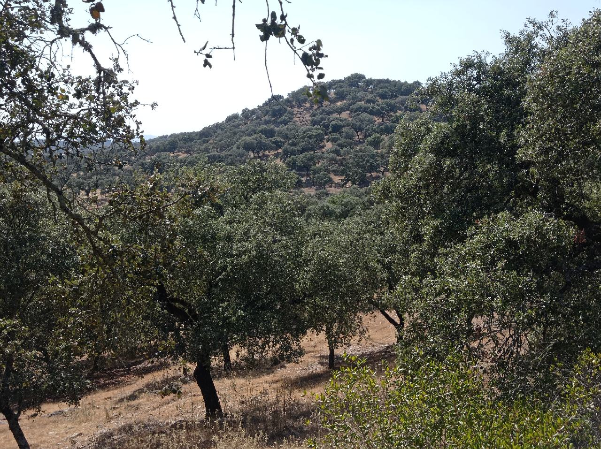

# Tour 2021 - part2

[2021/07/26]
### J56 - 26 juillet - Málaga,Almargen (Málaga) - 85 km (3079 km)

Bonne remise en jambes. Plus de 1000 mètres de dénivelé avec du vent défavorable assez fort. Pas eu trop chaud par contre. Soixante premiers kilomètres sur des routes assez passantes, plus tranquille sur la fin et avec des beaux paysages.

______
[2021/07/27]
### J57 - 27 juillet - Málaga,Carmona (Sevilla) - 95 km (3174 km)

Départ dans les collines mais après Osuna (30 km après le départ), la route passe par une plaine presque plate. Par contre, Carmona est sur une colline et la journée se finit par une montée de presque 200 mètres. Vent presque toujours favorable. Une portion de route bien tranquille mais pour le reste, il faut partager avec pas mal de trafic. Hôtel dans la vieille ville, plein de monuments, petites rues, petites places, très agréable.

______
[2021/07/28]
### J58 - 28 juillet - Carmona,Séville - 41 km (3215 km)

Petite étape qui me laisse un peu de temps pour visiter. Guère plus que la cathédrale. Evidemment sans mes guides habituels (Joaquin et Fernando), je perds beaucoup de choses. Moment embarrassant quand le préposé au tickets de la cathédrale me donne des explications auxquelles je ne comprends rien. En le faisant répéter, je réalise qu'il parle en anglais alors que je lui parle en espagnol. Mon accent doit avoir des faiblesses (mais le sien aussi !).

______
[2021/07/29]
### J59 - 29 juillet - Séville,El Real de la Jara (Sevilla) - 87 km (3302 km)

Sortie de Séville par les quais du Guadalquivir très agréable. Ensuite, traversée de la plaine par des routes moyennes. Et ensuite, on arrive dans les collines et c'est les montagnes russes tout le reste du chemin sur une route déserte. Principalement des plantations d'arbres (non identifiés) moins denses que les champs d'oliviers (il y a aussi quelques eucalyptus). Officiellement sur le chemin de Saint-Jacques alors je trouve une auberge pour dormir. Diner avec l'autre occupante de l'auberge, une Allemande qui parle très bien espagnol.

______
[2021/07/30]

### J60 - 30 juillet - El Real de la Jara,Zafra (Badajoz) - 68 km (3370 km)

Beaucoup de chemin aujourd'hui. Normal, la route que je suis depuis hier, l'Eurovélo 1, suit la Via de la Plata (la route de l'argent) qui est un des chemins de Saint-Jacques. Au départ dans les collines et les plantations d'arbres, puis le paysage se transforme en plaines moins pittoresques. J'arrive un peu plus fatigué que d'habitude et je retrouve une auberge. Comme il n'y a personne (trop chaud, pas la bonne saison), il n'y a personne et c'est tranquille.

______
