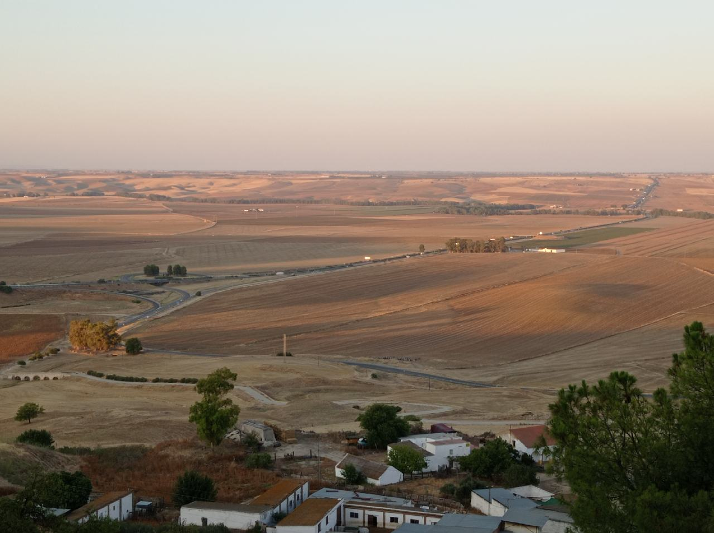
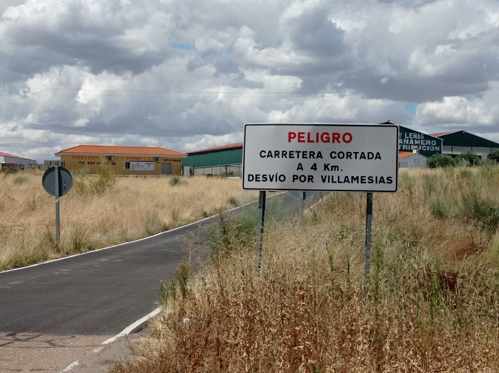
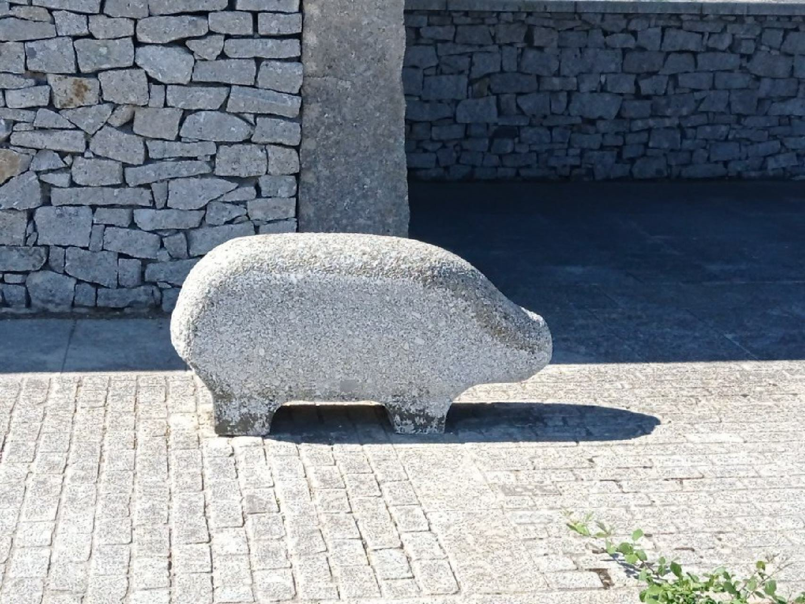

# Tour 2021 - part2

[2021/07/26]
### J56 - 26 juillet - Málaga,Almargen (Málaga) - 85 km (3079 km)

Bonne remise en jambes. Plus de 1000 mètres de dénivelé avec du vent défavorable assez fort. Pas eu trop chaud par contre. Soixante premiers kilomètres sur des routes assez passantes, plus tranquille sur la fin et avec des beaux paysages.

______
[2021/07/27]
### J57 - 27 juillet - Málaga,Carmona (Sevilla) - 95 km (3174 km)

Départ dans les collines mais après Osuna (30 km après le départ), la route passe par une plaine presque plate. Par contre, Carmona est sur une colline et la journée se finit par une montée de presque 200 mètres. Vent presque toujours favorable. Une portion de route bien tranquille mais pour le reste, il faut partager avec pas mal de trafic. Hôtel dans la vieille ville, plein de monuments, petites rues, petites places, très agréable.

______
[2021/07/28]
### J58 - 28 juillet - Carmona,Séville - 41 km (3215 km)

Petite étape qui me laisse un peu de temps pour visiter. Guère plus que la cathédrale. Evidemment sans mes guides habituels (Joaquin et Fernando), je perds beaucoup de choses. Moment embarrassant quand le préposé au tickets de la cathédrale me donne des explications auxquelles je ne comprends rien. En le faisant répéter, je réalise qu'il parle en anglais alors que je lui parle en espagnol. Mon accent doit avoir des faiblesses (mais le sien aussi !).

______
[2021/07/29]
### J59 - 29 juillet - Séville,El Real de la Jara (Sevilla) - 87 km (3302 km)

Sortie de Séville par les quais du Guadalquivir très agréable. Ensuite, traversée de la plaine par des routes moyennes. Et ensuite, on arrive dans les collines et c'est les montagnes russes tout le reste du chemin sur une route déserte. Principalement des plantations d'arbres (non identifiés) moins denses que les champs d'oliviers (il y a aussi quelques eucalyptus). Officiellement sur le chemin de Saint-Jacques alors je trouve une auberge pour dormir. Diner avec l'autre occupante de l'auberge, une Allemande qui parle très bien espagnol.

______
[2021/07/30]

### J60 - 30 juillet - El Real de la Jara,Zafra (Badajoz) - 68 km (3370 km)

Beaucoup de chemin aujourd'hui. Normal, la route que je suis depuis hier, l'Eurovélo 1, suit la Via de la Plata (la route de l'argent) qui est un des chemins de Saint-Jacques. Au départ dans les collines et les plantations d'arbres, puis le paysage se transforme en plaines moins pittoresques. J'arrive un peu plus fatigué que d'habitude et je retrouve une auberge. Comme il n'y a personne sur le chemin (trop chaud, pas la bonne saison), il n'y a personne à l'auberge et je suis seul dans la chambre.

______
[2021/07/31]

### J61 - 31 juillet - Zafra,Mérida (Badajoz) - 69 km (3439 km)

Aujourd'hui, chemins rectilignes dans un paysage plat. Ça doit être éprouvant pour ceux qui le font à pied. Avec ça, du vent frais toute la matinée. Je finis par sortir le coupe-vent pour l'enlever seulement vers 13h. Le bon côté des choses évidemment, c'est qu'il fait nettement moins chaud.

______
[2021/08/01]

### J62 - 1er août - Mérida

Jour de repos passé à visiter les monuments surtout romains. Mention spéciale pour le décor kitsch ajouté au théâtre romain (il y a un festival en ce moment).

______
[2021/08/02]

### J63 - 2 août - Mérida,Trujillo (Cáceres) - 124 km (3563 km)

Les 65 premiers kilomètres se font tout seul. Tout plat (c'est la plaine du Guadiana), vent favorable et même quelques petites routes tranquilles. Après, ça se gâte, la route est coupée. Alors retour en arrière et je commence à suivre la route proposée par Google. D'abord, de la route sans revêtement bien pourrie qui longe l'autoroute. Puis un chemin de terre qui s'enfonce dans les champs, mais là aussi, c'est coupé, ça arrive dans un pâturage plein de grosses bêtes. Retour le long de l'autoroute. Et enfin, il faut passer une grosse colline (avec une pente qui atteint 18%) pour atteindre Ibahernando, mon objectif initial. Vingt kilomètres de détour bien acrobatiques. Pour conclure, je fais le ravitaillement en eau et je cherche un coin pour dormir, mais rien à faire. Tout est clôturé des deux cotés de la route et j'arrive finalement à Trujillo où je trouve un hostal. Belle journée quand même !

_____
[2021/08/02]

Souvent avec les routes barrées à vélo, on essaye de forcer un peu le passage. Mais là, rien à faire, ça passe pas.

_____
[2021/08/03]

### J64 - 3 août - Trujillo,Plasencia (Cáceres) - 80 km (3643 km)

Itinéraire bien plus simple qu'hier. Une seule route tout du long, la route principale qui relie Trujillo à Plasencia. Peu de circulation et elle passe par Monfragüe, des gorges sur le Tage. Les paysages sont supers mais surtout c'est un repère de rapaces, dont des aigles et des vautours, et je passe un moment à les regarder.

_____
[2021/08/04]

### J65 - 4 août - Plasencia,Aldeanueva del Camino (Cáceres) - 60 km (3703 km)

Belle étape. De retour sur le chemin (la route à vélo s'en éloigne souvent), j'ai rencontré des marcheurs. Une française en arrivant à l'arc de Cáparra (qui est le symbole du chemin en Estrémadure) et un belge à l'auberge. Les deux parlent de la longueur des étapes par ici. Il peut y avoir quinze kilomètres sans village et  trente sans hébergement.

_____
[2021/08/05]

### J66 - 5 août - Aldeanueva del Camino,Los Santos (Salamanca) - 52 km (3755 km)

Aujourd'hui, il faut passer la barre de collines qu'on voyait toute la journée hier. Après quelques kilomètres de montée, j'arrive à l'embranchement entre les deux routes que j'ai tracées. Une qui continue à monter (pendant longtemps) et une voie verte, ancienne voie ferrée donc presque plate. Je n'hésite pas très longtemps et je prends la voie verte jusqu'à Béjar. Là, peut-être pas la meilleure idée, je me dis que je vais acheter une chambre à air pour remplacer celle que je n'arrive pas à réparer. Béjar est construite en haut d'un ravin et il faut pousser le vélo pour arriver en ville. Pour retrouver la route de l'autre côté du ravin, je fais confiance à Google. Il me fait passer par un chemin bétonné, que je monte en poussant et qui finit en escalier. Plutôt que de tout redescendre, je fais la navette avec les sacoches et le vélo vide jusqu'en haut. Beau point de vue !

_____
[2021/08/06]

Avant de quitter Los Santos, je fais un tour au parc thématique du granit (il y a des carrières dans la région). Des sculptures faites d'empilements de blocs, un Stonehenge un peu shadock et une belle vue sur les sierras tout autour.

_____
[2021/08/06]

### J67 - 6 août - Los Santos,Salamanque - 55 km (3810 km)

Programme en deux parties aujourd'hui. Ça commence par monter doucement mais avec un vent défavorable (comme depuis quelques jours) jusqu'au point le plus haut de ma route entre Mérida et Salamanque à 1100 mètres. Et ensuite, ça redescend, le vent devient favorable, et on quitte les prés et les arbres pour se retrouver dans la plaine et les champs presque jusqu'à Salamanque.

_____
[2021/08/07]
_____
[2021/08/08]

### 7,8 août - Salamanque

Deux jours de repos, un c'était pas assez. Au programme,  grasse matinée, procrastination et farniente. Et quand même visite du centre historique, de la Plaza Mayor, de la Maison aux coquillages et des deux cathédrales (l'ancienne et la nouvelle communiquent). Meilleur moment, la visite d'une tour des cathédrales qui fait passer par les galeries à mi-hauteur et surplomber les nefs.

_____
[2021/08/09]

### J70 - 9 août - Salamanque,Nava del Rey (Valladolid) - 82 km (3892 km)

Ça devait être une journée tranquille, pas trop chaud, pas de dénivelé. Mais j'ai crevé une première fois à l'arrière, puis une deuxième fois à l'avant. J'ai réparé mais ça n'a pas tenu, alors j'ai fait les derniers kilomètres pneu à plat jusqu'au village. Là, j'ai finalement pu réparer la chambre crevée à l'arrière. Ensuite, quelques kilomètres pour trouver une pinède où passer la nuit, pas d'hébergement dans le coin. A part ça, paysage de plaine et routes tranquilles.

_____
[2021/08/10]

### J71 - 10 août - Nava del Rey,Cevico de la Torre (Palencia) - 103 km (3995 km)

Routes moyennes jusqu'à Valladolid. Je rentre à peine dans la ville, juste pour trouver un marchand de vélos et acheter deux chambres à air (on n'est jamais trop prudent). Puis encore un peu de routes moyennes et enfin de la petite route dans un paysage agréable de plaines et de cultures encadrées par des collines.

_____
[2021/08/11]

### J72 - 11 août - Cevico de la Torre,Burgos - 94 km (4089 km)

Dormi dans les bois. Pneu arrière à plat au réveil. Pas grave, j'ai des chambres de rechange. Cinquante kilomètres jusqu'à la pause casse-croute. Au départ, pneu arrière à plat. Ça tombe bien, il me reste une chambre. A quatre kilomètres de Burgos, pneu arrière à plat. Si, si. Le pneu est entaillé à plusieurs endroits, c'est peut-être pour ça. Je pousse et roule sur la jante jusqu'au magasin de vélo le plus proche. J'achète encore une chambre, un pneu et une pompe, la mienne commence à être fatiguée de tout ça. Puis encore quatre kilomètre pneu à plat pour rejoindre le camping. À part ça, quatre vingt kilomètres de petites routes vides et de beaux paysages (des plateaux entrecoupés de vallées) et on passe presque sans transition des champs à la ville.

_____
[2021/08/12]

### 12 août - Burgos

Jour de repos. Changé mon pneu arrière et essayé de réparer les chambres à air. Diagnostic : une vraie crevaison, les deux autres chambres, même modèle, sont pincées au niveau de la valve. Je pense qu'elles étaient trop larges et qu'il y avait un problème de montage. Sinon visite de la ville : la cathédrale (sans blague) et le château où il n'y a plus grand chose sauf une belle vue.

_____
