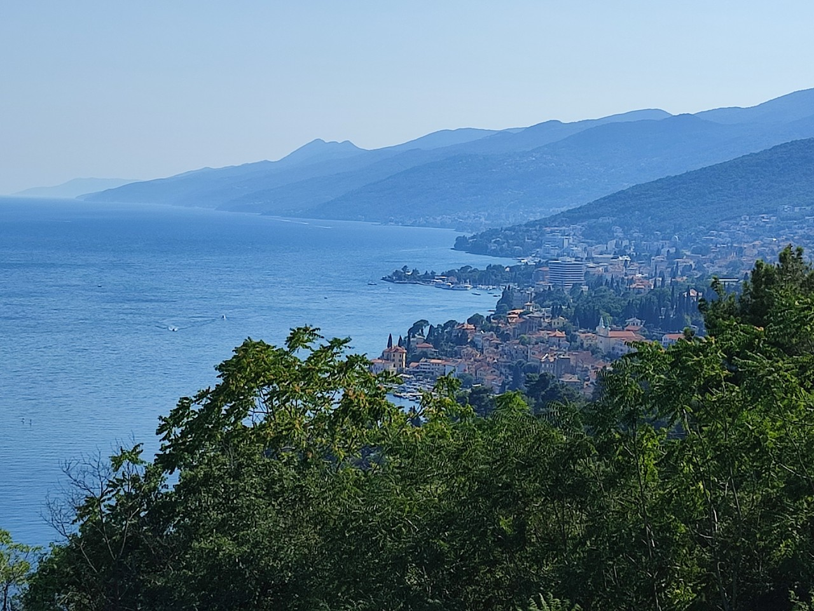
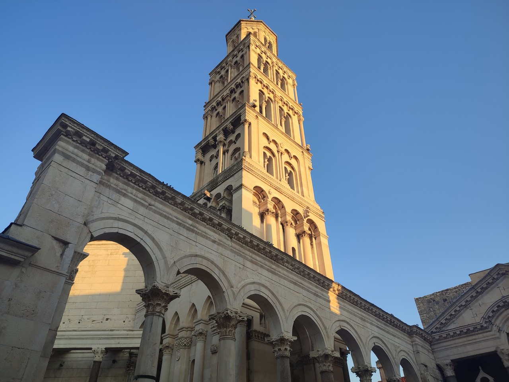
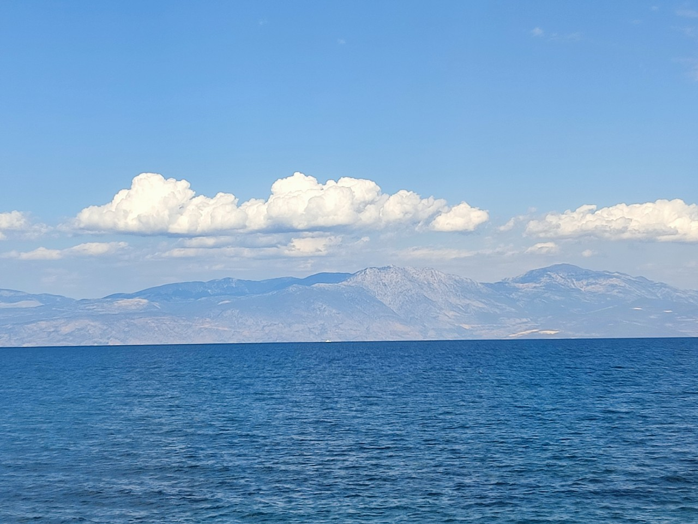

# EV8 2022 - part1

[2022/06/28]

### J1 - 28 juin - Moret-sur-Loing (Seine-et-Marne) - 72 km

Départ tardif en milieu d'après-midi. Je n'ai rien préparé et il y a toujours plein de petits trucs à faire. Départ de la maison en fait. Jusqu'à Orly ça va, après je rattrape la nationale et malgré quelques pistes cyclables, c'est pas vraiment sympa. Nettement mieux en traversant un bout de forêt de Fontainebleau et pour arriver à Moret.

______
[2022/06/29]

### J2 - 29 juin - Saint-Florentin (Yonne) - 96 km (168 km)

Encore 20 kilomètres de grosse route mais après c'est de la petite route de campagne. Je discute un moment avec un cycliste dont c'est la première ballade. Il a quand même fait 130 kilomètres en un jour, suivi d'un jour de repos pour se remettre. Croisé une autre cycliste mais qui ne s'est pas arrêtée, devait être pressée.

______
[2022/06/30]

### J3 - 30 juin - Saint-Florentin (Yonne) - 1 km (169 km)

Pluie de 5h30 à 8h30 et ensuite par intermittence toute la journée, entre crachin et averse. Aucune raison de passer la journée mouillé et j'ai la chance de trouver un hébergement sur booking pas très loin du camping. Hébergement farfelu d'ailleurs dans quelque chose comme une maison de gardien au fond d'un jardin. Une pièce avec coin cuisine. Emménagement de bric et de broc. Douche dans la pièce mais toilette au pied de la maison. Pour être honnête, l'annonce sur booking (et les commentaires) ne cache rien.

______
[2022/07/01]

### J4 - 1er juillet - Montbard (Côte-d'Or) - 89 km (258 km)

Sur la voie verte du canal de Bourgogne toute la journée. Pas la route la plus directe (à cause des méandres), mais sûrement la plus tranquille et agréable.

______
[2022/07/02]

### J5 - 2 juillet - Saint-Sernin-du-Plain (Saône-et-Loire) - 106 km (364 km)

Première moitié sur le canal, toujours aussi joli et agréable. Ensuite, des petites routes et des petits villages dans les collines. Hébergé chez Daniel (un ex collègue) et Cathy. Daniel me suit de temps en temps sur FB et quand il a vu que j'allais passer près de chez eux, il m'a proposé de passer. Super soirée.

______
[2022/07/03]

### J6 - 3 juillet - Mantenay-Montlin (Ain) - 88 km (452 km)

Petit-déjeuner dans le jardin chez Daniel et Cathy. Ils me proposent de rejoindre Chalon-sur-Saône par le canal du centre qui passe tout près. Bonne idée. En fait, c'est un bout d'Eurovelo 6. Après Chalon, c'est de la route moins pittoresque. Petit camping ubérisé. Pas de réception ni de numéro de téléphone. Il faut être inscrit et obtenir un code sur internet pour ouvrir la barrière et rentrer. Évidemment à vélo, le code n'est pas absolument nécessaire et je régulariserai si je vois quelqu’un.

______
[2022/07/04]

### J7 - 4 juillet - Ambérieu-en-Bugey (Ain) - 70 km (522 km)

Voie verte à la sortie du camping (la Traverse). Curieusement balisée tout du long avec une bande rouge. Malheureusement, elle se termine en cul-de-sac et l’arrivée à Bourg-en-Bresse se fait sur une trois voies puis une quatre voies. Après Bourg-en-Bresse, un peu de voie verte et pas mal de routes moyennes.

______
[2022/07/05]

### J8 - 5 juillet - Challes-les-Eaux (Savoie) - 94 km (616 km)

D'abord une vingtaine de kilomètres dans une vallée encaissée. Super paysage mais route un peu passante. Ensuite un bout de ViaRhona, puis un peu de dénivelé pour atteindre le tunnel du Chat. En fait, les vélos empruntent une galerie de service de 1500 mètres de long. La sortie du tunnel surplombe le lac du Bourget et ça redescend pour arriver à Chambéry. Arrivée et traversée de Chambéry avec plein de pistes cyclables et de cyclistes. Petit détour pour voir la fontaine aux Éléphants.

______
[2022/07/06]

### J9 - 6 juillet - Saint-Jean-de-Maurienne (Savoie) - 77 km (693 km)

Beaucoup de dénivelé aujourd'hui (plus de 1000 mètres) même si la route est presque tout le temps en fond de vallée. En échange, supers paysages.

______
[2022/07/07]

### J10 - 7 juillet - Lanslebourg-Mont-Cenis (Savoie) - 58 km (751 km)

Départementale assez passante, mais avec une bande cyclable, jusqu’à Modane. Beaucoup de vélos de route (d’ailleurs le tour de France va passer par St-Jean la semaine prochaine). Ça monte doucement dans un fond de vallée un peu encombré entre la rivière, le train, la route et l'autoroute. Route un peu plus tranquille après Modane mais avec un peu plus de pente. Encore 1000 mètres de dénivelé aujourd'hui pour arriver à 1400 mètres.

______
[2022/07/08]

### J11 - 8 juillet - Turin (Italie) - 97 km (848 km)

Ça commence à monter dès la sortie du village. Coup de bol, la route est réservée aux vélos ce matin. Dix kilomètres et 700 mètres de gain en altitude pour arriver au col du Mont-Cenis à 2083 mètres. Bonne chose de faite ! Ensuite encore une dizaine de kilomètres en France, en passant par le lac du Mont-Cenis, puis c’est l'Italie et la descente vers Turin. Arrivée à Turin dans la circulation mais les Italiens ont l’air de faire attention aux vélos.

______
[2022/07/09]

### J12 - 9 juillet - Turin

Jour de repos. Déambulation dans Turin. Beaucoup de places, de musées, de palais, d’églises et beaucoup d'animation. La cathédrale est fermée aujourd'hui exceptionnellement mais on peut quand même monter à la tour. Super panorama et ça permet d’avoir une vue d'ensemble.

______
[2022/07/10]

### J13 - 10 juillet - Casale Monferrato (Italie) - 87 km (935 km)

En route sur l'Eurovélo 8. Pas de fléchage, je suis un tracé GPS trouvé sur internet. Départ prometteur sur les quais du Pô mais il faut vite suivre les chemins dans les parcs au-dessus. Ça tournicote un moment entre chemins et pistes cyclables cabossées. Arrivé dans la campagne, ça continue entre routes et chemins à tracteurs. Au bout de quarante kilomètres, je craque et je dessine une trace en mode vélo de route sur Komoot. Fin de la journée sur des routes relativement tranquilles.

______
[2022/07/11]

### J14 - 11 juillet - Pavie (Italie) - 70 km (1005 km)

Option route encore aujourd’hui après une brève tentative dans un chemin recouvert de gravier. Plat de chez plat, rizières et champs de maïs, deux voies assez passantes. Ballade dans la vielle ville en arrivant : l'université (une des plus anciennes), la cathédrale (fermée) et les tours (qui ne sont que des symboles de prestige).

______
[2022/07/12]

### J15 - 12 juillet - Plaisance (Italie) - 63 km (1068 km)

Aujourd'hui, option "BRouter en mode vélo de route faible trafic". Pas mal, que des petites routes et juste assez de chemin pour profiter de la tranquillité. Pour dormir, j'ai hésité entre camping sauvage et Bed&Breakfast. Finalement, je me suis dit qu'en dormant dans les bois, je ne verrais pas grand-chose. J'ai choisi B&B et j'ai pu en profiter pour faire un tour dans la ville.

______
[2022/07/13]

### J16 - 13 juillet - Casalmaggiore (Italie) - 79 km (1147 km)

Vingt kilomètres de route passante et rectiligne pour démarrer. Ensuite, ça s'arrange avec des plus petites routes et un peu de chemin, souvent sur la digue qui longe le fleuve. Toujours la campagne, d’ailleurs je passe par une route qui s’appelle la "Food Valley Bike" d’après le surnom de la région.

______
[2022/07/14]

### J17 - 14 juillet - Bergantino (Italie) - 105 km (1252 km)

Presque toute la journée sur la digue, donc petites routes et un peu de chemin. Il y a même du fléchage pour l'Eurovélo 8, peut-être parce que ça ressemble à une vraie véloroute par ici. On voit plus le Pô que les jours précédents et le manque d'eau est visible. En fait, le niveau est historiquement bas.

______
[2022/07/15]

### J18 - 15 juillet - Porto Viro (Italie) - 104 km (1356 km)

Toujours sur la digue. Comme la digue est à quelques mètres au-dessus de la plaine, on voit le paysage assez loin et ca n'est pas monotone. Le Pô a l'air moins anémié sur la fin du trajet, même si les infos disent que l’eau salée remonte de vingt kilomètres à cause du manque de débit. Première crevaison. Coup de chance, je suis juste à coté d'un coin sympa et à l'ombre pour réparer. Je peux même aller me rincer les mains dans le fleuve.

______
[2022/07/16]

### J19 - 16 juillet - Venise (Italie) - 106 km (1462 km)

L'Eurovélo 8 suit un itinéraire un peu compliqué pour traverser le delta et les lagunes. Ça permet de voir des jolis paysages et d'éviter le trafic. Un détour en plus à cause d'un petit bac qui ne prend que des piétons. Et deux ferries pour rejoindre l’île en face de Venise. Clou de la journée, ce week-end c'est la fête du Rédempteur à Venise et il y a un beau feu d'artifice qui se voit très bien de l'autre coté de la lagune.

______
[2022/07/17]

______
[2022/07/18]

### 17,18 juillet - Venise

Deux jours pour visiter Venise, ça permet d'avoir un aperçu. Une visite guidée, en français, du palais des Doges et de la basilique Saint-Marc, des balades dans les petites rues et sur le grand canal en vaporetto, et quelques églises. C'est tout le temps beau, étonnant et inépuisable.

______
[2022/07/19]

### J22 - 19 juillet - Portogruaro (Italie) - 85 km (1547 km)

Un dernier vaporetto pour aller à Punta Sabbioni (le bout de la presqu’île qui prolonge l’île du Lido). Amusant de voir l’entrée du camping en passant. Ensuite, réseau de pistes cyclables pas mal pour sortir des lagunes, puis je longe la côte, occupée par des complexes touristiques. Finalement, retour dans une région agricole avec encore pas mal de pistes cyclables. Au camping, quelqu’un me demande mon âge, ça part d'une bonne intention :-).

______
[2022/07/20]

### J23 - 20 juillet - Grado (Italie) - 81 km (1628 km)

De la campagne, pas mal de pistes cyclables même entre villes, et des bouts de routes non goudronnées. Ensuite, traversée de la lagune et arrivée sur le littoral. Il y a un incendie au loin avant d'arriver à Grado. La fumée cache un peu le soleil et à certains moments, ça donne des couleurs de coucher de soleil au milieu de l’après-midi.

______
[2022/07/21]

### J24 - 21 juillet - Trieste (Italie) - 65 km (1693 km)

La route commence par suivre des chemins et des pistes cyclables à travers des lagunes, puis longe un bout de côte inhabitée (il n'y a pas de plages mais des bancs de vase). Ensuite, le paysage change complètement. La côte devient escarpée et la route passe à flanc de coteau en surplombant la mer. Petit tour en ville, très chic, sûrement à cause du passé autrichien.

______
[2022/07/22]

### J25 - 22 juillet - Rijeka (Croatie) - 78 km (1771 km)

Après la traversée de l'Italie en mode extra plat, aujourd'hui, c’est 1200 mètres de dénivelé positif. C’est aussi la traversée d’un petit bout de Slovénie (un quinzaine de kilomètres). Petite route, peu de voitures et des paysages qui semblent inhabités. Ça se repeuple petit à petit en redescendant vers Rijeka. En Slovénie, je croise un cycliste Australien. En fait, il va aussi en Croatie, mais la Croatie n'est pas dans l'espace Schengen et il lui manque une autorisation. Pas très content d’avoir à redescendre tout ce qu'il vient de monter et de faire un grand détour pour trouver son document.

______
[2022/07/23]

### J26 - 23 juillet - Rijeka

Un jour de repos pour avoir le temps de préparer la suite. Petit tour dans le centre quand même mais peu de choses à voir.

______
[2022/07/23]

Le parcours jusque là.

______
[2022/07/24]

### J27 - 24 juillet - Senj (Croatie) - 71 km (1842 km)

Pour longer la côte, j'ai le choix entre la route principale assez fréquentée et des petites routes, si il y en a, plus à l’intérieur. Je commence par des petites routes. Ça monte beaucoup avec quelques passages au-dessus de 10% que je passe en poussant. Finalement, je rattrape la route principale à Crikvenica plus tôt que prévu. Ça monte encore mais raisonnablement et le trafic est supportable. En plus, la route suit la mer d’assez près avec des paysages magnifiques. Pas sûr de chercher encore les petites routes.

______
[2022/07/25]

### J28 - 25 juillet - Bošana (Croatie) - 79 km (1921 km)

Cinquante kilomètres sur la route principale. Même ambiance qu'hier, des fois un peu coincé entre les voitures et le ravin, mais toujours aussi beau. Après ça, un ferry pour continuer sur une île et petite route jusqu'au AirBnB. Ambiance auberge et équipement approximatif. Pour une fois, il y a une plage juste à côté et je peux en profiter.

______
[2022/07/26]

### J29 - 26 juillet - Preko (Croatie) - 61 km (1982 km)

Première moitie presque plate, il y a même des marais salants. En deuxième partie, il faut traverser les collines et il y a quelques grosses montées. Finalement, encore un ferry pour aller sur l’île en face de Zadar où continue l'EV8 et où j’ai trouvé un AirBnb.

______
[2022/07/27]

### J30 - 27 juillet - Šibenik (Croatie) - 78 km (2060 km)

Pas trop de dénivelé aujourd'hui. D'abord pour traverser l’île, puis après encore un ferry, un peu plus loin de la mer que ces derniers jours. Double chance à l’arrivée : roue à plat à moins de cent mètres de l'auberge et gros orage à peine je suis à l'abri (première pluie depuis deux mois d’après la dame de l'accueil). Jolie ville, plein de petites ruelles et de vieilles pierres. Fin de la journée avec un spectacle de danse devant la cathédrale (il y a un Šibenik Dance Festival).

______
[2022/07/28]

### J31 - 28 juillet - Split (Croatie) - 74 km (2134 km)

Départ tardif entre les réservations jusqu'à Dubrovnik, FaceBook, la réparation de la roue crevée et un tour à la cathédrale. Traversée des collines aujourd'hui avec une montée de 0 à 400 mètres. À la redescente, on peut voir toute la côte jusqu'à Split. Petit tour minimaliste en allant faire des courses. Ça mérite plus, ça a l’air intéressant (la ville est construite autour d'un palais romain).

______
[2022/07/29]

### J32 - 29 juillet - Makarska (Croatie) - 35 km (2169 km) ... plus une quarantaine de kilomètres en bus

Journée compliquée. Route principale impraticable, trop de trafic. Donc c'est itinéraire bis et ça commence à monter dès la sortie de Split. Ça monte pendant trente kilomètres, pas méchamment mais tout le temps, et je m’arrête toutes les demi-heures pour peser le pour et le contre des différentes options. Arrivé au-dessus d'Omiš, point de vue spectaculaire sur le canyon de la Cetina et grosse descente jusqu'à la mer. De là, il faut tout remonter mais c'est décidé, si je trouve un bus, je le prends. Ça marche. La route suit la côte de plus en plus escarpée et je peux profiter du spectacle tranquillement installé. Fin de journée à la plage avec un paysage grandiose.

______
[2022/07/30]

### J33 - 30 juillet - Komarna (Croatie) - 32 km (2201 km)

Un peu plus d'une heure de bus jusqu'à Ploce. C'est le chauffeur qui décide si le vélo peut embarquer. Là, c’était tout juste. Après Ploce, la route fait le tour d'une zone de marais entourée par les collines, très joli et tout plat pendant quelques kilomètres. Booking avec vue sur la mer et le pont de Pelješac. Le pont a ouvert il y a quatre jours et permet de relier Dubrovnik sans traverser le morceau de Bosnie-Herzégovine qui donne sur la mer.

______
[2022/07/31]

### J34 - 31 juillet - Dubrovnik (Croatie) - 78 km (2279 km)

Pas de bus aujourd'hui. Deux passages de frontières, sans problème, pour traverser le "corridor de Neum", l’accès à la mer de la Bosnie-Herzégovine. Pour le reste, ça monte raisonnablement et pour être honnête, il y a un petit vent qui me pousse dans la bonne direction. Une dizaine de kilomètres avant Dubrovnik, il y a un incendie derrière les collines. Quatre Canadair font des navettes pour se ravitailler en eau en passant au-dessus de la route. C'est assez impressionnant et je passe un moment à les regarder.

______
[2022/08/01]

### J35 - 1er août - Dubrovnik

Un jour pour préparer la suite et visiter. Finalement, je ne visite que les remparts, "visite incontournable malgré son prix" j'ai lu sur un site. Effectivement, 32,50€ (j'ai cherché Versailles pour comparer, c'est 21,50€), mais c'est joli.

______
[2022/08/02]

### J36 - 2 août - Bijela (Montenegro) - 67 km (2346 km)

Après la sortie de Dubrovnik, l'EV8 passe par un bout d’une ancienne route fermée aux voitures. Très joli mais ça ne dure que deux kilomètres avant de retomber sur la grosse route bien encombrée. Heureusement, ça ne dure pas longtemps non plus et la suite se fait sur une petite route déserte. En haut de la plus haute montée de la journée, je rencontre un couple d’allemands qui m'expliquent que la route est coupée à cause d'un incendie. Il faut tout redescendre et reprendre la route principale. Là, je tombe sur une file de voitures à l’arrêt. Je remonte sans vergogne la file de voitures sur trois kilomètres jusqu’à la frontière que je passe sans problème. Arrivé au Montenegro, hors union, plus de forfait. J’étais prêt sauf que j'avais oublié de noter l'adresse de mon hébergement. Je m'en sors en demandant l’accès wifi dans un hôtel. Finalement, j’arrive à l’hébergement où je suis accueilli par un couple adorable. La dame parle couramment français pour avoir travaillé en Suisse et a fait plein de voyage à vélo. Ils m’offrent une bière et on discute un moment de voyages et de la Yougoslavie.

______
[2022/08/03]

### J37 - 3 août - Bijela (Montenegro) - 48 km (2394 km)

Toujours à Bijela mais pas au repos complet. La côte ici forme un système de golfes (les bouches de Kotor) presque complètement fermé (on parle même de fjord). L’itinéraire de l'EV8 fait le tour au lieu de prendre le ferry pour traverser le bras de mer. Comme mon hébergement est au bord du bras de mer, j'ai pu faire le tour sans bagage. La route est assez encombrée mais le paysage est grandiose. En passant, petit tour dans Kotor, petite ville fortifiée, très touristique.

______
[2022/08/04]

### J38 - 4 août - Bar (Montenegro) - 74 km (2468 km)

Beaucoup de trafic aujourd'hui. Pour éviter la route principale, l'Eurovelo 8 passe dans l’intérieur des terres mais démarre par une montée de 0 à 1000 mètres. Pas trop chaud pour autant de dénivelé, j'ai pris la route de la côte. Mais le trafic est dense, assez pour qu'il y ait des ralentissements et que je roule de temps en temps aussi vite que les voitures. Heureusement, ça se dégage un peu dans la deuxième moitié. En plus, la côte est plus urbanisée ici et c'est moins joli. Discuté cinq minutes avec un Polonais qui fait tout un périple dans les Balkans.

______
[2022/08/05]

### J39 - 5 août - Shkodër (Albanie) - 52 km (2520 km)

Départ de Bar par la grande route, mais rapidement je la quitte pour des petites routes. Dernier coup d’oeil sur la côte adriatique depuis les hauteurs. Un peu de trafic quand même, avec des voitures de tous les pays de la région, comme c'est une des routes qui conduit à la frontière. Passage de la frontière sans problème. Pas mal de curiosité à découvrir l’Albanie qui était complètement fermée jusqu’en 1991.

______
[2022/08/06]

### J40 - 6 août - Tirana (Albanie) - 110 km (2630 km)

Route principale très encombrée mais l'EV8 emprunte la plupart du temps des routes latérales plus confortables. Presque plat et vent favorable. Région agricole, beaucoup de maïs et des moutons jusqu'aux portes de Tirana.

______
[2022/08/07]

La route jusque là.

______
[2022/08/07]

### J41 - 7 août - Tirana

Une journée de repos et pour visiter. Pour le repos, c’est moyen, il y a des travaux à l’étage au-dessus. Et pour la visite, pas grand chose à voir qui ait plus de cinquante ans. En plus, deux des curiosités, la fresque du musée d'histoire et la pyramide (juste un bâtiment contemporain), sont en rénovation. Heureusement, j'ai suivi le Tirana Free Tour avec un jeune guide qui explique plein de choses sur l'histoire, l’époque communiste, la corruption et l’état du pays.

______
[2022/08/08]

Trois images de mon booking à Tirana. On dirait trois endroits différents.

______
[2022/08/08]

### J42 - 8 août - Labinot-Fushë (Albanie) - 59 km (2689 km)

Un peu de regret de quitter Tirana. Peut-être pas grand chose à voir mais l’ambiance est dépaysante. Grande montée toute la matinée. Pendant la montée, en passant devant une buvette, un gars me fait signe. Il m'offre à boire (j'ai préféré le jus de fruit à la bière) et on se raconte des trucs sans être sûr d'être à cent pour cent compris. Et ce soir, raki offert au resto de l’hôtel.

______
[2022/08/09]

### J43 - 9 août - Pogradec (Albanie) - 80 km (2769 km)

Journée moins agréable qu'hier à cause de la route qui est nettement plus encombrée. La route remonte une rivière sur cinquante kilomètres, puis passe au-dessus des collines pour redescendre vers le lac Ohrid. Les vingt derniers kilomètres longent le lac. Au total 1100 mètres de dénivelé positif. La dernière montée n'est pas qu'une épreuve pour les vélos. On sent que certains camions ont un peu de mal, et dans le sens de la descente, certaines camionnettes font ça doucement, sûrement de peur de rater un virage.

______
[2022/08/10]

### J44 - 10 août - Pogradec (Albanie) - 24 km (2793 km)

Un dernier jour en Albanie pour en profiter. Donc en  toute logique, je vais faire un tour en Macédoine du Nord à quelques kilomètres pour visiter le monastère Saint-Naum au bord du lac Ohrid. Pas grand chose à voir mais joli endroit. Manifestement très prisé, l’accès au monastère se fait entre la plage et les boutiques de souvenirs. Beaucoup plus de monde sur la plage qu'au monastère.

______
[2022/08/11]

### J45 - 11 août - Kastoria (Grèce) - 97 km (2890 km)

Pas beaucoup de circulation après les premiers kilomètres. D'abord, en traversant la campagne puis dans les collines. En particulier après la frontière, très peu d’habitations et très peu de voitures pendant trente kilomètres. Gros orage, mais je passe juste après et je suis à peine mouillé. Par contre, il fait frais (18°) surtout dans les descentes et je sors le coupe-vent. Encore de la pluie annoncée pendant deux jours.

______
[2022/08/12]

### J46 - 12 août - Peraia (Grèce) - 85 km (2975 km)

La route contourne d'abord le lac de Kastoria. Puis, grosse montée (de 680 mètres à 1145 mètres), et grosse descente vers une région de marais. Ensuite, c'est des champs avec un peu trop de routes non goudronnées (malgré le mode "vélo de route" pour tracer les itinéraires). Arrivée à l’hébergement sous la pluie. Je suis leur premier hôte et ils m'ont préparé à manger. Discussion avec la dame sur les voisins macédoniens et turques.

______
[2022/08/13]

### J47 - 13 août - Thessalonique (Grèce) - 110 km (3085 km)

De 600 mètres d'altitude à zéro. En fait, ça reste dans les collines pendant trente kilomètres, puis ça descend rapidement et le reste est quasi plat. Routes et paysage nettement moins pittoresques, surtout en arrivant à Thessalonique (deuxième ville de Grèce).

______
[2022/08/14]

______
[2022/08/15]

### J48,49 - 14,15 août - Thessalonique

Couvert hier, plus beau aujourd'hui. Balade sur le front de mer à vélo et montée à la Tour Blanche. Pour le reste du temps, repos et préparation des étapes suivantes.

______
[2022/08/16]

### J50 - 16 août - Asprovalta (Grèce) - 89 km (3174 km)

Route tranquille sauf pour la sortie de Thessalonique et pour les dix derniers kilomètres. J'ai traversé le nord de la Chalcidique en longeant deux grands lacs. C'est donc assez plat. Les paysages ne sont pas spectaculaires mais c'est joli quand même. Nuit en camping, le premier depuis l'Italie. Je commençais à me demander si c’était vraiment utile de trimbaler la tente et le couchage.

______
[2022/08/17]

### J51 - 17 août - Nea Karvali (Grèce) - 100 km (3274 km)

Après quelques kilomètres, là où il y a la grande statue du lion, je rencontre un grec, en train de réparer une crevaison, aidé par un français, qui est sur la route depuis un an et demi et revient d'Oman. Et on est rejoint par un couple d'allemands en tandem. Finalement, je retrouverai le grec, Georges, un peu plus tard sur la route et on finit la journée ensemble. En passant, il me propose de faire un tour dans un centre thermal abandonné. J'accepte évidemment et je m'offre un bain dans une eau très chaude à l'odeur sulfurée. Difficile d'en sortir, surtout que c'est à mon tour ensuite de réparer une crevaison. Quant à la route, ça a été soit toute petite en bord de plage, soit assez importante et surplombant la mer.

______
[2022/08/18]

### J52 - 18 août - Komotini (Grèce) - 100 km (3374 km)

Toute la journée avec Georges puisque nous allons au même endroit. Journée entrecoupée de plusieurs arrêts comme un détour pour aller voir une rivière qui passe dans des gorges, ou une pause à côté de vendeuses de pastèques qui nous en offriront. À l’étape, Georges prend une chambre dans le même hôtel que moi. Au moment de dîner, nous sommes rejoints par ses amis qu’il devait retrouver le lendemain. Du coup, super soirée, ils sont tous sympas et c'est resto, ballade dans la ville, dernier verre, etc., pour finir par se coucher assez tard.

"Chevaux sauvages"

Giorgos, Thomais, Pascal et Vassili.
______
[2022/08/19]

### J53 - 19 août - Alexandroúpoli  (Grèce) - 60 km (3434 km)

Dernier café avec Giorgos et chacun repart de son côté. Route presque vide, pas trop de dénivelé mais assez chaud. Camping municipal sur la plage. Arrivé assez tôt, j'ai le temps d'en profiter.

______
[2022/08/20]

### J54 - 20 août - Keşan (Turquie) - 82 km (3516 km)

À la sortie de Alexandroúpoli, je rencontre un anglais, Jacob, parti de Londres. On discute, on se sépare et on finit par se retrouver sur la route pour continuer ensemble jusqu'à Ipsala (première ville turque) où il a son hôtel. On se verra peut-être à Istanbul. Côté grec, il y a des petites routes et une autoroute. Côté turque, il n'y a qu'une grosse quatre-voies, mais pas encombrée et avec un accotement bien large. Par contre, ils ont tracé tout droit dans les collines et bien que le paysage soit plus plat, il y a quand même quelques longues montées.

______
[2022/08/21]

### J55 - 21 août - Keşan (Turquie)

Keşan n'est pas la destination la plus touristique. Comme ça, pas de regret à paresser toute la journée.

______
[2022/08/22]

### J56 - 22 août - Tekirdağ (Turquie) - 81 km (3597 km)

Toute la journée sur la grosse quatre-voies (pas d'autres solutions si les sites que j'utilise n'ont rien trouvé d'autre). La route est pratiquement rectiligne et comme ça va tout droit dans les collines, presque mille mètres de dénivelé à la fin de la journée. Chambre avec vue sur la mer de Marmara. Fenêtre ouverte, j'entends la mer. Je crois que je vais dormir comme ça.

______
[2022/08/23]

### J57 - 23 août - Silivri (Turquie) - 73 km (3670 km)

Toujours sur la quatre-voie. Moins de dénivelé mais du vent. Globalement moche même si la route longe la mer de temps en temps.

______
[2022/08/24]

### J58 - 24 août - Istanbul (Turquie) - 68 km (3738 km)

D'abord sur la quatre-voies, avec quelques rues adjacentes pour soulager un peu. Ensuite, il n'y a pas le choix et ça devient très gros (et toujours permis au vélos, d’ailleurs il n’y en a pas). De chaque coté, il y trois voies doublées avec deux voies. Dix voies ! Et par moment, c'est encombré. Les derniers dix kilomètres passent par des petites rues et là des fois, c'est complètement bloqué. Ajouté à ça, un peu de pluie et du vent contraire. Pas ma meilleure journée de vélo, mais j’étais prévenu et Paris-Istanbul, checked !

______
[2022/08/25]

______
[2022/08/26]

______
[2022/08/27]

### J59,60,61 - 25,26,27 août - Istanbul

Beaucoup d'histoire et beaucoup de choses à voir. Besoin de me reposer au début mais j'ai quand même visiter les trucs à ne pas rater et pas mal déambuler dans les rues. Aidé par le fait que mon hôtel est à dix minutes à pied de Sainte-Sophie.

______
[2022/08/28]

### J62 - 28 août - Bandirma

Traversée de la mer de Marmara en ferry (donc techniquement en Asie). Le ferry est un catamaran fermé, pas trop sympa pour les photos. Pas mal de monde dans les rues mais ambiance paisible.

______
[2022/08/29]

### J63 - 29 août - Biga (Turquie) - 73 km (3811 km)

Retour sur de la quatre-voies. Pas trop de trafic et accotement large. Un peu de dénivelé mais du vent favorable. Pas de raison de se plaindre. Le paysage est tranquille, des collines, beaucoup de champs et un passage pas trop loin de la mer.

______
[2022/08/30]

### J64 - 30 août - Çanakkale (Turquie) - 98 km (3909 km)

Après un passage dans les collines, la route retrouve la mer et suit le détroit des Dardanelles. C'est le détroit qui relie la mer Égée (donc la Méditerranée) à la mer de Marmara (donc à Istanbul puis à la mer Noire). En fait, je n'aurais pas su dire où c’était avant aujourd’hui. Toujours la quatre-voies avec quand même un bout de petite route qui longe la mer, toujours des montagnes russes mais encore du vent favorable.

______
[2022/08/31]

### J65 - 31 août - Troie (Turquie) - 31 km (3940 km)

Après Çanakkale, je longe la mer le plus loin possible, puis je rejoins le site de Troie, en ne suivant que des petites routes. Les vestiges couvrent deux mille ans, de l'âge du bronze aux Grecs et aux Romains, sur neuf niveaux décrits. Rien de spectaculaire et difficile à interpréter même avec l'audioguide. Mais quand même, c'est Troie ! En passant, j'apprends que l’autre nom de Troie est Ilios et que c'est pour ça que l'Iliade s'appelle comme ça.

______
[2022/09/01]

### J66 - 1er septembre - Küçükkuyu (Turquie) - 72 km (4012 km)

De retour sur la grande route sauf pour les quinze derniers kilomètres qui se font sur une petite route un peu sauvage. Ça a monté assez doucement pour arriver à 450 mètres et en quelques kilomètres, ça redescend au niveau de la mer. Freins serrés pendant toute la descente (j'en ai plus beaucoup).

______
[2022/09/02]

### J67 - 2 septembre - Ayvalik (Turquie) - 81 km (4093 km)

J’ai fait le tour d’une baie allongée pour me retrouver pratiquement en face de mon point de départ, à vingt-cinq kilomètres à vol d’oiseau. Six-voies une bonne partie en bord de mer, pittoresque, d’un côté de la baie. Puis quatre-voies dans les collines de l’autre côté. Pour y échapper sur les derniers kilomètres, mon itinéraire me propose un petite route. Ça devient rapidement un chemin un peu cabossé dans les oliviers. Ça sent l’huile d’olive, je me fais courser mollement par un chien, et vu l’état du chemin, je finis par crever.

______
[2022/09/03]

### J68 - 3 septembre - Yenişakran (Turquie) - 78 km (4171 km)

Un des bouts hors grosse route m’amène sur du chemin comme hier. Au bout de cinq cents mètres, un chien se met sur la route, se met à aboyer, et repart sur le côté. Il a un copain un peu plus loin, plus petit, qui aboie un peu aussi. Je ramasse des cailloux, histoire de me donner une contenance, et je commence à avancer. Et là, il y en trois autres qui arrivent alors je fais demi-tour. Arrivé au village juste avant, je vais pour prendre une autre petite route mais il y a encore deux gros chiens au milieu qui se mettent à aboyer. Tant pis, retour sur la grosse route pour ce coup-ci. Arrivée à l’hôtel les deux roues à plat. Il y a un réparateur juste à côté (absent de Google mais marqué sur OSM Cycle Map). Pas très sympa le gars. Il me vend deux chambres à air (bon diamètre mais deux largeurs différentes) mais il n'a pas de rustines. Du coup, j’apprends que "yoc" ça veut dire non en turc.

______
[2022/09/04]

### J69 - 4 septembre - Izmir (Turquie) - 75 km (4246 km)

Arrivée à Izmir (Smyrne en grec) encombrée évidemment (c’est la troisième ville de Turquie) mais ça passe. D’autant plus que les dix derniers kilomètres se font en bord de mer sur des pistes cyclables. Et une crevaison quinze kilomètres après le départ.

______
[2022/09/05]

### J70 - 5 septembre - Çeşme (Turquie) - 90 km (4336 km)

Avant de quitter Izmir, je fais un tour à l'Asansör, ascenseur public construit en 1907 pour accéder à la ville haute. De là haut, beau point de vue et on voit bien que Izmir est bâti à flanc de colline. (En passant, c’est juste à côté d'une des maisons de Dario Moreno). Ensuite, que des pistes cyclables pour sortir de la ville. En fait, c’est un morceau d'Eurovelo 8 qui est même fléché. La route rentre ensuite dans les collines avec deux bonnes montées. Pas mal de vent, heureusement de travers ou favorable. Tellement de vent qu'un des ferrys qui va à Chios (l’île grecque d'en face) est annulé. Il y a un deuxième ferry mais je ne saurai si il fait la traversée que demain matin à l’embarcadère. On verra bien.

______
[2022/09/06]

### J71 - 6 septembre - Chios (Grèce) - 13 km (4349 km)

Finalement le deuxième ferry n'est pas annulé. Il y a toujours beaucoup de vent, ça éclabousse un peu, mais ça va. Première fois quand même que je vois quelqu'un de l’équipage coucher mon vélo par terre pour qu'il reste en place. Un autre cycliste à bord, un Croate qui vient d'Istanbul et qui rentre en passant par la Grèce et l'Italie. Après le ferry, une dizaine de kilomètres pour rejoindre mon hébergement dans un petit village. Fin de la journée aux abonnés absents.

______
[2022/09/07]

______
[2022/09/08]

### J73 - 8 septembre - Chios - 56 km (4405 km)

Balade dans l’île pour visiter les curiosités les plus proches. Plus de mille mètres de dénivelé, mais c’est nettement plus facile sans les bagages. D’abord, le village de Pyrghi, avec ses maisons recouvertes de motifs géométriques et une toute petite église recouverte de peinture à l’intérieur. Ensuite, le musée du mastic, une résine très prisée d’un arbuste qui ne pousse que dans le sud de l’île. Et finalement, le site archéologique d’Emborios. Malheureusement, ça ferme à 15:30 et je prends mon ticket à 15:12. Juste le temps de monter en trottinant, faire trois photos, et redescendre en courant. Mini-vestiges mais super panorama. Fin de la journée à la plage, je viens de réaliser que mon fauteuil de camping peut aussi servir à la plage. Top !

______
[2022/09/09]

### J74 - 9 septembre - Chios - 64 km (4469 km)

Deuxième balade, cette fois pour aller voir le petit village de Avgonyma et ses maisons cubiques. Le village n’est peut-être pas à la hauteur de l’effort pour y arriver mais cette partie de l’ile, l’ouest, est peu habitée et les paysages sont supers. Dernier plouf à la plage et retour à la ville de Chios pour prendre le ferry pour Athènes. Cette fois, c’est un gros bateau.

______
[2022/09/10]

### J75 - 10 septembre - Athènes (Grèce) - 24 km (4493 km)

Débarquement au Pirée avec le lever du soleil. Puis une dizaine de kilomètres pour rejoindre mon hébergement dans le centre. J’y laisse mes affaires et en attendant l’heure du check-in, je vais faire un tour à Décathlon pour remplacer mes chaussures et le t-shirt que je mets à vélo (les deux fatigués jusqu’à la corde), et acheter un pneu et des rustines. L’après-midi, je fais le tour de l‘Acropole pour me mettre dans l’ambiance et je vais voir les gardes du Parlement place Sýntagma.

______
[2022/09/11]

### J76 - 11 septembre - Athènes

De retour à Syntagma pour voir la relève de la garde à 11 heures. Beaucoup de cérémonial mais trop de monde. J’attends midi pour voir la relève sans cérémonie (comme à toutes les heures). Ensuite, visite de l'Acropole. Ticket avec réduction personnes âgées :( 10e au lieu de 20e :). En fait, les drapeaux sur le Parthénon, ça n'est pas normal. C'est un illuminé qui est monté et qui les a accrochés (https://hellas.postsen.com/local/101740/A-man-climbed-the-Parthenon-and-threatens-to-fall-%E2%80%93-He-has-hung-flags-of-Israel-%E2%80%93-Greece-%E2%80%93-SW-%E2%80%93-Newsbomb-%E2%80%93-News.html) d'où un certain nombre de policiers autour. Je n'ai pas trouvé la fin de l'histoire.

______
[2022/09/12]

### J77 - 12 septembre - Corinthe (Grèce) - 78 km (4571 km)

Une quinzaine de kilomètres pour aller à Perama d'où je prends un ferry pour l’île de Salamine. Tout près d’Athènes mais ça ressemble déjà à une île grecque. Je m’arrête chez un marchand de vélo sympa qui prend le temps d'arranger la roue avant et de changer les freins. Le pneu n'est pas positionné correctement (trop enfoncé à un endroit) et ça fait bong bong en roulant. Encore un ferry pour quitter l’île puis la route suit la côte. Pas forcement pittoresque (grosse raffinerie et grosse route tout près) mais la route est tranquille et à certains moments, les paysages sont à tomber. Traversée du canal de Corinthe sur un pont qui descend sous l'eau pour laisser passer les bateaux et arrivée au camping en bord de plage.

______
[2022/09/13]

### J78 - 13 septembre - Akrata (Grèce) - 86 km (4657 km)

Retour au canal de Corinthe que je longe tout du long sans pouvoir le voir depuis la route. Un peu déçu de ne pas l’avoir vu là où il est le plus profond. Après ça, la route suit la côte, souvent juste au bord de la mer et en zone habitée tout du long. Un peu pénible au début, avec pas mal de circulation, plus grand monde sur la fin. Paysages moins spectaculaires qu’hier, peut-être parce qu’il n’y a presque pas de dénivelé, mais c’est quand même pas mal. Encore un camping sur la plage, mais aujourd’hui j’ai le temps d’en profiter.

______
[2022/09/14]

### J79 - 14 septembre - Patras (Grèce) - 65 km (4722 km)

Moins sympa qu'hier même si plus de dénivelé. La route est plus souvent plus proche de l'autoroute que de la mer et la circulation augmente en approchant de Patras. À l’arrivée, je vais acheter un billet de ferry pour Bari (plus de liaison Patras-Brindisi) et je fais un tour en ville. Dernière soirée en Grèce.

______
[2022/09/15]

### J80 - 15 septembre - Patras

Ferry à 17h30, embarquement deux heures avant. Pour passer le temps, je m’arrête d’abord chez un coiffeur. C’est un Albanais, assez fier de pouvoir lui dire merci en albanais. Ensuite, visite du château de Patras. Bel endroit et bonne balade. À l’embarquement, les bagages sont scannés et on me prend mes bonbonnes de gaz. Je devrais les retrouver à l’arrivée. Sur le ferry, tout le monde s’installe un peu n’importe où. La dernière fois, j’avais bien pris le sac à viande et l’oreiller mais pas le matelas. Là, j’ai compris le truc et je m’installe dans un coin d’escalier assez tranquille.

______
