# Tour 2022 - part1

[2022/02/24]

### J1 - 24 février - Jacksonville (Floride) - 9 km (sans compter l'avion)

Voyage longuet mais sans histoire sauf à la correspondance à Miami. Là, il faut récupérer les bagages et je retrouve le carton à vélo ouvert. Le scotch d'origine du fond du carton n'a pas tenu, pas glop. Je paye 8 dollars pour un charriot (!) et j'apporte le carton à l'enregistrement. Impossible de trouver du scotch mais les préposés m'assurent que de toute façon, le carton sera ouvert pour le contrôler et je suppose qu'il sera refermé. Plus qu'à croiser les doigts. A l’arrivée à Jacksonville, le carton est toujours ouvert mais rien ne manque. (Il n'y a pas que le vélo dans le carton, il y a la tente, les outils, une sacoche, du bazar). Ouf ! Ça m'apprendra à lésiner sur le scotch.

______
[2022/02/25]

### J2 - 25 février - Jacksonville - 49 km (58 km)

Début de journée pour faire des courses mais pas trouvé de recharges de gaz. Premier magasin à quelques kilomètres mais il n'y en a plus, deuxième magasin, mauvais tuyau, troisième magasin, fermé le vendredi, quatrième à 40 kilomètres, j'ai lâché l'affaire. Ça risque d’être dur pour le café du matin. Ensuite, un peu de route (à 4 voies) pour faire un tour dans le centre ville. Au retour, je prends quelques rues parallèles et c'est nettement plus sympa. Et une fois n'est pas coutume, j'ai fait un selfie.

______
[2022/02/26]

### J3 - 26 février - Jacksonville - 89 km (137 km)

J'ai finalement trouvé des cartouches de gaz mais il a fallu aller les chercher à 40 kilomètres, de l'autre côté du centre ville. Deux itinéraires, un pour l'aller, un pour le retour, tracés avec Komoot et BRouter, qui évitent à peu près les plus grosses routes. Finalement pas si mal, il y a souvent un couloir cyclable. Par contre, pas beaucoup de vélos.

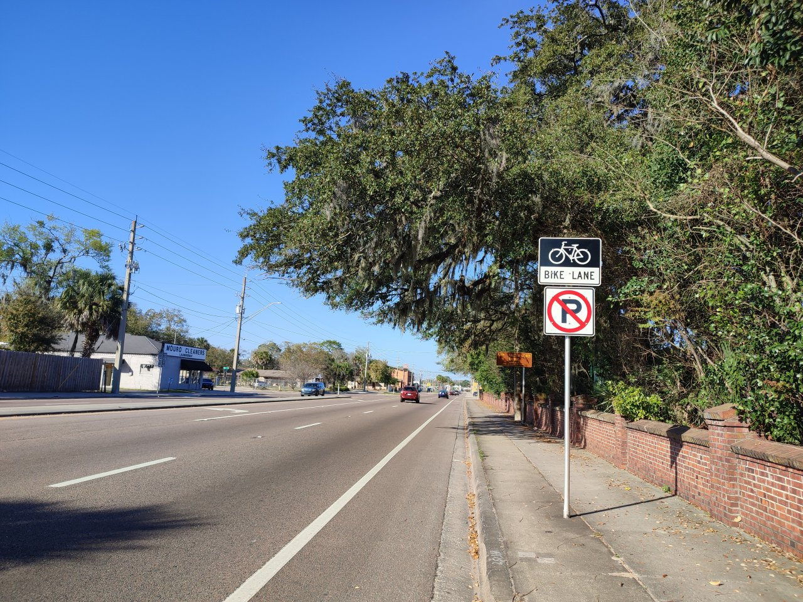

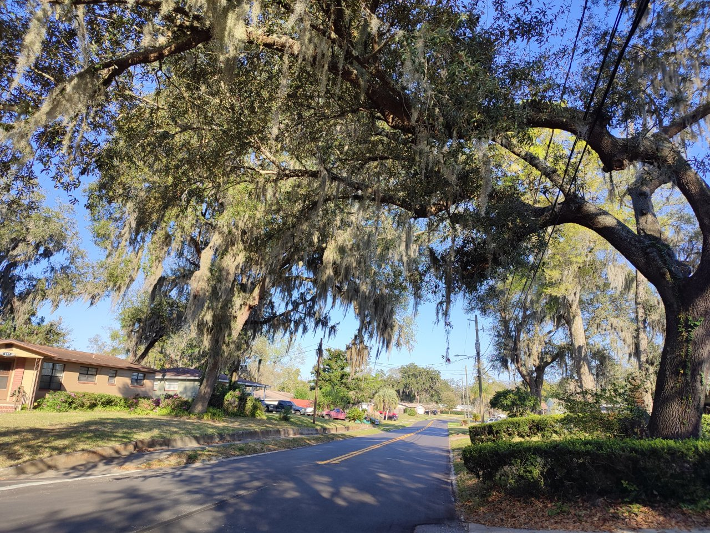
______
[2022/02/27]

### J4 - 27 février - Saint Augustine (Floride) - 96 km (243 km)

Grosses routes puis ferry pour rejoindre la côte. Encore des grosses routes pour traverser Atlantic Beach et Jacksonville Beach. Ensuite 40 kilomètres de ligne droite sur une deux voies un peu chargée. Il y a des maisons presque tout du long et on ne voit presque pas la mer, je m’arrête quand même pour prendre une photo. Première expérience avec WarmShowers, un site d'échange d’hébergement pour les cyclistes. Je suis accueilli par Dan, très sympa, qui vit sur son bateau.

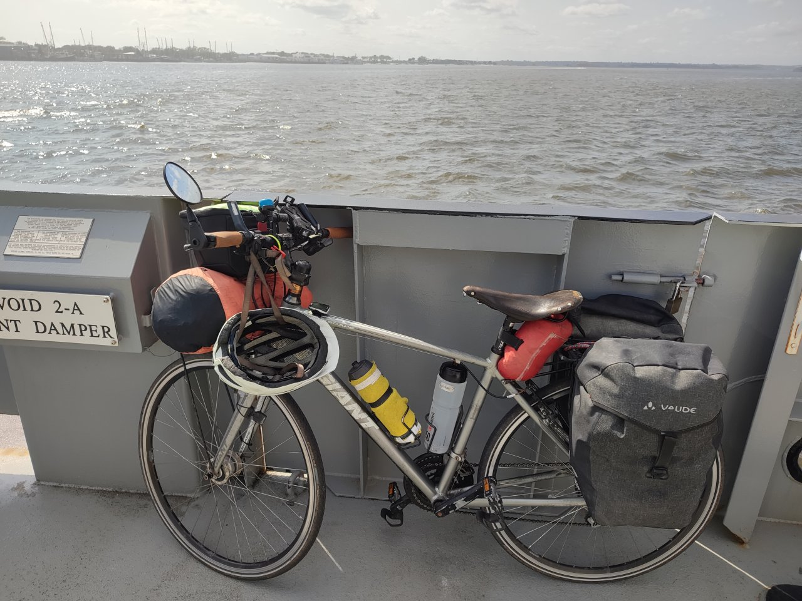

______
[2022/02/28]

### J5 - 28 février - Saint Augustine

Temps très moche, froid, du vent et de la pluie. Dan me propose de rester encore un jour et j'accepte avec reconnaissance. On va quand même faire un petit tour en ville. Saint Augustine est considérée comme la plus ancienne ville des Etats-Unis et il y a une zone avec plein de petites rues.

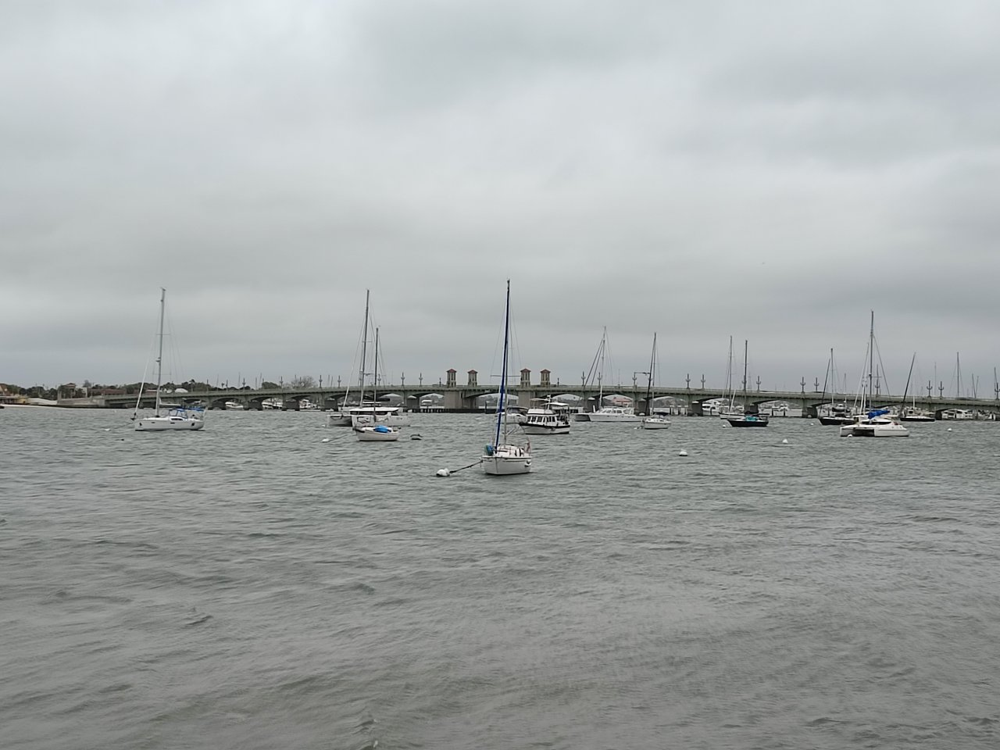

______
[2022/03/01]

### J6 - 1er mars - Palatka (Floride) - 50 km (293 km)

Départ tôt (8h), Dan doit changer de marina. Étape courte (avec un bout de vraie voie verte ) et vent favorable. Du coup, je fais tout mon possible pour traîner en route et arriver à 1pm pour rentrer dans mon logement. 

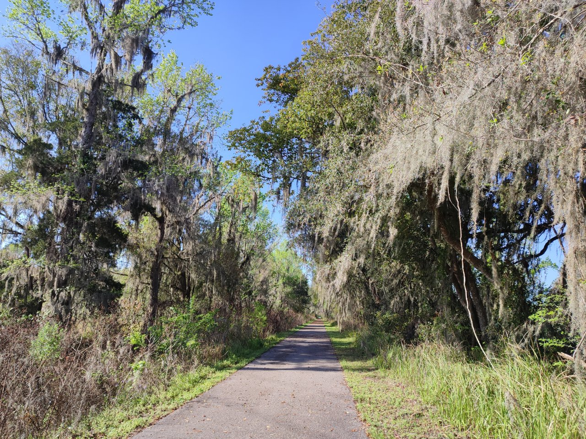

______
[2022/03/02]

### J7 - 2 mars - Gainesville (Floride) - 103 km (396 km)

Vingt kilomètres d'une belle voie verte quasiment rectiligne en sous-bois. Puis de la grosse quatre voies et de la deux voies dans la campagne. (En fait, la quatre voies, c'est plutôt mieux, plus de place sur le côté). Et pour finir, encore quinze kilomètres de belle voie verte. 

______
[2022/03/03]

### J8 - 3 mars - Ichetucknee Springs (Floride) - 65 km (461 km)

Pas de voies vertes aujourd'hui. Un peu de grosses routes et beaucoup de deux voies assez tranquilles au milieu de la campagne. Première nuit en camping (en campground). Dix dollars pour les cyclistes. Il y a même un âne qui gueule de temps en temps.

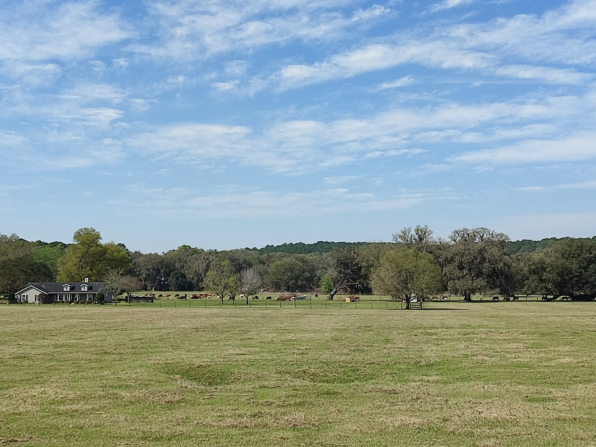
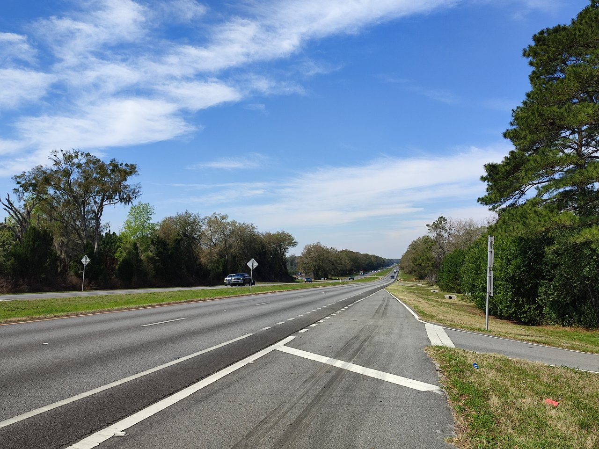

______
[2022/03/04]

### J9 - 4 mars - Suwannee River State Park (Floride) - 92 km (553 km)

Que des petites routes dans la campagne et vent favorable. Arrivé au parc, la ranger (une Philippine) me demande si j'ai réservé. Bien sûr que non mais c'est complet. Comme je suis à vélo, elle me propose quand même un emplacement réservé en cas de problème. Comme l'emplacement est bétonné, elle me dit de vérifier que je peux planter ma tente après la partie bétonnée. Un peu juste et un peu en pente, mais ça passe. Tout ça pour 38,40 dollars. Pas de monnaie et la CB ne passe pas, ça sera 40 dollars. Je lui demande combien de temps avant j'aurais dû réserver et elle me répond que ça peut être des mois avant. OK. Jolie balade le long de la rivière après l’installation.

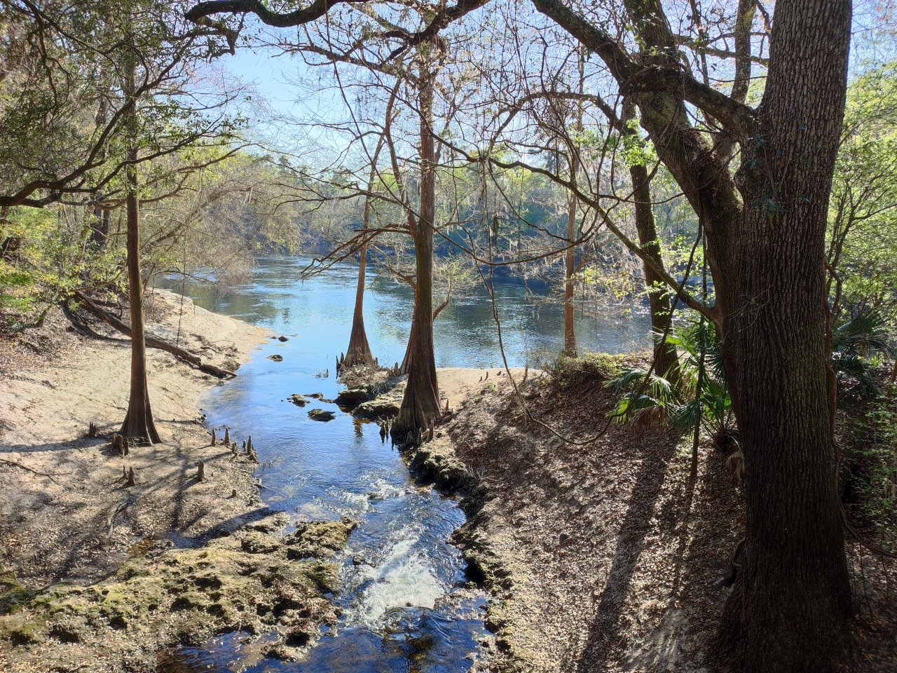
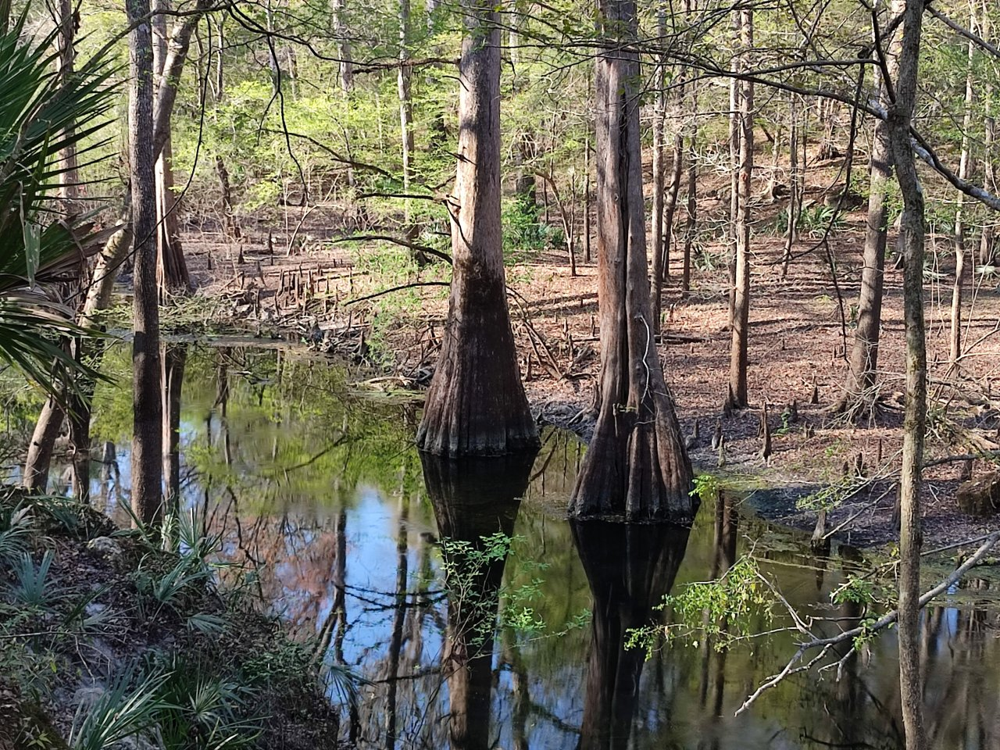

______
[2022/03/05]

### J10 - 5 mars - Tallahassee (Floride) - 125 km (678 km)

Grosse deux voies avec peu de circulation et vent favorable jusqu'à Monticello (70 premiers kilomètres). Après petites routes, puis grosses routes moins sympa, surtout à l’arrivée à Tallahassee. La route a obliqué vers le sud-ouest et le vent est moins sympa, plus de montées et descentes aussi. J'ai pris un WarmShowers à la Bicycle House, un endroit associatif qui répare des vélos. Dans ma chambre, matelas par terre et poignées de porte fabriquées avec des guidons de vélo. Les gens sont très sympas.

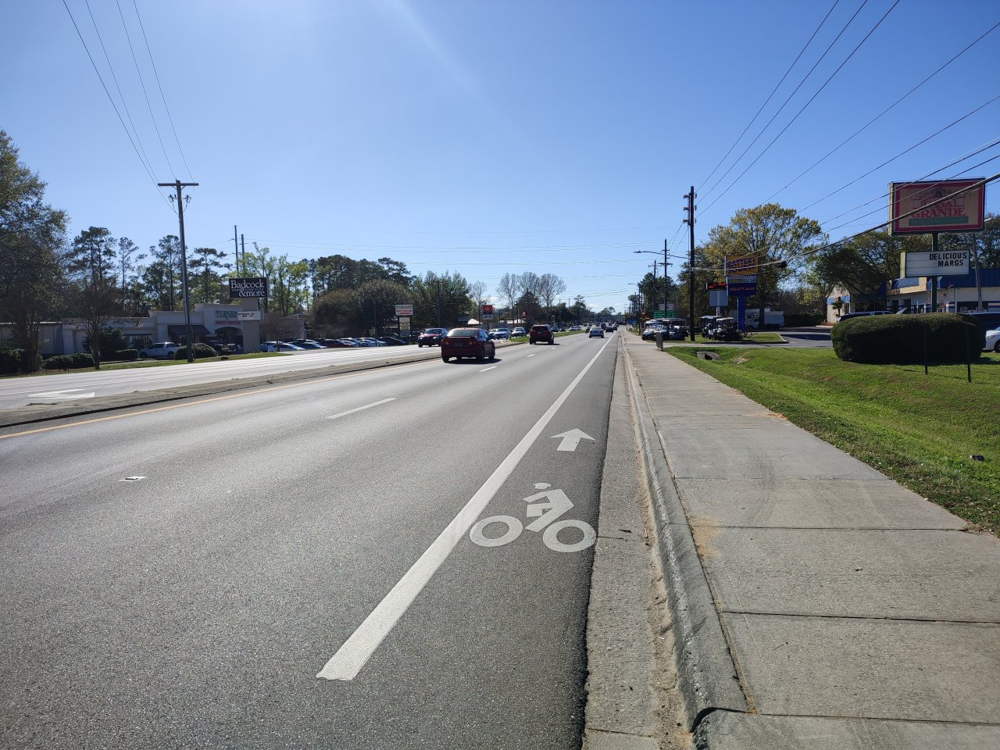

______
[2022/03/06]

### J11 - 6 mars - Tallahassee

Jour de repos. Ballade au parc à côté en allant faire des courses. Grosse partie de l'après-midi avec Scott, le propriétaire des lieux, qui me commente la route sur écran géant. Repas du soir avec un autre cycliste qui vient d'arriver et qui va faire la même route que moi.

______
[2022/03/07]

### J12 - 7 mars - Carrabelle (Floride) - 95 km (773 km) 

Roue avant à plat au départ. Une fois sorti de la ville, je pars pour quarante kilomètres de voies vertes parfaites. Ensuite, c'est moins bien surtout les quinze derniers kilomètres où il n'y a plus d'accotement. En fait, j'ai traversé la Floride (la presqu’île, pas l’état, l’état continue encore vers l'ouest) et je suis arrivé au bord du golfe du Mexique. Je suis hébergé par des amis de Scott de la Bicycle House de Tallahassee.

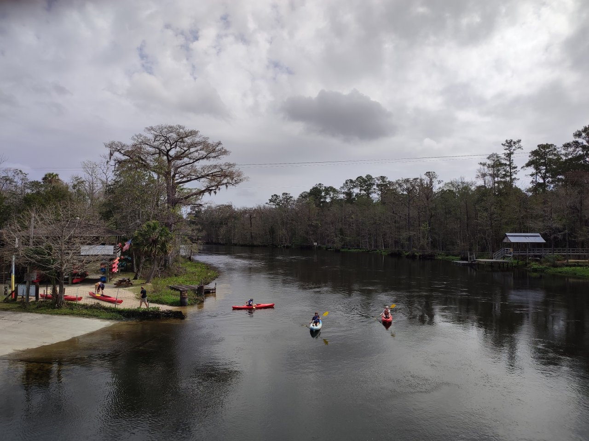
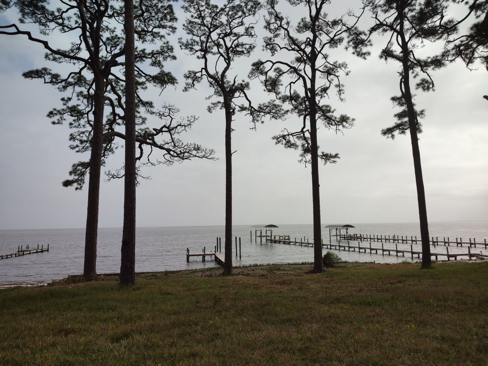
______
[2022/03/08]

### J13 - 8 mars - Indian Pass (Floride) - 71 km (844 km) 

Patricia et Michael sont adorables. Michael tient une boutique de vélo et avant mon départ, il règle les freins et les vitesses de mon vélo aux petits oignons. Et comme il fait ça en m'expliquant tout, j'en apprends plus en vingt minutes avec lui qu'en dix ans de vélo. Il m'accompagne ensuite pendant quelques kilomètres. Temps brumeux ie matin, plus dégagé mais quand même grisâtre ensuite. La route suit maintenant la mer, ou pas très loin, et le vent est favorable. Par contre, pluie attendue cette nuit et demain. Ce soir, dans un campground. Réfugié sous la tente sinon attaqué par les petits moucherons qui piquent.

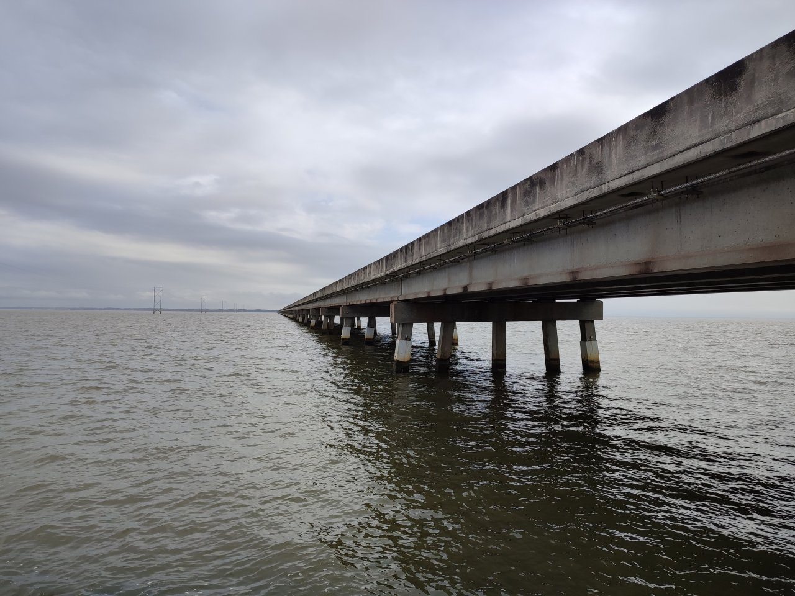

______
[2022/03/09]

### J14 - 9 mars - Panama City Beach (Floride) - 98 km (942 km) 

Un peu de pluie pendant la nuit mais départ au sec. À 10 heures, la pluie arrive à l'heure prévue. Au bout de quelques instants, c'est un déluge qui va durer une demi-heure. Heureusement, j'ai pu m'abriter. Ensuite, il va pleuvoir plus ou moins jusqu'au soir. Heureusement, il ne fait pas froid et c'est pas trop la misère. Scott et Michael m'avaient prévenu tous les deux que Panama City n’était pas très fréquentable et de rester sur la highway. C’est ce que je fais mais c'est une route énorme et pas sympa (deux fois quatre voies à un moment). Opération séchage dans la chambre du motel en arrivant.

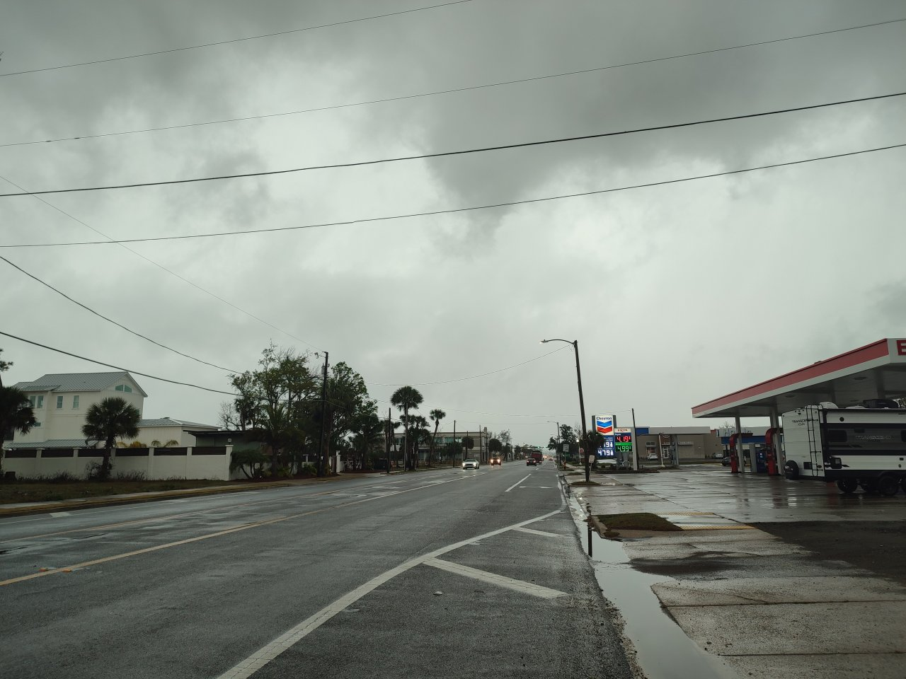

______
[2022/03/10]

### J15 - 10 mars - Fort Walton Beach (Floride) - 88 km (1030 km) 

J'ai réalisé hier soir qu'il y a un changement de fuseau horaire au milieu de la Floride, donc une heure de plus de décalage. Panama City Beach n'est pas exactement une petite station balnéaire. Grosses routes, buildings tout du long du front de mer et attractions gigantesques. Assez pénible d'en sortir. Après, ça va mieux et une grosse partie de la journée se passe sur une piste cyclable qui longe la route. En WarmShowers chez Tyler et Christina. Tyler me recommande d'aller voir le coucher de soleil sur la plage juste à coté. C’était une bonne idée ! Bien meilleur temps aujourd'hui, pluie annoncée pour demain.

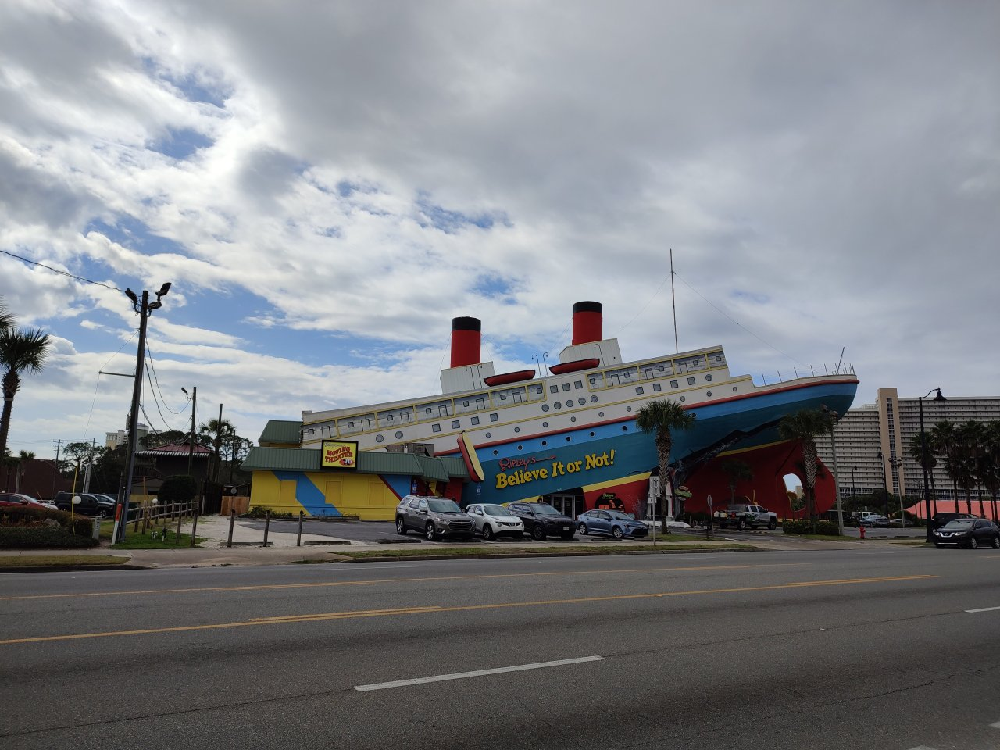
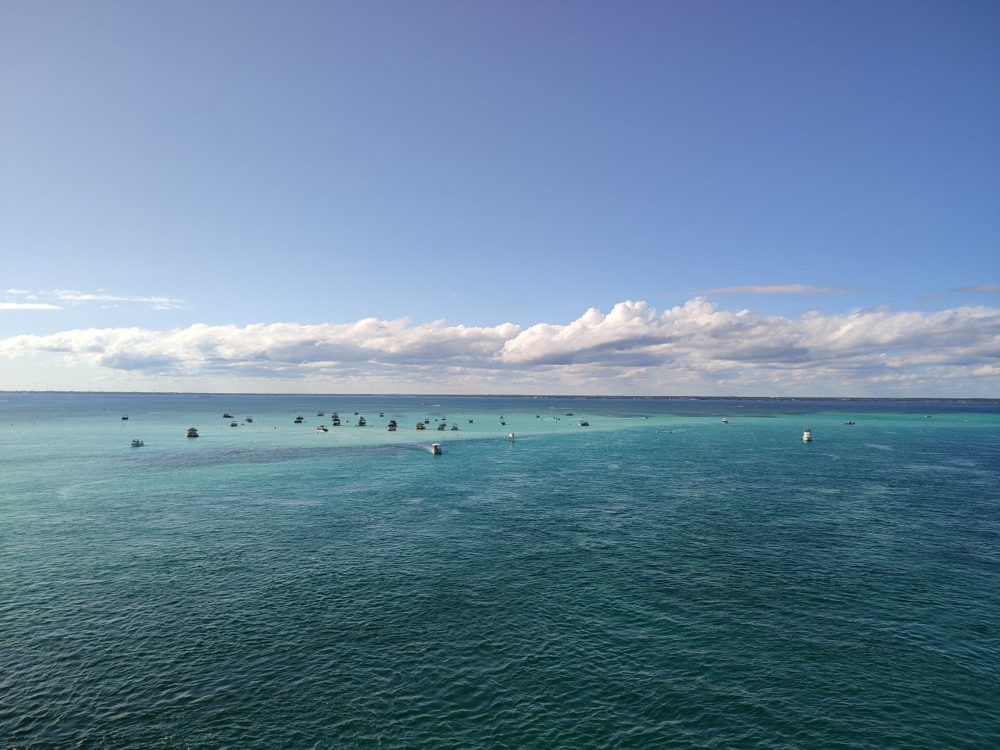

______
[2022/03/11]

### J16 - 11 mars - Pensacola (Floride) - 69 km (1099 km) 

Pluie le matin, j'attends 13h30 pour laisser passer la dernière averse. Première partie sur une quatre voies avec vent dans le dos. Deuxième partie sur une presqu’île étroite, en sable, la mer des deux côtés, et rien de construit sur des kilomètres. Malheureusement, ça se termine soudainement et curieusement par une résidence de plusieurs buildings de vingt étages. Ensuite, pour arriver à Pensacola, il faut passer un pont. Il a été abîmé par un ouragan et est en travaux. Selon les avis, il est ouvert ou fermé. Si il est fermé, c’est un détour de 70 kilomètres. Arrivé au début du pont, je constate que les voitures circulent mais que les voies piétons et vélos sont fermées, qu’il n'y a pas d'accotement et que le trafic est intense (c'est l'heure de pointe). Un peu embêté, je demande à quelqu'un comment on peut traverser. Après quelques explications, il me propose de mettre le vélo dans sa voiture et de m'emmener de l’autre coté. Reconnaissance infinie. En Airbnb sur le canapé du salon d'une maison partagée (21$, ça va). Le proprio, Victor est russe, ravagé par la guerre (il a des parents en Russie et en Ukraine, ses économies en roubles se sont effondrées) et il vient de perdre son chien renversé par une voiture. Pas au mieux de sa forme.

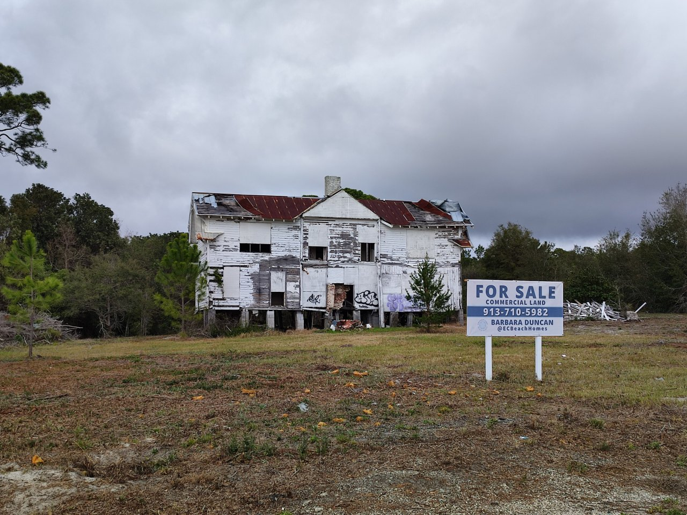

______
[2022/03/12]

### J17 - 12 mars - Pensacola

Jour de repos forcé. Beaucoup de vent, la température a chuté, 10º dans l'après-midi, 1º prévu cette nuit. Je n'ai pas trouvé d’hébergement en dur sur la route et je ne suis pas équipé pour passer une nuit sous la tente avec cette température. Je passe donc une journée et une nuit de plus dans mon Airbnb russe (Victor a son gamin et je les entends parler russe). Ça doit être mieux demain.

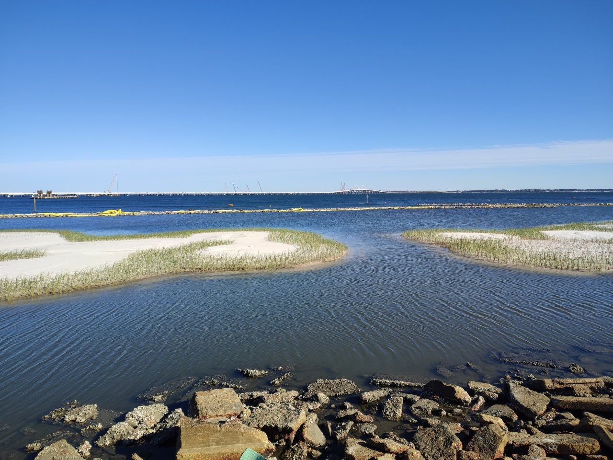
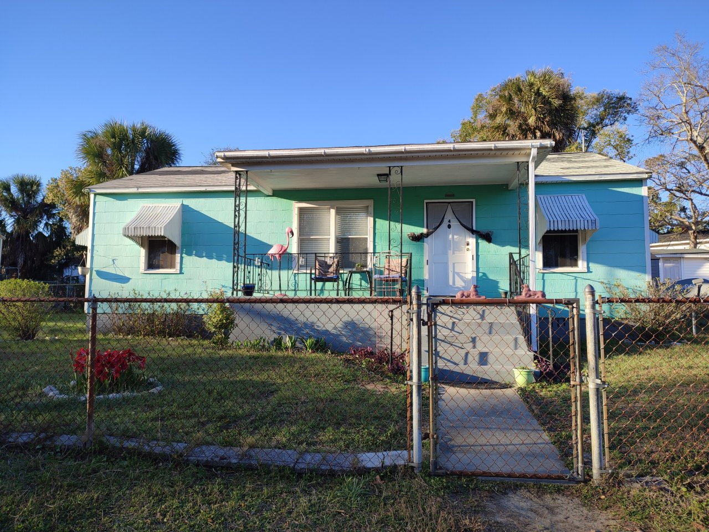
______
[2022/03/13]

### J18 - 13 mars - Dauphin Island (Alabama) - 94 km (1193 km) 

10º au réveil dans la maison. Pas mal de grosses routes, toujours avec accotement, et de la voie verte. Température supportable et vent favorable. Une demi-heure de ferry pour arriver dans l’île où je rejoins un WarmShowers. La maison est sur pilotis (comme beaucoup) et je campe sous la maison.

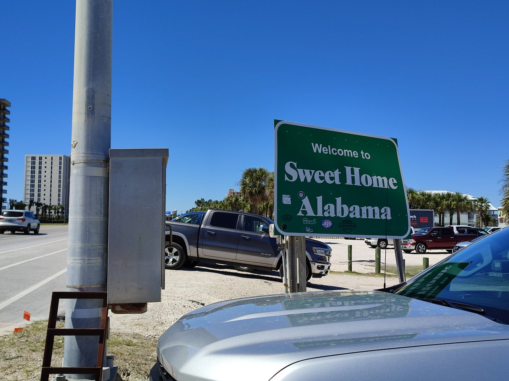
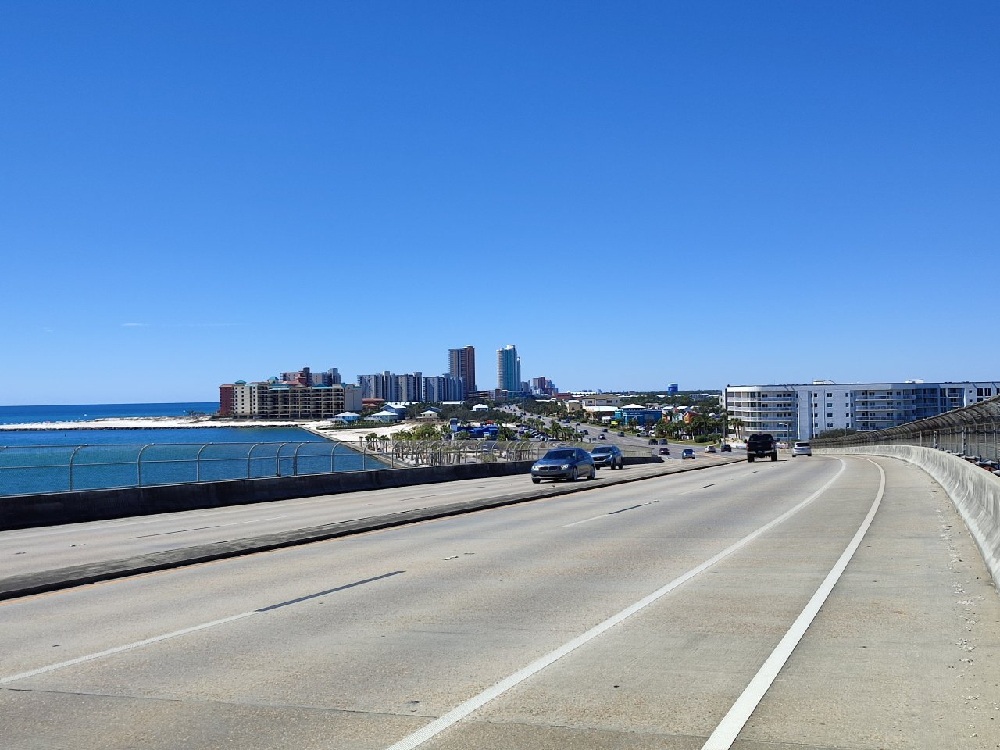

______
[2022/03/14]

### J19 - 14 mars - Pascagoula (Mississippi) - 72 km (1265 km) 

Tente secouée par le vent au petit matin. Ça se calme dans la journée et de toute façon, il va dans le bon sens. Sortie de l’île par un pont très long. Je m’arrête au bout du pont faire des photos et je suis rejoint par Czarina puis Matt. On avait partagé le même WarmShowers à Panama City Beach. Ils suivent la même route que moi, mais eux sont partis depuis huit mois et font le tour des États-Unis. Routes de toutes les tailles pour arriver ici (de la quatre voies à la petite route de campagne).

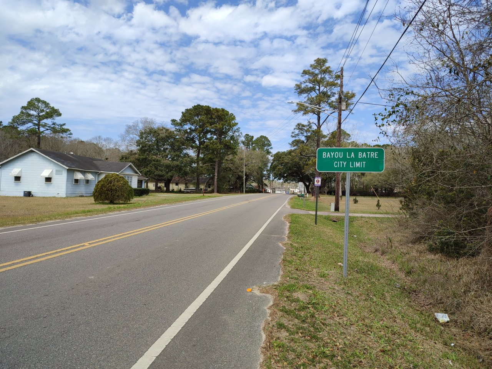

______
[2022/03/15]

Le propriétaire de la maison où j'ai campé sur Dauphin Island était absent, mais il m'avait prévenu que je ne serai pas seul. Effectivement, j'arrive un peu après une famille à qui j'explique que je vais camper sous la maison avec WarmShowers. Pas de soucis et ils me demandent si j'ai besoin de quelque chose. Dans la soirée, le monsieur viendra même m'offrir une bière. Le matin, j'ai eu un peu plus le temps de discuter avec lui et avec son fils Sawyer. Thanks a lot, Kyle!

______
[2022/03/15]

### J20 - 15 mars - Bay Saint Louis (Mississippi) - 93 km (1358 km) 

Grosses pluies ce matin qui se terminent à 11h, l'heure où je dois quitter le motel. Ça tombe bien. Grosse route pour commencer (une six voies pittoresque avec accotement confortable) puis traversée de Ocean Springs (station balnéaire à taille humaine) puis de Biloxi (station balnéaire que des buildings). Ensuite, ça continue par des kilomètres et des kilomètres de plages immenses longées sans intermédiaire par une quatre voies. Le vent est devenu moins sympa, surtout le long des plages (je roule à 11 km/h dans les plus mauvais moments). 

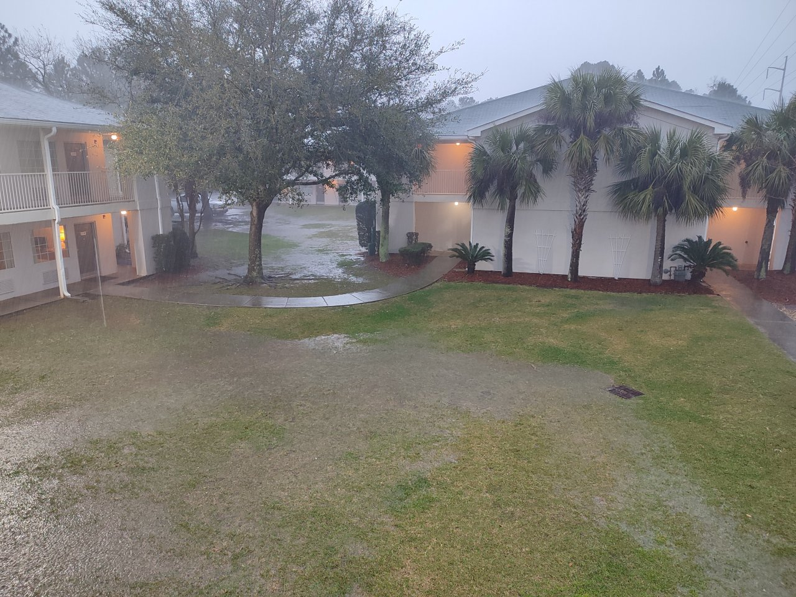

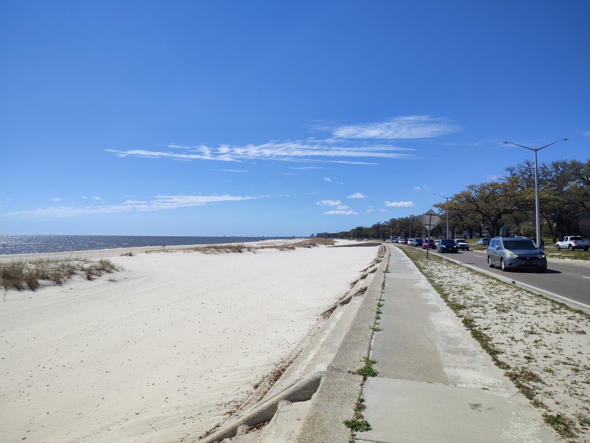
______
[2022/03/16]

### J21 - 16 mars - Nouvelle-Orléans (Louisiane) - 105 km (1463 km) 

Quarante premiers kilomètres en deux lignes droites (à peu près) pour arriver en Louisiane. Ensuite, je traverse une région de lacs avec de l'eau jamais très loin des deux cotés de la route. Arrivé à la Nouvelle-Orléans, je rejoins une proposition de WarmShowers. C'est loin du centre, dans une zone un peu limite et ça tient plutôt du squat occupé par des marginaux. Je me vois mal traverser la zone de nuit après une sortie en ville et je finis par réserver dans une auberge. Première sortie dans le centre pour aller manger. Effectivement, il y a de l'ambiance.

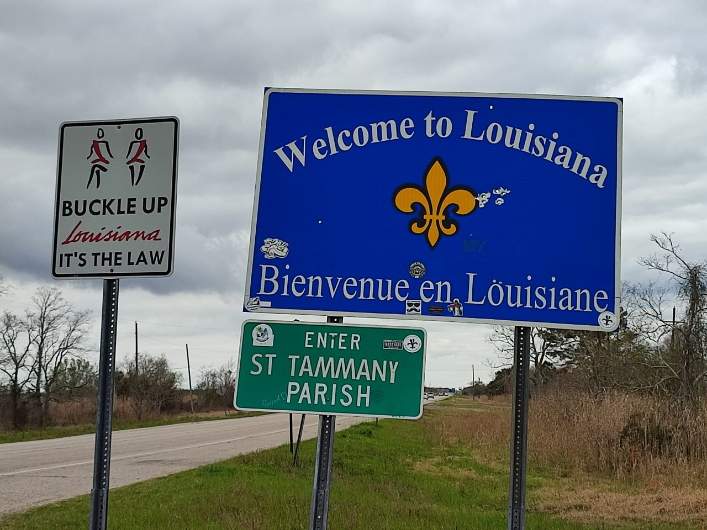

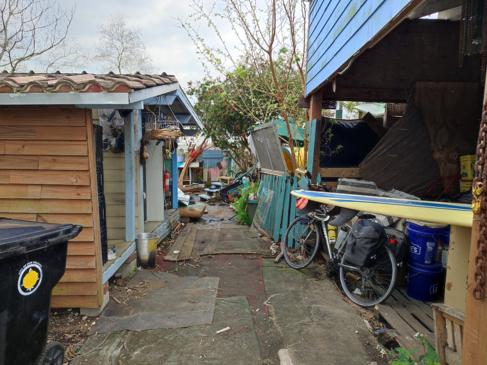
______

