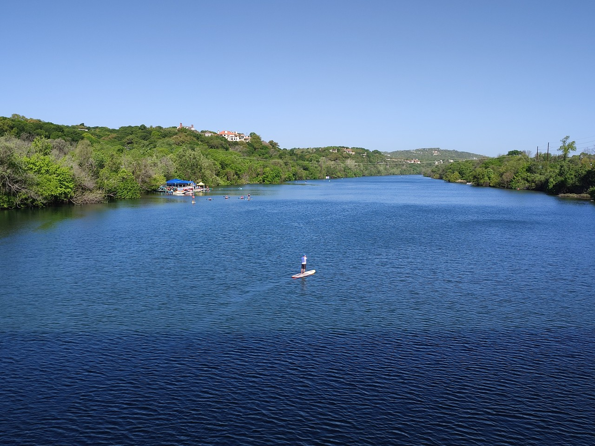
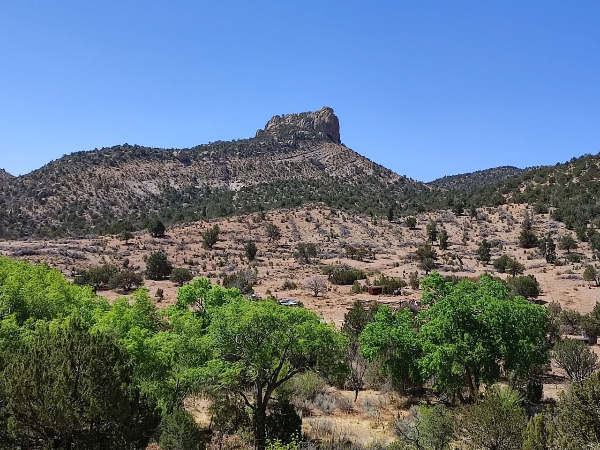
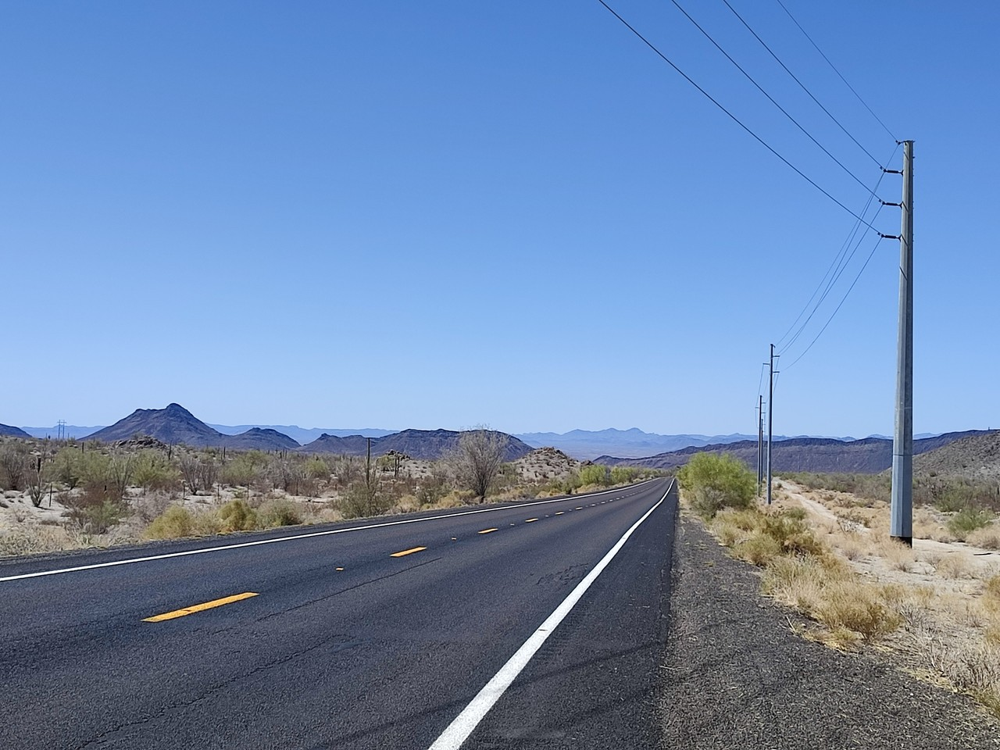

# Tour 2022 - part2

[2022/04/01]

[Début](../part1/index.html)
______
[2022/04/09]

### J45 - 9 avril - Johnson City (Texas) - 83 km (2751 km)

Départ par les parcs le long de la rivière, très fréquentés ce samedi matin, puis traversée d'une banlieue chic (vu la taille des maisons). Ensuite, des petites routes avec pas mal de circulation au début, puis de moins en moins. Pas mal de dénivelé (860 mètres), pas mal de vent, végétation plus basse et paysages plus secs. Je suis rentré dans la région des collines du Texas. J'ai croisé une cycliste (Jolene) puis, un peu plus tard, un anglais (qui habite à Vienne). Ils sont tous les deux aussi sur la Southern Tier et on échange des informations sur ce qui nous attend.

______
[2022/04/10]

### J46 - 10 avril - Fredericksburg (Texas) - 63 km (2814 km)

Petites routes, pas beaucoup de circulation ni d'habitations, même si c'est clôturé des deux côtés tout du long. Toujours du vent et du dénivelé. J'ai vu un tatou ! Pas pu faire une bonne photo, il a décampé, mais content quand même.

______
[2022/04/11]

### J47 - 11 avril - Hunt (Texas) - 81 km (2895 km)

Première partie sur des petites routes (voire toutes petites) sans circulation qui finissent par monter sur un plateau. Plus beaux paysages jusqu’à maintenant. Ensuite, la route redescend un peu, devient plus fréquentée et suit la Guadalupe river. On m'a déconseillé plusieurs fois de chercher un endroit pour dormir à côté de la route (le copain de Nicole s'est fait viré deux fois, les texans sont assez susceptibles concernant leur propriété). Alors, je passe la nuit dans un resort un peu au-dessus de mon budget, mais ça vaut le coup : deux pièces tout équipé au bord de la rivière avec baignade aménagée (j'en ai profité bien sûr).

______
[2022/04/12]

### J48 - 12 avril - Leakey (Texas) - 76 km (2971 km)

Petites routes presque sans voitures et très peu d'habitations. La route se balade entre 500 mètres au pied des collines et 700 mètres en haut des collines. Beaucoup de dénivelé, beaucoup de vent, 34º, mais des beaux paysages et un peu de sensation d'isolement.

______
[2022/04/13]

### J49 - 13 avril - Bracketville (Texas) - 116 km (3087 km)

Retour en haut des collines pendant trente kilomètres par des petites routes pour commencer la journée. Changement d'ambiance à Campwood, seule ville et seul point de ravitaillement aujourd’hui. C'est parti pour trente kilomètres de plus grosse route toute plate, plein sud, vent dans le dos, le bonheur. Ensuite, la route repart vers l'ouest et je retrouve le vent et un peu de dénivelé. Route et paysage assez vides.

______
[2022/04/14]

### J50 - 14 avril - Del Rio (Texas) - 52 km (3139 km)

Changement de décor, fin des collines, de moins en moins d'arbres. Route toute droite et toute plate. Vent presque toujours favorable. Je croise un cycliste, on discute cinq minutes et il me dit que j'ai fait la partie la plus fun.

______
[2022/04/15]

### J51 - 15 avril - Del Rio

Jour de repos. Visite du Whitehead Memorial Museum consacré à l'histoire de la ville et en particulier à celle du juge Roy Bean (https://fr.wikipedia.org/wiki/Roy_Bean).

______
[2022/04/16]

### J52 - 16 avril - Langtry (Texas) - 98 km (3237 km)

Maintenant, il n'y a presque plus d'arbres, paysages bien vides et vue sur l'horizon. Route moyenne, pas mal de camions, mais accotement large. Traversée de la rivière Pecos. Du coup, c'est officiel, je suis dans l'ouest sauvage. Arrivé à Langtry, visite rapide du musée Roy Bean. En fait, il n'y a pas grand chose à part une reconstitution du saloon où il officiait. Arrivée au motel, rustique, ambiance mexicaine, puis balade à un endroit appelé Eagle's Nest qui surplombe le Rio Grande. Endroit magnifique mais on ne voit que des arbres au fond du canyon. Croisé un cycliste ce matin (qui n'a vu que deux cyclistes dont moi depuis son départ de San Diego), puis deux autres l’après-midi.

______
[2022/04/17]

### J53 - 17 avril - Sanderson (Texas) - 96 km (3333 km)

Même ambiance qu'hier, un peu plus sec, un peu plus de dénivelé (je gagne 400 mètres d'altitude) et retour du vent en début d’après-midi. Arrivée à Sanderson roue arrière presque à plat. Je trouve un minuscule bout de fil de fer planté dans le pneu. Je pense que c'est un bout d'armature de pneu éclaté. J'ai lu un blog où le gars se plaignait de ça.

______
[2022/04/18]

### J54 - 18 avril - Marathon (Texas) - 89 km (3422 km)

Le vent a tourné dans la nuit et est devenu favorable. Pourvu que ça dure ! Encore gagné 400 mètres d'altitude (puis reperdu un peu), mais ça monte de façon insensible (rarement plus de 1%). Sanderson et la route sur les cinquante premiers kilomètres sont entourés de collines. Du coup, paysages supers et super étape. Le WarmShowers de Marathon m'a aiguillé sur un endroit original, La Loma del Chivo, qui reçoit des hôtes dans des chambres new age un peu décaties. On m'a donné la Ruche, toute petite chambre très agréable en forme de dôme.

______
[2022/04/19]

### J55 - 19 avril - Marfa (Texas) - 94 km (3516 km)

Départ vent calme, puis moment d'euphorie quand le vent s'est levé et qu'il est favorable. Malheureusement, la route change d'orientation et ça ne dure pas longtemps. Pente un peu plus accentuée aujourd’hui et à force de monter, je franchis le col du Paisano (Paisano Pass) à 1500 mètres. En fait, la pente est tellement faible qu'il y a même un train parallèle à la route. Après le col, la paysage change et ca devient tout plat. En WarmSowers, chez Manu, mais je ne le verrai pas. Parti dans le centre du Texas, il n'a pas le temps de revenir et passe la nuit ailleurs. Dommage.

______
[2022/04/20]

### J56 - 20 avril - Valentine (Texas) - 61 km (3577 km)

Finalement, mon hôte, Manu, arrive juste avant que je parte. Franco-québécois, il parle français et a encore de la famille en France. Il s’est installé à Marfa à cause de sa proximité avec le parc national de Big Bend (je me suis posé la question d'y aller mais il aurait fallu une semaine de plus). Départ tardif après café et discussion. Ça commence à descendre mais de façon insensible. À peu près toute la journée sur une seule ligne droite. Paysage plat et vide des deux côtés avec des collines au loin. Plaine à 1400 mètres, le vent d’ouest se régale. Pas moi.

______
[2022/04/21]

### J57 - 21 avril - Sierra Blanca (Texas) - 116 km (3693 km)

Départ à 8h pour essayer d’échapper un peu au vent. Ça ne marche pas tout à fait. Quelques kilomètres après le départ, crevaison. Cette fois, c'est une petite épine. En fait, il y a plein de petites épines dans les deux pneus et je les enlève à la pince à épiler. J'ai dû rouler dans un truc qui fallait pas. Retour du vent à 10h30. Fin de la plaine à Van Horn. Là, ma route me fait prendre un bout d'Interstate 10, de la grosse route, mais ça traverse les collines et c'est quand même pas mal. Après les collines, nouvelle plaine, petite route parallèle à la Interstate et vent moins défavorable.

______
[2022/04/22]

### J58 - 22 avril - Fort Hancock (Texas) - 72 km (3765 km)

Quarante premiers kilomètres sur la petite route qui suit l'Interstate. Ensuite, c'est une petite route déserte entre l'Interstate et la frontière. D'abord complètement isolée puis dans un paysage agricole. Il y a des canaux d'irrigation qui doivent être alimentés par le Rio Grande tout proche. Paysages toujours aussi intéressants mais il fait un peu chaud, 35°.

______
[2022/04/23]

### J59 - 23 avril - El Paso (Texas) - 85 km (3850 km)

Fin des petites routes. De plus en plus urbanisé et de plus en plus de circulation. Moins chaud. Je croise un canadien en mode ultraléger (pas celui de la photo) qui me dit que le vent devrait changer de direction à partir de lundi. Ça serait une bonne idée.

______
[2022/04/24]

La route jusque là.

______
[2022/04/25]

Deux jours de repos. Commencé par chercher un magasin de vélos pour acheter un pneu et deux chambres à air. Ensuite, petit tour coté mexicain pour dire que j'y ai été et pour voir le Rio Grande. En fait de Grande, c'est plutôt un canal un peu zone. Aujourd'hui, c’était entretien vélo, préparation des prochaines étapes, courses et balade dans un parc pas trop loin.

______
[2022/04/26]

### J62 - 26 avril - Las Cruces (Nouveau-Mexique) - 85 km (3995 km)

Après la sortie de El Paso, treize kilomètres de piste cyclable très agréable le long du Rio Grande. Nettement plus joli qu'en pleine ville mais pas une goutte d'eau. Ensuite, c'est de la campagne avec beaucoup de plantations de pécan. Je retrouve le Rio Grande près de Las Cruces et là il y a juste un peu d'eau.

______
[2022/04/27]

### J63 - 27 avril - Caballo (Nouveau-Mexique) - 104 km (4039 km)

La route suit à peu près le Rio Grande vers le nord. Changement de paysage à Radium Springs où les collines se rapprochent et où ça devient un peu plus aride. Ça redevient un paysage de plaine un peu après, quand même un peu plus sec mais avec toujours des cultures et des plantations de pécan. Vent revenu au sud-ouest mais pas trop gênant aujourd'hui.

______
[2022/04/28]

### J64 - 28 avril - Mimbres (Nouveau-Mexique) - 88 km (4127 km)

Direction à l'ouest vers les collines, puis dans les collines et ça monte jusqu'au col d'Emory (Emory pass) à 2500 mètres. 1200 mètres de dénivelé pour 1500 mètres de dénivelé positif (la somme de toutes les montées). Ça monte assez doucement à 4 ou 5% sans dépasser 7%. Un point de vue est aménagé au sommet et surplombe toute le région que je viens de traverser.

______
[2022/04/29]

### J65 - 29 avril - 20 km au sud de Silver City (Nouveau-Mexique) - 66 km (4193 km)

J'avais décidé de faire une petite étape (40 km) pour couper une grosse étape en deux. Arrivé à Silver City, tout est complet (sauf les hôtels à plus de 100$) parce qu'il y a une course cycliste. Je vais faire des courses parce qu'il ne me reste plus grand chose et je fais vingt kilomètres supplémentaires jusqu'à un RV park complètement isolé dans les collines. Paysage moins spectaculaire aujourd’hui, ça a l'air de devenir plus plat mais presque mille mètres de D+ quand même entre 1700 et 1900 mètres.

______
[2022/04/30]

### J66 - 30 avril - Lordsburg (Nouveau-Mexique) - 52 km (4245 km)

Première partie dans les collines. Très beaux paysages, j'aurais presque envie de descendre du vélo et le pousser pour en profiter plus longtemps. Deuxième partie, une immense descente, qui passe en gros de 1800 mètres à 1300 mètres en une seule ligne droite, et qui se termine dans une grande plaine complètement plate. Étonnant comme changement de paysage. Dans la descente, je croise un couple d'anglais qui va faire la même route que moi. Premiers cyclistes depuis 500 kilomètres.

______
[2022/05/01]

### J67 - 1er mai - Duncan (Arizona) - 61 km (4306 km)

Même paysage qu'hier et arrivée en Arizona. Je croise un Espagnol qui va en Floride, mais lui, il est parti de Perth en Australie, traversé l'Australie, et pris l'avion à Sydney pour Los Angeles. Pas mal. Je passe la nuit dans un endroit très douillet, plein de tableaux et de belles choses, surprenant dans un tout petit endroit comme Duncan.

______
[2022/05/02]

### J68 - 2 mai - Safford (Arizona) - 64 km (4370 km)

Début du trajet dans les collines avec des super paysages. Puis la route sort des collines pour arriver dans une plaine aride. Finalement, la plaine devient cultivée, les habitations plus nombreuses et la circulation plus importante.

______
[2022/05/03]

### J69 - 3 mai - Apache Gold RV Park (Arizona) - 116 km (4486 km)

Trente premiers kilomètres de cultures puis ça redevient désert. Encore trente kilomètres et c'est le retour du vent, des collines mais aussi des beaux paysages. Par contre, pas mal de circulation. Et presque tout du long, l’accotement est crevassé tous les quelques mètres, très inconfortable. La route traverse une réserve indienne. À Peridot (20 km avant le RV park), je m’arrête dans un supermarché prendre une boisson, que des indiens.

______
[2022/05/04]

### J70 - 4 mai - Tonto Basin (Arizona) - 101 km (4587 km)

Dix kilomètres pour arriver à Globe, une petite ville. Encore quelques kilomètres et je quitte la route d'hier, qui va directement à Phoenix, pour prendre la direction du nord. Ensuite une grande montée (ça monte de 200 mètres) suivie d'une grande descente (ça descend de 400 mètres) vers un lac de barrage. Super point de vue et super paysages comme tout le reste de la journée. Il y a un parc national sur la route avec deux villages indiens dans les falaises alors je fais le détour. L’accès au plus grand village est fermé et je monte (à pied) au plus petit. Le paysage était super au niveau du lac mais ça devient encore plus beau en montant vers le village. Après la visite, plus que 40 kilomètres pour arriver au motel. La dame (qui s'appelle Rochelle) me demande 90$. Je prends un air éberlué en demandant si il n'y a pas une autre solution et elle me dit 70$, manifestement de préférence en cash. Je sors un billet de vingt, puis deux, puis trois et la dame finit par me dire que ça va comme ça.

______
[2022/05/05]

### J71 - 5 mai - Usery Mountain Regional Park (Arizona) - 106 km (4693 km)

Après une vingtaine de kilomètres vers le nord, je retrouve une quatre voies direction sud ouest vers Phoenix. Longue montée qui fait passer de 900 à 1300 mètres (en fait, ça monte de 200, redescend de 200 et remonte de 400 mètres). Malgré la quatre voies, les paysages sont superbes, peut-être parce que les collines sont plus découpées. Après soixante kilomètres de quatre voies, je suis des routes moins larges pour rejoindre le parc. Paysages plus escarpé avec des éboulis et des falaises. Mention spéciale à la dernière montée de 200 mètres pour arriver au parc (et aux 1500 mètres de D+ dans la journée).

______
[2022/05/06]

### J72 - 6 mai - Phoenix (Arizona) - 85 km (4778 km)

Avant de reprendre la route, je pars faire un sentier qui monte presque en haut de la falaise qui domine le parc. L’arrivée est dans une wind cave, un porche sculpté par le vent. Montée dans les cactus et paysage grandiose. La civilisation revient très vite après le parc. Rues interminables avec des alignements de maisons, de plus en plus de trafic, mais je passe d'est en ouest sans voir le centre de Phoenix. Il y a quelques canaux qui traversent la zone. Google me fait suivre l'un deux pour rejoindre le AirBnB. Ça me donne l'occasion de croiser les sans-abri qui squattent le long du canal et dont on m'avait parlé sur la route.

______
[2022/05/08]

L'Arizona c'est "The Grand Canyon State".  Même si c'est à 400 kilomètres de Phoenix, c'est l'occasion ou jamais, et j'ai pris une excursion pour y aller. Pas déçu. C'est énorme, beau et impressionnant.

______
[2022/05/10]

### J76 - 10 mai - Wickenburg (Arizona) - 104 km (4882 km)

Sortie de Phoenix en suivant d'abord des canaux (sans homeless) puis une très belle piste cyclable qui suit le lit d'une rivière. Ensuite, grosse route puis route moyenne qui traverse un paysage de buissons et de cactus. À vingt kilomètres de l’arrivée, une voiture s’arrête. Le gars me demande où je vais et me propose de m'y déposer. Je n'ai pas voulu rentrer dans les détails du code d'honneur cyclotouriste mais je l'ai remercié chaleureusement quand même. RV park pas cher, dix dollars, mais l'installation se fait sous des arbres à mûres (en tout cas, ça y ressemble) et je choisis l'endroit où il y en a le moins. À un moment, en train de manger, je me dis, tiens, j'avais pas vu qu'il y avait de l'eau. En fait, de l'eau est en train de remonter à l'endroit où j’ai installé la tente et je me retrouve à patauger dans deux trois centimètres d'eau. Fin du repas expédiée et déménagement de la tente.

______
[2022/05/11]

### J77 - 11 mai - Salome (Arizona) - 89 km (4971 km)

Toute la journée sur la même route presque toute droite. Tout plat et des collines de chaque côté un peu plus loin. Et du vent.

______
[2022/05/12]

### J78 - 12 mai - Quartzsite (Arizona) - 67 km (5038 km)

À peu près le même paysage qu'hier. Par contre, le vent est moins défavorable et l’étape est plus courte. C'est peut-être pour ça que je profite plus du paysage, et c'est quand même pas mal, malgré les retrouvailles avec l'Interstate 10 sur une vingtaine de kilomètres. C'est déjà l’été ici et les trucs commencent à fermer (un des RV park ici ou la cuisine d'une station où je me suis arrêté) parce qu'il va faire trop chaud.

______
