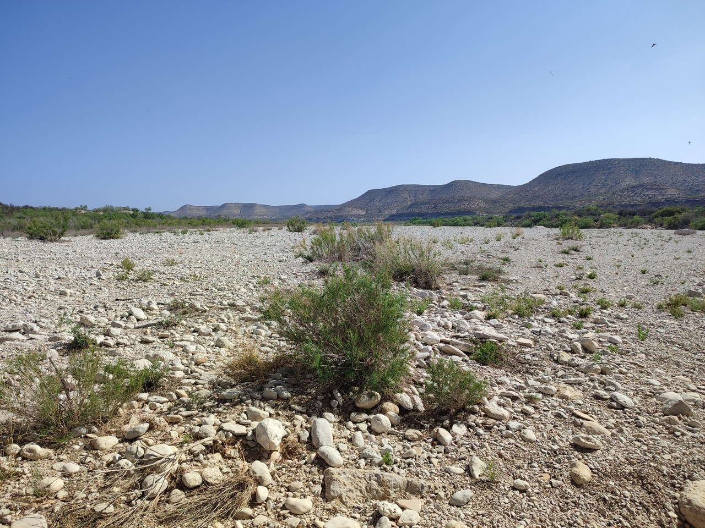

# Tour 2022 - part2

[2022/04/01]

[Début](../part1/index.html)
______
[2022/04/09]

### J45 - 9 avril - Johnson City (Texas) - 83 km (2751 km)

Départ par les parcs le long de la rivière, très fréquentés ce samedi matin, puis traversée d'une banlieue chic (vu la taille des maisons). Ensuite, des petites routes avec pas mal de circulation au début, puis de moins en moins. Pas mal de dénivelé (860 mètres), pas mal de vent, végétation plus basse et paysages plus secs. Je suis rentré dans la région des collines du Texas. J'ai croisé une cycliste (Jolene) puis, un peu plus tard, un anglais (qui habite à Vienne). Ils sont tous les deux aussi sur la Southern Tier et on échange des informations sur ce qui nous attend.

______
[2022/04/10]

### J46 - 10 avril - Fredericksburg (Texas) - 63 km (2814 km)

Petites routes, pas beaucoup de circulation ni d'habitations, même si c'est clôturé des deux côtés tout du long. Toujours du vent et du dénivelé. J'ai vu un tatou ! Pas pu faire une bonne photo, il a décampé, mais content quand même.

______
[2022/04/11]

### J47 - 11 avril - Hunt (Texas) - 81 km (2895 km)

Première partie sur des petites routes (voire toutes petites) sans circulation qui finissent par monter sur un plateau. Plus beaux paysages jusqu’à maintenant. Ensuite, la route redescend un peu, devient plus fréquentée et suit la Guadalupe river. On m'a déconseillé plusieurs fois de chercher un endroit pour dormir à côté de la route (le copain de Nicole s'est fait viré deux fois, les texans sont assez susceptibles concernant leur propriété). Alors, je passe la nuit dans un resort un peu au-dessus de mon budget, mais ça vaut le coup : deux pièces tout équipé au bord de la rivière avec baignade aménagée (j'en ai profité bien sûr).

______
[2022/04/12]

### J48 - 12 avril - Leakey (Texas) - 76 km (2971 km)

Petites routes presque sans voitures et très peu d'habitations. La route se balade entre 500 mètres au pied des collines et 700 mètres en haut des collines. Beaucoup de dénivelé, beaucoup de vent, 34º, mais des beaux paysages et un peu de sensation d'isolement.

______
[2022/04/13]

### J49 - 13 avril - Bracketville (Texas) - 116 km (3087 km)

Retour en haut des collines pendant trente kilomètres par des petites routes pour commencer la journée. Changement d'ambiance à Campwood, seule ville et seul point de ravitaillement aujourd’hui. C'est parti pour trente kilomètres de plus grosse route toute plate, plein sud, vent dans le dos, le bonheur. Ensuite, la route repart vers l'ouest et je retrouve le vent et un peu de dénivelé. Route et paysage assez vides.

______
[2022/04/14]

### J50 - 14 avril - Del Rio (Texas) - 52 km (3139 km)

Changement de décor, fin des collines, de moins en moins d'arbres. Route toute droite et toute plate. Vent presque toujours favorable. Je croise un cycliste, on discute cinq minutes et il me dit que j'ai fait la partie la plus fun.

______
[2022/04/15]

### J51 - 15 avril - Del Rio

Jour de repos. Visite du Whitehead Memorial Museum consacré à l'histoire de la ville et en particulier à celle du juge Roy Bean (https://fr.wikipedia.org/wiki/Roy_Bean).

______
[2022/04/16]

### J52 - 16 avril - Langtry (Texas) - 98 km (3237 km)

Maintenant, il n'y a presque plus d'arbres, paysages bien vides et vue sur l'horizon. Route moyenne, pas mal de camions, mais accotement large. Traversée de la rivière Pecos. Du coup, c'est officiel, je suis dans l'ouest sauvage. Arrivé à Langtry, visite rapide du musée Roy Bean. En fait, il n'y a pas grand chose à part une reconstitution du saloon où il officiait. Arrivée au motel, rustique, ambiance mexicaine, puis balade à un endroit appelé Eagle's Nest qui surplombe le Rio Grande. Endroit magnifique mais on ne voit que des arbres au fond du canyon. Croisé un cycliste ce matin (qui n'a vu que deux cyclistes dont moi depuis son départ de San Diego), puis deux autres l’après-midi.

______
[2022/04/17]

### J53 - 17 avril - Sanderson (Texas) - 96 km (3333 km)

Même ambiance qu'hier, un peu plus sec, un peu plus de dénivelé (je gagne 400 mètres d'altitude) et retour du vent en début d’après-midi. Arrivée à Sanderson roue arrière presque à plat. Je trouve un minuscule bout de fil de fer planté dans le pneu. Je pense que c'est un bout d'armature de pneu éclaté. J'ai lu un blog où le gars se plaignait de ça.

______
[2022/04/18]

### J54 - 18 avril - Marathon (Texas) - 89 km (3422 km)

Le vent a tourné dans la nuit et est devenu favorable. Pourvu que ça dure ! Encore gagné 400 mètres d'altitude (puis reperdu un peu), mais ça monte de façon insensible (rarement plus de 1%). Sanderson et la route sur les cinquante premiers kilomètres sont entourés de collines. Du coup, paysages supers et super étape. Le WarmShowers de Marathon m'a aiguillé sur un endroit original, La Loma del Chivo, qui reçoit des hôtes dans des chambres new age un peu décaties. On m'a donné la Ruche, toute petite chambre très agréable en forme de dôme.

______
