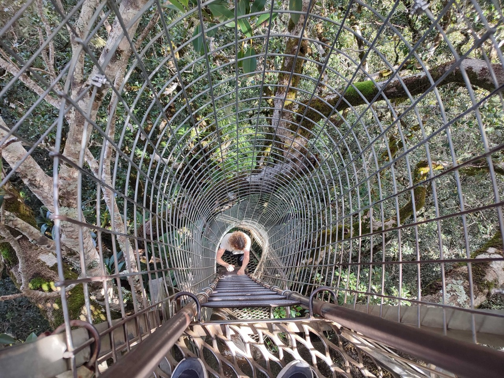
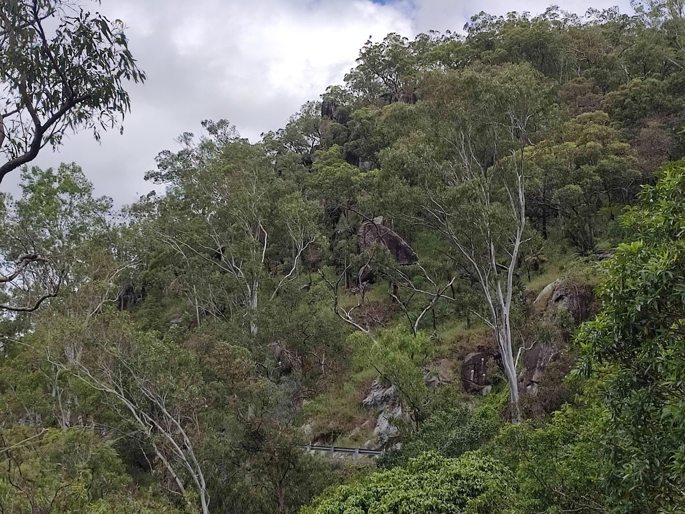

# Australie 2023 - part1

[2000/01/01]

On peut cliquer sur la route ou les étapes pour aller directement au jour mais
le dernier jour [c'est ici](#{LASTDATE}). Cliquez sur </img> pour passer la carte en plein écran (Esc pour sortir du plein écran).  Cliquez sur les images pour agrandir. Et pour tous les journaux  les voyages, [c'est par ici](https://gilles-arcas.blogspot.com/2020/09/home_31.html).
______
[2023/03/15]

{MAPPOST map.html}
{MAPFULL maplocal.html}
______
[2023/03/16]

### J1 - 16 mars - Melbourne - 22 km (+ 17000 km en avion)

Voyage un peu longuet, 6h30 jusqu'à Dubaï puis 13h30 jusqu'à Melbourne. Coup de bol, il y a une place libre à coté de moi dans les deux vols, ça permet de s'allonger un peu. Atterrissage à 22h30, une heure pour passer les contrôles et récupérer le vélo, encore une heure pour le remonter. Arrivée, dans le crachin, passé deux heure du matin à l'auberge.

______
[2023/03/17]

### J2 - 17 mars - Melbourne

Rendez-vous avec le père de Mathieson pour le déjeuner. Mathieson, c'est l'Australienne que j'avais hébergée il y a une dizaine d’années quand elle était venue avec son école. Elle a bien fait son chemin depuis, parle couramment français, et c’est grâce à elle que j'ai eu l’idée de mon premier voyage en Australie. Reste de la journée à tourner dans le CBD (le Central Business District, le centre quoi) pour trouver des cartouches de gaz, une carte SIM (chez Telstra, l’opérateur principal, on me dit de l'acheter dans une grande surface, ça sera deux fois moins cher), un adaptateur de prise de courant (que je pensais avoir) et du ravitaillement de base.

______
[2023/03/18]

### J3 - 18 mars - Melbourne - 26 km (48 km)

Un petit circuit trouvé sur komoot pour se réchauffer les mollets. Il traverse le centre, suit la rivière Yarra, contourne un lac et longe la plage à St Kilda. Pas trop mal, beaucoup de pistes cyclables et pour le reste, il y a presque toujours un couloir pour les vélos.

______
[2023/03/19]

### J4 - 19 mars - Hastings - 81 km (129 km)

Temps moyen, 18°, grisâtre, pas mal de vent pas toujours défavorable. La route enchaîne les pistes cyclables, d’abord en bord de mer, mais aussi en bord de routes ou de voies ferrées. La réception du camping park que j’avais repéré ferme à 15h (15h !). Comme il n’y a rien d’autre dans le coin, je fais le plein d’eau et je vais chercher un coin tranquille dans les bois en sortie de la ville pour passer la nuit (pas mal de moustiques par contre).

______
[2023/03/20]

### J5 - 20 mars - Cape Paterson - 69 km (198 km)

Du soleil mais toujours température un peu juste et beaucoup de vent. Encore beaucoup de pistes cyclables et voies vertes, dont une qui surplombe la mer pendant quelques kilomètres. Et un ferry pour traverser un petit bras de mer. En attendant le ferry, je discute avec quelqu’un qui me dit que mon anglais n’est pas mauvais. C’est gentil surtout que je lui fait répéter presque tout ce qu’il me dit. Caravan Park à 49$ (30E) mais avec accès sur la mer. Encore plus de vent que sur la route, personne dans l’eau mais j’en profite quand même pour me tremper les pieds.

______
[2023/03/21]

### J6 - 21 mars - Port Welshpool - 87 km (285 km)

Beaucoup de vent pendant la nuit (avec la toile de tente qui fait flap flap). Beaucoup de vent aussi pendant la journée avec retour du temps gris. Première partie sur de la route pas trop fréquentée et quarante derniers kilomètres sur une belle voie verte, la Great Southern Rail Trail. Fish & chips au dîner, ça cale plus que les nouilles chinoises, et retour au caravan park sous la pluie.

______
[2023/03/22]

### J7 - 22 mars - Sale - 108 km (393 km)

Presque que de la route aujourd’hui, assez tranquille, quelque gros camions quand même. Le beau temps est revenu dans l’après-midi et il y a beaucoup moins de vent, plutôt dans la bonne direction.

______
[2023/03/23]

### J8 - 23 mars - Bairnsdale - 77 km (470 km)

Ciel plombé toute le journée mais moins de vent. Que de la route. Paysage plat comme la main en début de journée, après c’est un peu plus mouvementé. Pas grand-chose à voir, à part des prés de chaque côté de la route, mais le regard porte loin. Caravan park à cinquante mètres de la highway, bof bof.

______
[2023/03/24]

### J9 - 24 mars - Nowa Nowa - 59 km (529 km)

Toute la journée sur la East Gippsland Rail Trail, une belle voie verte ancienne voie ferrée. Au début, la voie traverse des prés, souvent cachés par la végétation, ensuite ce n’est plus que de la forêt. Un peu de dénivelé (400 mètres de D+) mais la pente ne dépasse pas un ou deux pour cent (puisque c'est le train qui passait par là). Croisé plusieurs vélos dont un cycliste longue distance (en fait, je n’ai compris ni d’où il venait ni où il allait).

______
[2023/03/25]

Hier soir, en mangeant dans la petite cuisine du caravane park, causette avec une vielle dame venue dans son van. Elle me dit que son cardiologue est français, qu’elle en est à son troisième pace maker et qu’il n’y en aura pas de quatrième. Après ça, deux cyclistes arrivent, ce sont deux américains, dont un parle français, et qui sont sur la même route que moi. Ils me demandent le prix de l’emplacement puis disparaissent en m’expliquant qu’ils n’aiment pas trop payer pour passer la nuit.

______
[2023/03/25]

### J10 - 25 mars - Cowrie Bay - 77 km (606 km)

Quarante premiers kilomètres sur la voie verte. Ensuite, c’est de la route qui longe la Snowy River jusqu’à son estuaire, puis qui suit la mer d’assez loin. Arrivé au caravan park, je vérifie qu’il n’y a pas d’eau potable (j’avais anticipé). Personne à la réception, il faut appeler, mais les prix sont affichés. 45$ pour un emplacement. J’ai de l’eau, je recharge mon téléphone dans les toilettes, et je fais comme les américains d’hier soir, je repars pour trouver un endroit tranquille pour passer la nuit.

______
[2023/03/26]

### J11 - 26 mars - Cann River - 60 km (666 km)

Détour par la plage pour jeter un coup d’œil à la mer. Ensuite petite route dans la forêt qui finit par rejoindre la grande route. Et là, ça commence à monter, 850 mètres de D+ aujourd’hui. Toujours dans la forêt, très joli, très dense, avec des grandes fougères. Campement dans un caravan park désaffecté au bord d’une rivière. Pas d’électricité, toilettes, douches froides , c’est pas grave, je vais me débarbouiller dans la rivière. Un autre cycliste s’est installé, Steve, très sympa, on va manger ensemble. Et les américains d’il y a deux jours arrivent aussi et ont fini la journée au bar en jouant au billard.

______
[2023/03/27]

### J12 - 27 mars - Genoa - 58 km (724 km)

Toujours sur la grosse route, la Princes Highway, mais ça va. Toujours dans la forêt, quelques vraiment beaux paysages, toujours dans les collines, mais moins de dénivelé qu’hier. Campground sans eau potable mais confortable. Une fois la tente installée, je repars cinq kilomètres en arrière, vélo à vide, pour aller voir une petite cascade marquée sur la carte. Joli coin mais pas beaucoup d’eau.

______
[2023/03/28]

### J13 - 28 mars - Eden - 63 km (788 km)

En me préparant ce matin, je discute avec quelqu’un de mon voyage et il me propose de recharger mon téléphone. En allant le rechercher, je suis invité à boire le café avec deux couples, tous nés à Malte ou d’origine maltaise (Frank, Jo, Esther et Veronica). Après ça, retour sur la highway, changement d’état (je quitte le Victoria pour rentrer dans la Nouvelle Galles du Sud) et séance de montagnes russes (900 mètres de D+ aujourd’hui). Journée la plus chaude (26°) depuis mon arrivée.

______
[2023/03/29]

### J14 - 29 mars - Eden - 0 km (788 km)

Jour de repos. J’avais réservé un motel plusieurs jours avant, et ça tombait bien : orage hier soir et pluie toute la matinée. Mathieson est en Australie avec son compagnon et son bébé. Arrivés à Melbourne, ils rejoignent maintenant Sydney en voiture. Et comme Eden est sur leur route, ils se sont arrêtés le temps d’un café. Fallait bien qu’un jour je la vois en Australie. (Et comme j’ai recroisé les deux cyclistes américains en ville, j’ai l’impression de connaître plein de monde ici).

______
[2023/03/30]

### J15 - 30 mars - Tathra - 57 km (845 km)

Petite route isolée au début, qui se transforme en piste pendant un moment, un bout de highway, et une route, dite touristique, assez fréquentée et sans accotement. Et surtout, beaucoup de collines, avec plusieurs montées à 10% que je passe en poussant (je crois que je n’ai jamais autant poussé le vélo qu’aujourd’hui). Gros caravan park avec accès sur la mer, avec mon emplacement bien exposé au milieu des caravanes.

______
[2023/03/31]

### J16 - 31 mars - Wallaga - 52 km (897 km)

Jolie étape (deux personnes me l’avaient dit ce matin). De temps en temps, on voit des rivières et des lagunes d’un côté, ou la mer de l’autre. Le reste du temps, ça monte dans les collines mais moins qu’hier (je ne pousse le vélo que deux fois). Caravan park un peu plus rustique mais emplacement nettement mieux qu’hier. Une fois installé (côté lagune), je vais faire un tour à la mer pour voir le Camel Rock et la tête de cheval. Ça ressemble sans trop d’effort.

______
[2023/04/01]

### J17 - 1er avril - Moruya - 79 km (976 km)

Presque toute la journée sur la highway. Je commence à éviter les petites routes qui rallongent et montent encore plus. J’ai croisé deux cyclos espagnols (ils disent « on vient de Barcelone » pas « on vient d’Espagne ») qui viennent d’Indonésie, puis de Nouvelle-Zélande (où ils ont eu beaucoup de pluie). Et à Narooma, en suivant un bout de piste cyclable qui longe la mer, je retrouve les quatre australo-maltais rencontrés quatre jour plus tôt. Décidément...

______
[2023/04/02]

### J18 - 2 avril - Ulladulla - 78 km (1054 km)

Dormi dans les bois hier soir. Caravan park complet, peut-être parce que c’était samedi soir. Encore une journée de montées et descentes sur la highway. Plus de trafic et les villes deviennent plus importantes et moins espacées. J’ai dû échapper à une bonne averse, la pelouse du caravan park de ce soir est détrempée à certains endroits.

______
[2023/04/03]

### J19 - 3 avril - Nowra - 70 km (1124 km)

Au depart, détour par la mer pour jeter un coup d’œil (je l’ai entendue toute la nuit), puis retour sur la grosse route. En traversant Milton quelques kilomètres après, je finis par réaliser que quelqu’un m’appelle. C’est Joe (les gens de Malte) qui m’a vu passer et qui essaye de me rattraper. Heureusement, ça montait et j’allais pas bien vite. Cette fois, on prend le temps de prendre un café. Ils sont vraiment sympas. Sinon, grosse route, toujours autant de dénivelé mais moins de pente, et une grosse averse qui ne dure qu'un quart d’heure.

______
[2023/04/04]

### J20 - 4 avril - Wollongong - 82 km (1206 km)

Vingt kilomètres tout plat (je me croyais tiré d’affaire) sur une route tranquille longeant une rivière. Arrivé près de la mer, ça montait pas mal pour retourner sur la highway. Et là, grosse montée (en poussant). Après ça que de la grosse route. Mention spéciale pour la highway, quatre ou six voies, avec l’accotement emménagé en piste cyclable, pas si mal, ça roulait bien.

______
[2023/04/05]

### J21 - 5 avril - Rockdale - 78 km (1284 km)

Départ en longeant la plage, pas mal de monde et des surfers. Ensuite route moyenne souvent prêt de la mer et une grosse montée (à pied) qui termine sur un endroit d’où décollent les parapentes. Je passe un quart d’heure à regarder et ensuite la route traverse un parc nationale dans une belle forêt. Trois quarts d’heure d’attente pour chopper un petit ferry puis arrivée au caravan park (le plus proche de Sydney) par une succession de pistes cyclables en bord de mer (avec encore plein de surfers).

______
[2023/04/06]

### J22 - 6 avril - Sydney - 38 km (1322 km)

Essayé une première route qui veut me faire rejoindre le centre de Sydney en suivant la côte puis la baie. Ça me fait contourner l’aéroport et longer le port commercial pour arriver à la mer (encore plus de surfers) mais avec quelques surprises (pistes cyclables qui se terminent en cul de sac ou qui passent de l’autre côté de la deux fois trois voies). Après un dernier cul de sac (il fallait prendre un escalier pour continuer), c’est Google qui m’emmène jusqu’au au backpacker.

______
[2023/04/07]

### J23 - 7 avril - Sydney - 0 km (1322 km)

Pluie le matin et le soir, balade l’après-midi.

______
[2023/04/08]

### J24 - 8 avril - Sydney - 0 km (1322 km)

Un aller-retour en ferry presque au bout de la ligne qui remonte la baie, pour voir Sydney depuis l’eau.

______
[2023/04/09]

### J25 - 9 avril - Sydney - 0 km (1322 km)

Journée touriste avec une excursion en minibus aux Blue Mountains, chaînes de grosses collines (montagnes ? ça monte à plus de 1000 mètres) à cent kilomètres à l’ouest de Sydney. Des vallées escarpées, des falaises, des chutes d’eau. Très emménagé, très fréquenté, mais plein de beaux paysages. Mention spéciale à quelqu’un qui jouait du cor des Alpes en haut d’une falaise.

______
[2023/04/10]

### J26 - 10 avril - The Entrance - 71 km (1393 km)

Un premier ferry pour traverser la baie jusqu’à Manly, the plage des surfers. Puis trente kilomètres et un deuxième ferry. Celui-là, je l’attends presque deux heures. Pas bien grave, l’endroit est super. Le reste, sur une piste cyclable très agréable et de la grosse route un peu moins agréable, mais ok.

______
[2023/04/11]

### J27 - 11 avril - Newcasttle - 76 km (1469 km)

Petites routes, grosses routes, une belle voie verte, un peu moins de dénivelé et un petit vent favorable. Des beaux paysages de temps en temps avec les baies et les lagunes d’un côté, et la mer de l’autre.

______
[2023/04/12]

### J28 - 12 avril - Bombah Point - 81 km (1550 km)

Presque tout plat aujourd’hui, un tout petit peu de pluie, du vent favorable (on s’en rend mieux compte en faisant demi-tour quand on a raté un embranchement), une belle traversée en ferry et un super coucher de soleil à travers les arbres. Bush camping et montage de la tente dans la nuit noire.

______
[2023/04/13]

### J29 - 13 avril - Forster - 59 km (1609 km)

Un peu de pluie dans la nuit mais tente presque sèche le matin. Vingt kilomètres  de chemin à travers un parc national, au début très agréable mais caillouteux sur la deuxième moitié. Retour sur la route avec du crachin puis une série d’averses et de grosses averses. Arrivé à Forster avec le soleil mais bien mouillé. Retrouvaille pour le dîner avec Brian qui vit ici. Je l’avais rencontré avec sa femme Ingrid il y a quatre ans à Woomera. Ils m’avaient emmené en voiture jusqu’à Coober Pedy et je les avais revu à Alice Springs.

______
[2023/04/14]

### J30 - 14 avril - Forster - 37 km (1646 km)

Balade pour aller voir deux points de vue indiqués par Brian (dont un avec une montée à 20%) et au bout d’une presqu’île sur un lac. Belle journée, seulement deux petites averses.

______
[2023/04/15]

### J31 - 15 avril - Cundletown - 41 km (1687 km)

Matinée avec Brian et Ingrid, et Sookyee une de leurs amies. Ils nous emmènent à aux plages de Diamond Beach et Black Head, à une quinzaine de kilomètres de Forster. De là, on va rouler sur la Nine Mile Beach pendant quelques kilomètres (on est en 4x4) et s’arrêter en plein milieu pour prendre un café et jouer aux boules. Encore quelques kilomètres de plage pour rejoindre la route, et on va à la jetée de Tuncurry (en face de Forster) pour passer un moment à regarder les dauphins qui s’approchent très près de la plage. Belle matinée à la hauteur de ce qu’il m’avaient fait visiter il y a quatre ans, et je leur décerne le titre de spécialistes en supers souvenirs australiens.

______
[2023/04/16]

### J32 - 16 avril - Bonny Hills - 76 km (1763 km)

Principalement des petites routes de campagne, éventuellement sans revêtement, et 25 kilomètres de piste à travers un parc national. Le soleil n’est pas de la partie. Des gouttes toute la matinée.

______
[2023/04/17]

### J33 - 17 avril - Crescent Head - 79 km (1842 km)

Petit-déjeuner en regardant les surfers (la cuisine du caravan park surplombe la plage). Jusqu’à Port-Macquarie, c’est assez urbanisé mais la route suit la mer et il y a quelques beaux points de vue. Ensuite, je prends un ferry et il n’y a plus grand-chose après, une gravel road sur vingt kilomètres à travers une réserve puis des fermes. Caravan park blindé (c’est les vacances de Pâques) alors je fais quelques kilométres en plus pour trouver un endroit où dormir dans les bois.

______
[2023/04/18]

### J34 - 18 avril - Macksville - 84 km (1926 km)

Petite route de campagne au bord d’une rivière, puis un gros détour pour éviter la highway mais qui fait monter un peu. Caravan park vide et deux fois moins cher que celui d’avant-hier (sûrement parce qu’il est loin de la mer).

______
[2023/04/19]

### J35 - 19 avril - Coffs Harbour - 72 km (1998 km)

Routes et paysages tranquilles, tout plat en bordure de rivières (cool) ou en montées et descentes (moins cool).

______
[2023/04/19]

En traversant Nambucca Heads, je tombe sur cette mosaïque. Cinquante mètres de long, pleine d’invention et un peu surréaliste, surtout le long du poste de police.

______
[2023/04/20]

### J36 - 20 avril - Coffs Harbour - 0 km (1998 km)

Journée repos. Juste une balade sur la Muttonbird Island (qu’on voit au loin sur la première photo). Il y a une jetée pour y aller et c’est une réserve. On peut y voir des oiseaux qui nichent par terre et qui ne bougent pas quand on passe à côté (des puffins).

______
[2023/04/21]

### J37 - 21 avril - Corindi Beach - 42 km (2040 km)

À la sortie de Coffs Harbour, arrêt obligatoire à la Big Banana, une des Big Things australiennes. Beaucoup de vent aujourd’hui, mais il a la générosité de souffler dans le bon sens. Campground un peu rustique mais pas cher, 25 dollars l’emplacement, 5 dollars pour les chevaux.

______
[2023/04/21]

À l’entrée de Woolgoolga, je vois un bâtiment un peu étrange qui est en fait un temple Sikh. Il y a un petit musée en face, gratuit, que je visite, puis je vais faire un tour au temple. Comme dans tous les temples Sikhs, tout le monde est invité à prendre un repas, ce que je fais. Je n’ai pas osé prendre de photos des gens qui servaient ou qui mangeaient.

______
[2023/04/22]

### J38 - 22 avril - Grafton - 61 km (2101 km)

De la pluie pendant la nuit, de la pluie le matin, et de la pluie prévue pendant une semaine, c’est l’automne ici. De la grosse highway en début de journée puis des routes tranquilles dans la campagne.

______
[2023/04/23]

### J39 - 23 avril - Woombah - 86 km (2187 km)

Toute la journée le long d’une grosse rivière, la Clarence River, tout plat, vent favorable. Presque parfait, à part la pluie. Plusieurs averses, ça ne dure pas longtemps mais ça mouille quand même ! Arrivé au caravan park, je demande une cabine (pas trop envie de camper) , il n’y en a pas, mais on me propose de dormir dans la cuisine en cours de réfection. Trop gentil, d’autant plus qu’à peine dans la cuisine arrive la plus grosse averse de la journée.

______
[2023/04/24]

### J40 - 24 avril - Ballina - 75 km (2262 km)

Première partie sur la grosse highway, deuxième partie en suivant une autre grosse rivière, la Richmond River. Grosse averse au réveil, et une seule petite averse sur la route. J’ai quand même pris une chambre à l’hôtel, au dessus du pub, j’ai l’impression que c’est là qu’on trouve les chambres les plus abordables.

______
[2023/04/25]

### J41 - 25 avril - Casuarina - 85 km (2347 km)

Départ tardif. D’abord, j’attends la fin de l’averse du matin, ensuite en récupérant le vélo, je découvre que le pneu arrière est à plat (première crevaison). Finalement, en arrivant dans la rue, je vois plein de gens qui attendent. Je comprends que c’est le jour de l’Anzac (Australian and New Zealand Army Corps) et du coup, j’attends aussi pour voir le défilé. Après ça, trente kilomètres de highway et pas mal de petites routes, mais temps gris et averse dans l’après-midi.

______
[2023/04/26]

### J42 - 26 avril - Helensvale - 68 km (2415 km)

De plus en plus urbanisé, toujours aussi humide mais toujours vent favorable. Je  quitte la Nouvelle Galles du Sud pour renter dans le Queensland. Traversée de Surfers Paradise et de Gold Coast en bord de plage. Belles plages, beaucoup de vagues, des buildings presque tout du long.

______
[2023/04/27]

### J43 - 27 avril - Brisbane - 89 km (2504 km)

Pas mal humide jusqu’au milieu de l’après-midi (cela dit, il ne fait pas froid). Quelques pistes cyclables étonnantes le long de la motorway et de la rivière, un peu comme si l’autoroute ou la voie sur berge étaient doublées par une piste cyclable. Premier cycliste au long cours depuis 1500 kilomètres, un jeune japonais qui fait le tour du monde. Hébergé chez Julie et Darcy que j’avais rencontrés il y a quatre ans. Hi Julie!

______
[2023/04/28]

Fin de la première partie. La carte jusque là. Carte au jour le jour en https://gilles-arcas.travelmap.net/.

______
[2023/04/28]

J'avais rencontré Julie et Darcy dans un caravan park dans le nord de l'Australie en 2019. On avait dîné ensemble et au fil de la discussion, ils m’avaient dit qu’ils avaient photographié un cycliste 800 kilomètres avant. C’était bien moi !  Depuis, on était resté un petit peu en contact et ils m’avaient envoyé un mail en décembre. Quand je leur ai parlé de mon voyage, ils m’ont gentiment proposé de passer chez eux. Inutile de préciser qu’ils sont adorables.

______
[2023/04/28]

### J44 - 28 avril - Brisbane - 0 km (2504 km)

Toute la journée avec Julie et Darcy. D’abord, passage par l’aéroport pour trouver un carton à vélo. Ensuite, ils nous emmènent au parc national de Lamington à cent kilomètres de Brisbane. 900 mètres d’altitude, une forêt primaire très dense (une rain forest), et une passerelle et des échelles pour monter jusqu’à la canopée. Repas en terrasse en face du paysage, un peu harcelés par les perroquets qui en veulent à nos frites et à nos sandwichs.

______
[2023/04/29]

### J45 - 29 avril - Cairns - 0 km (2504 km)

Un peu plus de deux heures d’avion et 1700 kilomètres pour rejoindre Cairns. C’est le moyen le plus économique et bien plus rapide que les autres solutions. J’avais déjà fait cette route à vélo en 2015, pas trop de raison de recommencer. Bien plus chaud ici (29°), pas de pluie en vue et ambiance beaucoup plus tranquille.

______
[2023/04/30]

### J46 - 30 avril - Cairns - 0 km (2504 km)

.
______
[2023/05/01]

### J47 - 1er mai - Cairns - 0 km (2504 km)

Excursion à Kuranda, un village touristique, et anciennement hippie, à 300 mètres d’altitude. Montée avec le Scenic Railway (ligne historique, wagons des années 1900), et redescente par un téléphérique de sept kilomètres de long au dessus de la forêt primaire. Supers paysages tout du long. Le village est très touristique, je ne m’attarde pas dans les boutiques, et je vais visiter la serre aux papillons.

______
[2023/05/02]

### J48 - 2 mai - Yungaburra - 68 km (2572 km)

Trente cinq kilomètres tranquilles et ensuite, ça monte de 0 à 800 mètres en quinze kilomètres. Belle route, des voitures mais pas inconfortable, et des beaux paysages. La pente est toujours autour de 5%, deux heures et quelque pour monter mais ça passe. La route monte sur le plateau à l’ouest de Cairns, les Tablelands, un peu bosselé quand même. Ce soir, en auberge. J’entends parler italien depuis une demi-heure.

______
[2023/05/03]

### J49 - 3 mai - Herberton - 36 km (2608 km)

Petit détour pour aller voir le Curtain Fig Tree, un « figuier étrangleur » et un des plus grands arbres de la région. Un autre petit détour pour aller visiter l’hôpital des chauve-souris. Mignonnes petites bêtes. Elles arrivent souvent là parce qu’elles s’étaient accrochées à des barbelés (aïe) ou parce qu’elles ont une paralysie causée par des tiques (beurk). Après ça, plus le temps de continuer, le prochain caravan park est 40 kilomètres plus loin. Temps très couvert, moins chaud et un peu de grosse bruine.

______
[2023/05/04]

### J50 - 4 mai - Innot Hot Springs - 72 km (2680 km)

Encore un peu de montée pour atteindre le point le plus haut (1100 mètres) sur la route pour traverser la péninsule du cap York (le grand truc pointu en haut à droite de l’Australie). Ça va mieux après et en plus, le temps s’éclaircit au fur et à mesure de la descente. Petit crochet pour voir les chutes de Millstream et arrivée au caravan park. Innot Hot Springs doit son nom à des sources thermales. Aux endroits où l’eau chaude sort dans la rivière, impossible de mettre le pied, beaucoup trop chaud. Le caravan park a emménagé des bains de différentes températures dont je profite évidemment. Difficile dans sortir.

______
[2023/05/05]

### J51 - 5 mai - Pinnarendi Station - 72 km (2752 km)

Une belle route, pas dérangé par la circulation, du vent favorable mais pas si plat que ça (700 mètres de D+ quand même). Je suis dans un « station », une exploitation agricole, qui fait aussi caravan park. Balade sur un sentier emménagé et repas avec deux autres personnes. Pour la petite  histoire, la dame du caravan park nous raconte que Nabila, celle-là même, et une équipe de trente personnes sont venus en tournage ici. Et elle a entendu Nabila épeler poulet à un de ses enfants, p-o-l-e-t.

______
[2023/05/06]

### J52 - 6 mai - Undara - 47 km (2799 km)

Les arbres sont plus bas et plus clairsemés, la route est plus vide et plus plate (mais toujours vent favorable), quelques road trains (trois remorques, cinquante mètres de long). Campement dans un parc national qui contient des vestiges volcaniques, visite demain matin.

______
[2023/05/07]

### J53 - 7 mai - Mount Surprise - 53 km (2852 km)

Visite guidée ce matin avec une ranger des tunnels de lave. La région a été volcanique et les éruptions qui ont créé les tunnels datent de 190 000 ans. Beaucoup de lave très fluide qui se solidifie au dessus et qui continue à couler en-dessous. Ça a donné ces gros tunnels. Impressionnant d’imaginer la quantité de lave qui a coulé là-dedans. Après ça, cinquante kilomètres comme hier et une grenouille dans la douche.

______
[2023/05/08]

### J54 - 8 mai - Mount Surprise - 0 km (2852 km)

Jour de repos. Pas grand-chose à voir.  Mount Surprise est une toute petite ville (169 habitants au dernier recensement) avec quelques services sur la route principale. Même le cimetière est vide. Grenouille toujours là, mais cette fois elle était perchée, elle n’a pas essayé de monter le long de ma jambe.

______
[2023/05/09]

### J55 - 9 mai - Georgetown - 93 km (2945 km)

Belle journée, pas un nuage, ça monte juste assez pour avoir des beaux paysages.  A certains endroits, la route n’est pas bitumée sur les côtés. Il faut laisser la place pour se croiser ou se faire dépasser, surtout si c’est un très gros qui arrive. A un moment, une voiture se met à ma hauteur et une dame me demande si j’ai besoin d’eau. Je retrouve la dame au caravan park et on tape la causette pendant une demi-heure.

______
[2023/05/10]

### J56 - 10 mai - Gilbert River - 76 km (3021 km)

Beaucoup de vent pendant la nuit. Un peu moins le jour et toujours dans la bonne direction. La route est plus plate qu’hier avec des sections à une seule voie plus longues. Crochet pour aller voir la cheminée d’une ancienne ville minière dont il ne reste plus rien. Il n’y a rien sur les 150 kilomètres entre Georgetown et la prochaine ville alors c’est bivouac dans un campground à côté d’une rivière.

______
[2023/05/11]

### J57 - 11 mai - Croydon - 73 km (3094 km)

Même route qu’hier à des nuances près : un peu moins plat, un peu plus clairsemé et pas de une voie aujourd’hui. Rodéo à Croydon city ce week-end.

______
[2023/05/12]

### J58 - 12 mai - Croydon - 0 km (3094 km)

Une journée sans rouler pour voir le rodéo. Je commence par aller au Visitor Information Centre, et faire un tour de la ville et des environs. C’est une ancienne ville minière (mines d’or) et il y a pas mal de vestiges mis en valeur.  Je vais au rodéo vers 16h et il ne se passe pas grand-chose. Toute petite parade en ville à 17h et j’y retourne vers 19h30, où là c’est du vrai rodéo. J’y retournerai demain matin avant de partir. Demain soir, bivouac entre deux villes, pas de réseau.

______
[2023/05/13]

### J59 - 13 mai - Blackbull - 64 km (3158 km)

Matinée au rodéo. Plusieurs épreuves avec des temps morts entre chaque. Plutôt rodéo des écoles ce matin. Difficile de savoir quand il aurait fallu venir pour voir les trucs les plus intéressants. Quand même content d’y être. Départ à midi pour soixante kilomètres de route plate et rectiligne. Des arbres bas et de la broussaille tout du long. Bivouac dans un campground. Il y a déjà plusieurs voitures installées. Un des gars vient m’apporter une bière et me propose de les rejoindre autour du feu de camp.

______
[2023/05/14]

### J60 - 14 mai - Normanton - 95 km (3253 km)

Même route qu’hier en un peu plus plat. Un des symboles de Normanton est la réplique grandeur nature du plus grand crocodile jamais tué (8 mètres et quelques).

______
[2023/05/15]

### J61 - 15 mai - Karumba - 71 km (3324 km)

Route encore plus plate. Pendant un petit moment, il n’y a même plus de végétation du tout. Du vent défavorable à l’arrivée et une crevaison. Karumba est à l’embouchure de la Norman River sur le golfe de Carpentaria (la grosse encoche au nord de l’Australie). On ne peut pas aller plus loin. J’y suis pour trois jours de repos.

______
[2023/05/16]

### J62 - 16 mai - Karumba - 0 km (3324 km)

.
______
[2023/05/17]

### J63 - 17 mai - Karumba - 0 km (3324 km)

Il y a deux spécialités à Karumba, les couchers de soleil et le barramundi. Le barramundi est un poisson de rivière très réputé et qui peut devenir très gros. Pour combiner les deux, le bon endroit est sûrement la Sunset Tavern à Karumba Point face à la mer.

______
[2023/05/18]

### J64 - 18 mai - Karumba - 0 km (3324 km)

Trois heures d’excursion en bateau pour faire un tour sur la rivière et voir le coucher de soleil sur un îlot de sable au large. Beaucoup d’oiseaux et un crocodile. Pas eu le temps de prendre une photo mais on comprend bien pourquoi on ne se baigne pas ici. Troisième spécialité de Karumba, les grosses crevettes en dégustation. Et spécialité australienne, la causette avec les gens à bord (je m’en sors à peu près mais des fois, c’est tout juste).

______
[2023/05/18]

.
______
[2023/05/19]

### J65 - 19 mai - Normanton - 71 km (3395 km)

Au revoir à Karumba, nouvelle traversée de la pampa et retour à Normanton. Je passe à la gare pour aller voir le Gulflander, le petit train qui fait la navette entre Croydon et Normanton, mais c’est une fois par semaine et c’était pas le bon jour. Chicken schnitzel (c’est pas facile à dire) au Purple Pub pour finir la journée. Pas de réseau les deux prochains jours, les distances deviennent plus grandes.

______
[2023/05/20]

### J66 - 20 mai - Flinders River - 64 km (3459 km)

Départ pour trois jours sans rien au milieu avec dix litres d’eau. Première moitié de la route, de la broussaille, deuxième moitié, de la pampa. Bivouac dans un campground à côté d’une rivière. Peut-être pas une bonne idée de se rincer dedans, il y a des crocodiles. Un couple est déjà installé et me propose de les rejoindre au feu de camp. Cette fois, on m’offre un verre de vin. Vive l’Australie !

______
[2023/05/21]

### J67 - 21 mai - Donor Hill Rest Area - 78 km (3537 km)

Route comme hier, beaucoup de pampa. Sûrement pas le terme consacré, de l’herbe assez haute, pas d’arbres, clôturé tout du long, du bétail de temps en temps (qui me regarde passer). Beaucoup de vent d’est (défavorable mais plutôt de côté). Campground nettement moins sympa qu’hier, une aire de repos rustique, exposée à la route. Je me mets un peu à l’écart, à peine à cinquante mètres de la route mais il n’y a pratiquement pas de voitures qui passent.

______
[2023/05/22]

### J68 - 22 mai - Burke & Wills Roadhouse - 62 km (3599 km)

Même route qu’hier. A vingt kilomètres de l’arrivée, une caravane se met à ma hauteur et un couple me demande si j’ai besoin de quelque chose. Ils se garent sur le bas côté, m’offrent une boisson bien fraîche et c’est parti pour un quart d’heure de causette au bord de la route.

______
[2023/05/23]

### J69 - 23 mai - Terry Smith Lookout Rest Area - 103 km (3702 km)

Journée un peu longue mais il n’y a pas vraiment d’endroit pour s’arrêter avant. Je repars pour deux jours avec cinq litres d’eau (il faut l’acheter) et un sandwich au jambon. Avec les nouilles chinoises et ce qui me reste, ça fera l’affaire. Un peu de relief à un moment et un peu de dénivelé, mais ça montre très doucement. Campground pas mal. Un peu surélevé, on voit des collines au loin. Et comme ça donne ver l’ouest, super coucher de soleil.

______
[2023/05/24]

### J70 - 24 mai - Cloncurry - 84 km (3786 km)

Thé du matin offert par le voisin d’à côté. La route continue à monter tout doucement. Par contre, elle tourne un peu vers l’est et le vent devient plus pénible. Ça devrait aller mieux demain. Après trente kilomètres, je m’arrête au Quamby Pub, rien autour et rien jusqu’à Cloncurry. Pas de réseau demain.

______
[2023/05/25]

### J71 - 25 mai - Mary Kathleen - 69 km (3855 km)

Plus de collines aujourd’hui. Le paysage est moins uniforme mais il y a un peu de dénivelé. Pour compenser, la route a tourné vers l’ouest et le vent est devenu favorable. Mary Kathleen est une ancienne ville minière (mine d’uranium) qui a existé des années 50 à 1982. Il ne reste rien, à part le bitume des rues, les trottoirs et les fondations. En fait, la plupart des bâtiments ont été démontés et reconstruits ailleurs. L’endroit est accessible aux caravanes et aux campeurs, mais il faut le partager avec le bétail.

______
[2023/05/26]

### J72 - 26 mai - Mount Isa - 58 km (3913 km)

Visite de la mine ce matin dans les collines à six kilomètres de Mary Kathleen. L’eau est étonnamment bleue. En choisissant bien le gradin, on arrive à faire tout le tour à mi-hauteur. En backpaker pour trois nuits à Mount Isa. L’araignée a fait le voyage. Je croyais l’avoir chassée mais je l’ai retrouvée en décrochant mes sacoches. Je l’ai soigneusement mise dehors.

______
[2023/05/27]

### J73 - 27 mai - Mount Isa - 0 km (3913 km)

Mount Isa est une ville minière qui a à peine cent ans. Visite aujourd’hui de l’hôpital souterrain, creusé pendant la guerre par les mineurs, et visite du musée des fossiles. Il y a un gisement de fossiles très riche dans la région.

______
[2023/05/28]

### J74 - 28 mai - Mount Isa - 41 km (3954 km)

Ce matin, visite guidée d’une ancienne mine, la Hard Times Mine, en pleine ville. Ça ne va pas profond mais l’ambiance y est. Le guide explique les techniques, les explosifs, la sécurité. J’avoue que je n’ai pas tout compris. Et cet après-midi, balade au lac Moondarra, à une vingtaine de kilomètres. C’est un lac artificiel créé pour alimenter la ville, avec des endroits emménagés en base de loisir.

Ça repart demain avec 600 kilomètres en une semaine avec seulement deux escales. Réseau tous les deux ou trois jours.

______
[2023/05/29]

### J75 - 29 mai - David Hall Rest Area - 102 km (4056 km)

Température fraîche ce matin (8° annoncé pour la nuit). Départ direction nord ouest. Vent extrêmement favorable, je suis poussé tout du long et je crois que je n’ai jamais tenu une moyenne aussi rapide (18,6 km/h, d’habitude c’est plutôt 14 ou 15). Paysage de collines au début qui s’aplatit au fur et à mesure. Le campground est surtout une aire de repos pour les camions. D’ailleurs il y en a un qui laisse tourner son moteur depuis qu’il est arrivé.

______
[2023/05/30]

### J76 - 30 mai - Camooweal - 92 km (4148 km)

8° dans la tente au réveil. Vent aussi sympa qu’hier. À un moment, un van s’arrête à ma hauteur et en sort quelqu’un qui m’offre une bière au gingembre bien fraîche. C’est un roumain (Stil) qui vit en Australie et fait beaucoup de vélo. Il a fait deux fois la route que je suis en train de faire, dont une fois contre le vent. Ça soufflait tellement fort, qu’à des moments il préférait pousser son vélo. À Camooweal (toute petite bourgade), la fille de l’accueil au caravan park, et celle du resto, me demandent si je parle français. La première est belge et la deuxième est anglaise mais parle un français impeccable.

  
______
[2023/05/31]

### J77 - 31 mai - Avon Downs Rest Area - 69 km (4217 km)

Après trois kilomètres, une voiture qui me croise s’arrête et on me tend une boisson fraîche. Un peu tôt mais ça fait toujours plaisir. Et après douze kilomètres, je quitte le Queensland pour rentrer dans les Territoires du Nord. À part ça, que de la pampa. Mon voisin de campground est allemand et est en train de faire le tour de l’Australie en voiture.

______
[2023/06/01]

### J78 - 1er juin - Wunara Gravel Camp - 95 km (4312 km)

Paysage complètement vide par moments. Un peu d’ondulations vers la fin qui permettent de voir encore plus loin. Uniforme mais pas ennuyeux.

______
[2023/06/02]

### J79 - 2 juin - Barkly Homestead - 98 km (4410 km)

Vent un peu moins favorable. Gros caravan park blindé. Faut dire, il n’y a rien  d’autre à 200 kilomètres à la ronde. Resto pour un chicken schnitzel et une bière après trois jours de bush. Plusieurs personnes me disent qu’ils m’ont vu passé, ou savent que je suis le cycliste et viennent me parler.

______
[2023/06/03]

### J80 - 3 juin - Tower - 93 km (4503 km)

Tower ce n’est pas le nom d’un endroit, c’est juste que le campground est autour d’une tour de télécommunication. L’endroit est appelé comme ça dans Wikicamps, l’appli que j’utilise pour trouver où passer la nuit et les points de ravitaillement. Tout seul dans le campground d’ailleurs.

______
[2023/06/04]

### J81 - 4 juin - Tennant Creek - 122 km (4625 km)

La route a obliqué vers l’ouest et le vent est redevenu favorable. Ça aurait été trop long sinon. Il n’y a plus que du bush par ici. Après 90 kilomètres, je retrouve la Stuart Highway pour un petit bout vers le sud jusqu’à Tennant Creek. Trois jours ici.

______
[2023/06/05]

### J82 - 5 juin - Tennant Creek - 0 km (4625 km)

Journée relax. J’avais passé deux jours ici il y a quatre ans. Petit tour en ville, un petit côté ville fantôme dont je ne me souvenais pas (beaucoup de trucs fermés) et visite du Battery Hill Mining Centre, un musée sur l’histoire des mines dans la région. La vie n’avait pas l’air très facile dans le coin dans les années 30.

______
[2023/06/05]

Fin de la deuxième partie. La carte jusque là. La carte zoomable et le journal complet en https://tinyurl.com/gilles-australie.

______
[2023/06/06]

### J83 - 6 juin - Tennant Creek - 38 km (4663 km)

Balade pour aller voir le lac, par une piste cyclable un peu cabossée, l’ancienne station de télégraphe, et les Pebbles, par une piste de six kilomètres pas du tout cyclable. Les Pebbles (les Cailloux) sont des groupes de rochers pas spectaculaires, qui ont l’air de présenter plus d’intérêt pour les aborigènes que pour les visiteurs, mais l’endroit est joli.

______
[2023/06/06]

Toutes les routes parcourues en cinq voyages.

______
[2023/06/07]

______
[2023/06/08]

### J85 - 8 juin - Darwin - 0 km (4663 km)

Bus de nuit pour Darwin. Départ 1h30, 14 heures de voyage, 1200 kilomètres. Quelques arrêts en cours de route, finalement, ça s’est bien passé.

______
