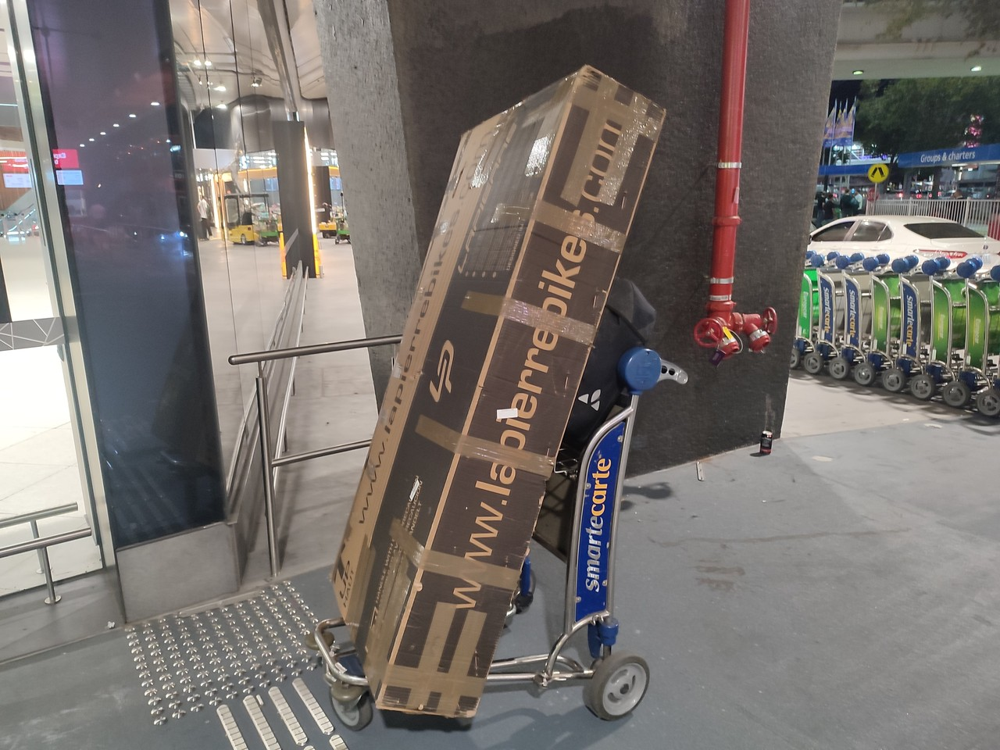
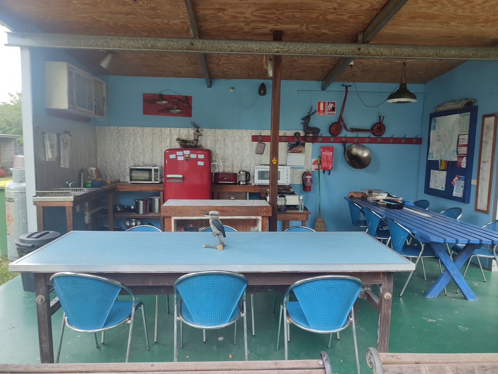
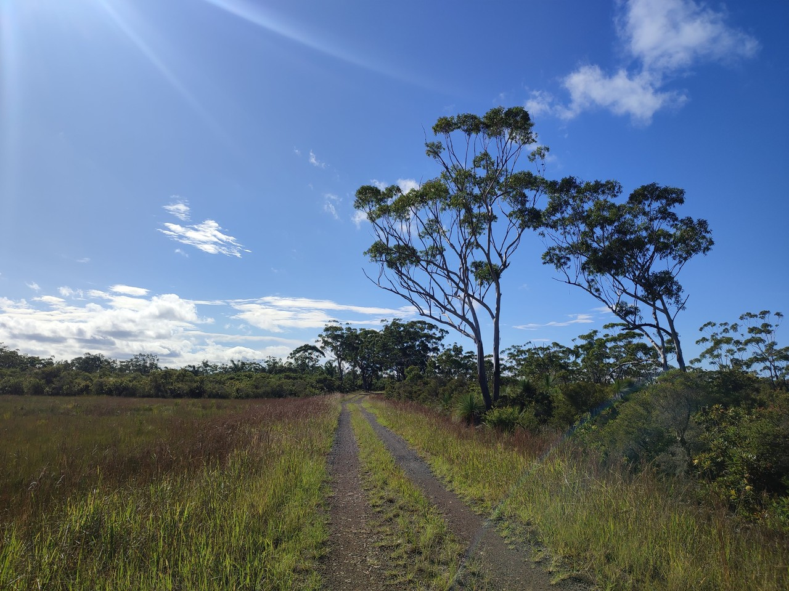

# Australie 2023 - part1

[2023/03/15]

Tous les voyages, [c'est par ici](https://gilles-arcas.blogspot.com/2020/09/home_31.html)

La carte des étapes, [c'est par là](https://gilles-arcas.travelmap.net/)
______
[2023/03/16]

### J1 - 16 mars - Melbourne - 22 km (+ 17000 km en avion)

Voyage un peu longuet, 6h30 jusqu'à Dubaï puis 13h30 jusqu'à Melbourne. Coup de bol, il y a une place libre à coté de moi dans les deux vols, ça permet de s'allonger un peu. Atterrissage à 22h30, une heure pour passer les contrôles et récupérer le vélo, encore une heure pour le remonter. Arrivée, dans le crachin, passé deux heure du matin à l'auberge.

______
[2023/03/17]

### J2 - 17 mars - Melbourne

Rendez-vous avec le père de Mathieson pour le déjeuner. Mathieson, c'est l'Australienne que j'avais hébergée il y a une dizaine d’années quand elle était venue avec son école. Elle a bien fait son chemin depuis, parle couramment français, et c’est grâce à elle que j'ai eu l’idée de mon premier voyage en Australie. Reste de la journée à tourner dans le CBD (le Central Business District, le centre quoi) pour trouver des cartouches de gaz, une carte SIM (chez Telstra, l’opérateur principal, on me dit de l'acheter dans une grande surface, ça sera deux fois moins cher), un adaptateur de prise de courant (que je pensais avoir) et du ravitaillement de base.

______
[2023/03/18]

### J3 - 18 mars - Melbourne - 26 km (48 km)

Un petit circuit trouvé sur komoot pour se réchauffer les mollets. Il traverse le centre, suit la rivière Yarra, contourne un lac et longe la plage à St Kilda. Pas trop mal, beaucoup de pistes cyclables et pour le reste, il y a presque toujours un couloir pour les vélos.

______
[2023/03/19]

### J4 - 19 mars - Hastings - 81 km (129 km)

Temps moyen, 18°, grisâtre, pas mal de vent pas toujours défavorable. La route enchaîne les pistes cyclables, d’abord en bord de mer, mais aussi en bord de routes ou de voies ferrées. La réception du camping park que j’avais repéré ferme à 15h (15h !). Comme il n’y a rien d’autre dans le coin, je fais le plein d’eau et je vais chercher un coin tranquille dans les bois en sortie de la ville pour passer la nuit (pas mal de moustiques par contre).

______
[2023/03/20]

### J5 - 20 mars - Cape Paterson - 69 km (198 km)

Du soleil mais toujours température un peu juste et beaucoup de vent. Encore beaucoup de pistes cyclables et voies vertes, dont une qui surplombe la mer pendant quelques kilomètres. Et un ferry pour traverser un petit bras de mer. En attendant le ferry, je discute avec quelqu’un qui me dit que mon anglais n’est pas mauvais. C’est gentil surtout que je lui fait répéter presque tout ce qu’il me dit. Caravan Park à 49$ (30E) mais avec accès sur la mer. Encore plus de vent que sur la route, personne dans l’eau mais j’en profite quand même pour me tremper les pieds.

______
[2023/03/21]

### J6 - 21 mars - Port Welshpool - 87 km (285 km)

Beaucoup de vent pendant la nuit (avec la toile de tente qui fait flap flap). Beaucoup de vent aussi pendant la journée avec retour du temps gris. Première partie sur de la route pas trop fréquentée et quarante derniers kilomètres sur une belle voie verte, la Great Southern Rail Trail. Fish & chips au dîner, ça cale plus que les nouilles chinoises, et retour au caravan park sous la pluie.

______
[2023/03/22]

### J7 - 22 mars - Sale - 108 km (393 km)

Presque que de la route aujourd’hui, assez tranquille, quelque gros camions quand même. Le beau temps est revenu dans l’après-midi et il y a beaucoup moins de vent, plutôt dans la bonne direction.

______
[2023/03/23]

### J8 - 23 mars - Bairnsdale - 77 km (470 km)

Ciel plombé toute le journée mais moins de vent. Que de la route. Paysage plat comme la main en début de journée, après c’est un peu plus mouvementé. Pas grand-chose à voir, à part des prés de chaque côté de la route, mais le regard porte loin. Caravan park à cinquante mètres de la highway, bof bof.

______
[2023/03/24]

### J9 - 24 mars - Nowa Nowa - 59 km (529 km)

Toute la journée sur la East Gippsland Rail Trail, une belle voie verte ancienne voie ferrée. Au début, la voie traverse des prés, souvent cachés par la végétation, ensuite ce n’est plus que de la forêt. Un peu de dénivelé (400 mètres de D+) mais la pente ne dépasse pas un ou deux pour cent (puisque c'est le train qui passait par là). Croisé plusieurs vélos dont un cycliste longue distance (en fait, je n’ai compris ni d’où il venait ni où il allait).

______
[2023/03/25]

Hier soir, en mangeant dans la petite cuisine du caravane park, causette avec une vielle dame venue dans son van. Elle me dit que son cardiologue est français, qu’elle en est à son troisième pace maker et qu’il n’y en aura pas de quatrième. Après ça, deux cyclistes arrivent, ce sont deux américains, dont un parle français, et qui sont sur la même route que moi. Ils me demandent le prix de l’emplacement puis disparaissent en m’expliquant qu’ils n’aiment pas trop payer pour passer la nuit.

______
[2023/03/25]

### J10 - 25 mars - Cowrie Bay - 77 km (606 km)

Quarante premiers kilomètres sur la voie verte. Ensuite, c’est de la route qui longe la Snowy River jusqu’à son estuaire, puis qui suit la mer d’assez loin. Arrivé au caravan park, je vérifie qu’il n’y a pas d’eau potable (j’avais anticipé). Personne à la réception, il faut appeler, mais les prix sont affichés. 45$ pour un emplacement. J’ai de l’eau, je recharge mon téléphone dans les toilettes, et je fais comme les américains d’hier soir, je repars pour trouver un endroit tranquille pour passer la nuit.

______
[2023/03/26]

### J11 - 26 mars - Cann River - 60 km (666 km)

Détour par la plage pour jeter un coup d’œil à la mer. Ensuite petite route dans la forêt qui finit par rejoindre la grande route. Et là, ça commence à monter, 850 mètres de D+ aujourd’hui. Toujours dans la forêt, très joli, très dense, avec des grandes fougères. Campement dans un caravan park désaffecté au bord d’une rivière. Pas d’électricité, toilettes, douches froides , c’est pas grave, je vais me débarbouiller dans la rivière. Un autre cycliste s’est installé, Steve, très sympa, on va manger ensemble. Et les américains d’il y a deux jours arrivent aussi et ont fini la journée au bar en jouant au billard.

______
[2023/03/27]

### J12 - 27 mars - Genoa - 58 km (724 km)

Toujours sur la grosse route, la Princes Highway, mais ça va. Toujours dans la forêt, quelques vraiment beaux paysages, toujours dans les collines, mais moins de dénivelé qu’hier. Campground sans eau potable mais confortable. Une fois la tente installée, je repars cinq kilomètres en arrière, vélo à vide, pour aller voir une petite cascade marquée sur la carte. Joli coin mais pas beaucoup d’eau.

______
[2023/03/28]

### J13 - 28 mars - Eden - 63 km (788 km)

En me préparant ce matin, je discute avec quelqu’un de mon voyage et il me propose de recharger mon téléphone. En allant le rechercher, je suis invité à boire le café avec deux couples, tous nés à Malte ou d’origine maltaise (Frank, Jo, Esther et Veronica). Après ça, retour sur la highway, changement d’état (je quitte le Victoria pour rentrer dans la Nouvelle Galles du Sud) et séance de montagnes russes (900 mètres de D+ aujourd’hui). Journée la plus chaude (26°) depuis mon arrivée.

______
[2023/03/29]

### J14 - 29 mars - Eden - 0 km (788 km)

Jour de repos. J’avais réservé un motel plusieurs jours avant, et ça tombait bien : orage hier soir et pluie toute la matinée. Mathieson est en Australie avec son compagnon et son bébé. Arrivés à Melbourne, ils rejoignent maintenant Sydney en voiture. Et comme Eden est sur leur route, ils se sont arrêtés le temps d’un café. Fallait bien qu’un jour je la vois en Australie. (Et comme j’ai recroisé les deux cyclistes américains en ville, j’ai l’impression de connaître plein de monde ici).

______
[2023/03/30]

### J15 - 30 mars - Tathra - 57 km (845 km)

Petite route isolée au début, qui se transforme en piste pendant un moment, un bout de highway, et une route, dite touristique, assez fréquentée et sans accotement. Et surtout, beaucoup de collines, avec plusieurs montées à 10% que je passe en poussant (je crois que je n’ai jamais autant poussé le vélo qu’aujourd’hui). Gros caravan park avec accès sur la mer, avec mon emplacement bien exposé au milieu des caravanes.

______
[2023/03/31]

### J16 - 31 mars - Wallaga - 52 km (897 km)

Jolie étape (deux personnes me l’avaient dit ce matin). De temps en temps, on voit des rivières et des lagunes d’un côté, ou la mer de l’autre. Le reste du temps, ça monte dans les collines mais moins qu’hier (je ne pousse le vélo que deux fois). Caravan park un peu plus rustique mais emplacement nettement mieux qu’hier. Une fois installé (côté lagune), je vais faire un tour à la mer pour voir le Camel Rock et la tête de cheval. Ça ressemble sans trop d’effort.

______
[2023/04/01]

### J17 - 1er avril - Moruya - 79 km (976 km)

Presque toute la journée sur la highway. Je commence à éviter les petites routes qui rallongent et montent encore plus. J’ai croisé deux cyclos espagnols (ils disent « on vient de Barcelone » pas « on vient d’Espagne ») qui viennent d’Indonésie, puis de Nouvelle-Zélande (où ils ont eu beaucoup de pluie). Et à Narooma, en suivant un bout de piste cyclable qui longe la mer, je retrouve les quatre australo-maltais rencontrés quatre jour plus tôt. Décidément...

______
[2023/04/02]

### J18 - 2 avril - Ulladulla - 78 km (1054 km)

Dormi dans les bois hier soir. Caravan park complet, peut-être parce que c’était samedi soir. Encore une journée de montées et descentes sur la highway. Plus de trafic et les villes deviennent plus importantes et moins espacées. J’ai dû échapper à une bonne averse, la pelouse du caravan park de ce soir est détrempée à certains endroits.

______
[2023/04/03]

### J19 - 3 avril - Nowra - 70 km (1124 km)

Au depart, détour par la mer pour jeter un coup d’œil (je l’ai entendue toute la nuit), puis retour sur la grosse route. En traversant Milton quelques kilomètres après, je finis par réaliser que quelqu’un m’appelle. C’est Joe (les gens de Malte) qui m’a vu passer et qui essaye de me rattraper. Heureusement, ça montait et j’allais pas bien vite. Cette fois, on prend le temps de prendre un café. Ils sont vraiment sympas. Sinon, grosse route, toujours autant de dénivelé mais moins de pente, et une grosse averse qui ne dure qu'un quart d’heure.

______
[2023/04/04]

### J20 - 4 avril - Wollongong - 82 km (1206 km)

Vingt kilomètres tout plat (je me croyais tiré d’affaire) sur une route tranquille longeant une rivière. Arrivé près de la mer, ça montait pas mal pour retourner sur la highway. Et là, grosse montée (en poussant). Après ça que de la grosse route. Mention spéciale pour la highway, quatre ou six voies, avec l’accotement emménagé en piste cyclable, pas si mal, ça roulait bien.

______
[2023/04/05]

### J21 - 5 avril - Rockdale - 78 km (1284 km)

Départ en longeant la plage, pas mal de monde et des surfers. Ensuite route moyenne souvent prêt de la mer et une grosse montée (à pied) qui termine sur un endroit d’où décollent les parapentes. Je passe un quart d’heure à regarder et ensuite la route traverse un parc nationale dans une belle forêt. Trois quarts d’heure d’attente pour chopper un petit ferry puis arrivée au caravan park (le plus proche de Sydney) par une succession de pistes cyclables en bord de mer (avec encore plein de surfers).

______
[2023/04/06]

### J22 - 6 avril - Sydney - 38 km (1322 km)

Essayé une première route qui veut me faire rejoindre le centre de Sydney en suivant la côte puis la baie. Ça me fait contourner l’aéroport et longer le port commercial pour arriver à la mer (encore plus de surfers) mais avec quelques surprises (pistes cyclables qui se terminent en cul de sac ou qui passent de l’autre côté de la deux fois trois voies). Après un dernier cul de sac (il fallait prendre un escalier pour continuer), c’est Google qui m’emmène jusqu’au au backpacker.

______
[2023/04/07]

### J23 - 7 avril - Sydney - 0 km (1322 km)

Pluie le matin et le soir, balade l’après-midi.

______
[2023/04/08]

### J24 - 8 avril - Sydney - 0 km (1322 km)

Un aller-retour en ferry presque au bout de la ligne qui remonte la baie, pour voir Sydney depuis l’eau.

______
[2023/04/09]

### J25 - 9 avril - Sydney - 0 km (1322 km)

Journée touriste avec une excursion en minibus aux Blue Mountains, chaînes de grosses collines (montagnes ? ça monte à plus de 1000 mètres) à cent kilomètres à l’ouest de Sydney. Des vallées escarpées, des falaises, des chutes d’eau. Très emménagé, très fréquenté, mais plein de beaux paysages. Mention spéciale à quelqu’un qui jouait du cor des Alpes en haut d’une falaise.

______
[2023/04/10]

### J26 - 10 avril - The Entrance - 71 km (1393 km)

Un premier ferry pour traverser la baie jusqu’à Manly, the plage des surfers. Puis trente kilomètres et un deuxième ferry. Celui-là, je l’attends presque deux heures. Pas bien grave, l’endroit est super. Le reste, sur une piste cyclable très agréable et de la grosse route un peu moins agréable, mais ok.

______
[2023/04/11]

### J27 - 11 avril - Newcasttle - 76 km (1469 km)

Petites routes, grosses routes, une belle voie verte, un peu moins de dénivelé et un petit vent favorable. Des beaux paysages de temps en temps avec les baies et les lagunes d’un côté, et la mer de l’autre.

______
[2023/04/12]

### J28 - 12 avril - Bombah Point - 81 km (1550 km)

Presque tout plat aujourd’hui, un tout petit peu de pluie, du vent favorable (on s’en rend mieux compte en faisant demi-tour quand on a raté un embranchement), une belle traversée en ferry et un super coucher de soleil à travers les arbres. Bush camping et montage de la tente dans la nuit noire.

______
[2023/04/13]

### J29 - 13 avril - Forster - 59 km (1609 km)

Un peu de pluie dans la nuit mais tente presque sèche le matin. Vingt kilomètres  de chemin à travers un parc national, au début très agréable mais caillouteux sur la deuxième moitié. Retour sur la route avec du crachin puis une série d’averses et de grosses averses. Arrivé à Forster avec le soleil mais bien mouillé. Retrouvaille pour le dîner avec Brian qui vit ici. Je l’avais rencontré avec sa femme Ingrid il y a quatre ans à Woomera. Ils m’avaient emmené en voiture jusqu’à Coober Pedy et je les avais revu à Alice Springs.

______
