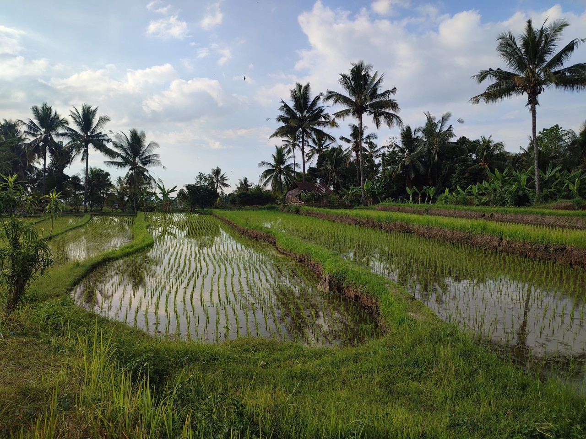
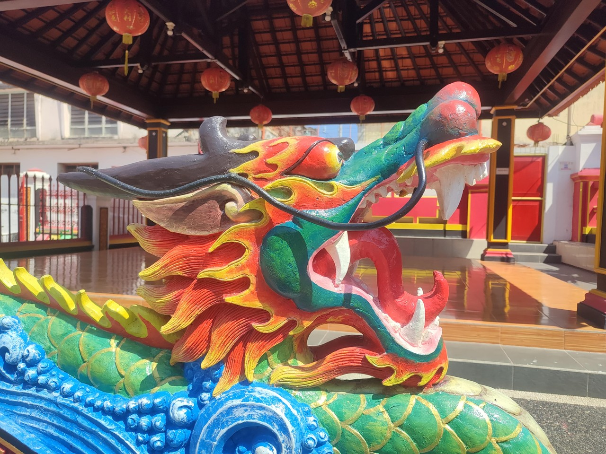

# 2023-Australie - Bali

[2023/06/14]

On peut cliquer sur la route ou les étapes pour aller directement au jour mais
le dernier jour [c'est ici](#{LASTDATE}). Cliquez sur </img> pour passer la carte en plein écran (Esc pour sortir du plein écran).  Cliquez sur les images pour agrandir. Et pour tous les journaux de voyage, [c'est par ici](https://gilles-arcas.blogspot.com/2020/09/home_31.html).
______
[2023/06/14]

{MAPPOST map.html}
{MAPFULL maplocal.html}
______
[2023/06/14]

______
[2023/06/15]

### J92 - 15 juin - Ubud (Bali) - 0 km (4706 km)

Deuxième jour à Bali. Premier jour à Denpasar, où arrive l’avion, et où il n’y a vraiment pas grand-chose, et deuxième jour à Ubud, nettement plus touristique. Dans les deux cas, beaucoup de trafic, beaucoup de scooters, et difficile de traverser une rue. Visite de deux temples très jolis et de la Monkey Forest, très amusant. J’ai oublié de dire qu’íl fallait que je sorte d’Australie pour renouveler mon visa et que Bali est la plus proche destination (en fait, il y a aussi le Timor Oriental, mais ça me paraissait moins attractif). Je n’ai pas dit non plus que l’avion était à 6:45. Ça pique un peu quand il faut rebrousser chemin et recommencer le jour suivant. Du coup, j’ai laissé le vélo chez Fleur.

______
[2023/06/16]

### J93 - 16 juin - Ubud (Bali) - 0 km (4706 km)

Excursion autour de Ubud en voiture avec chauffeur privé. 700 000 roupies indonésiennes. Pour convertir, on enlève quatre zéros pour avoir les dollars australiens et on prend deux tiers pour avoir les euros. Ça devient tout de suite plus raisonnable. Visite de plusieurs temples, des rizières et d’une chute d’eau. Tout très joli mais souvent encombré. Fin de la journée chez le coiffeur.

______
[2023/06/17]

### J94 - 17 juin - Lovina - 0 km (4706 km)

.

______
[2023/06/18]

______
[2023/06/19]

### J96 - 19 juin - Lovina - 0 km (4706 km)

Trois jours à Lovina au nord de l’île. Sortie en mer pour aller voir les dauphins, c’est la principale attraction, mais beaucoup de bateaux autour. Hébergement un peu à l’écart donc scooter obligatoire. J’en profite pour me balader autour de Lovina et aller voir le temple de Danau Beratan, très beau sur les photos mais beaucoup de monde et un côté parc d’attraction.

______
[2023/06/20]

______
[2023/06/21]

______
[2023/06/22]

### J99 - 22 juin - Amed - 0 km (4706 km)

Trois jours à Amed sur la côte nord est. Petite ville, spot de plongée et volcan tout près. Visite de plusieurs trucs, le premier jour, en chemin avec le chauffeur, et après en scooter. Visite du temple de Lempuyang, effectivement très beau mais organisé en studio Instagram (les gens font la queue et un photographe les prend entrain de faire des poses). Sortie en snorkeling (masque et tuba) et montée en haut du phare de Gili Selang à la pointe est de l’ile (pas un site officiel, il faut graisser la patte du gardien).

______
[2023/06/23]

______
[2023/06/24]

______
[2023/06/25]

______
[2023/06/26]

### J102 - 25 juin - Candidasa - 0 km (4706 km)

Trois jours à Candidasa. Pas forcément le meilleur endroit, une rangée d’hôtels, de restaurants et de boutiques, coincée entre les collines et la mer. Et l’accès à la plage ne se fait que par les hôtels. Alors, scooter, visite du palais de Taman Ujung, et snorkeling autour des petits îlots en face de Candidasa. 

______
