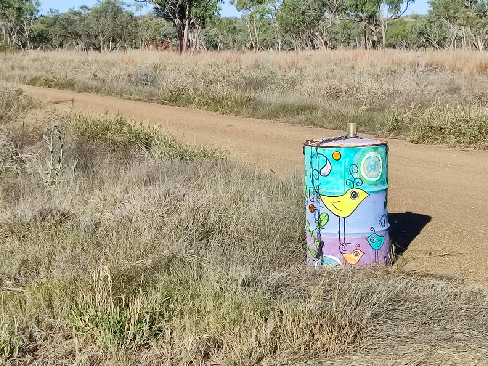
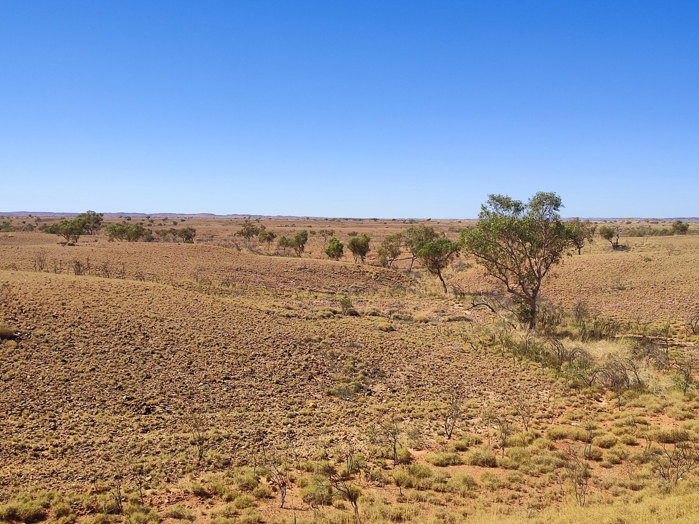
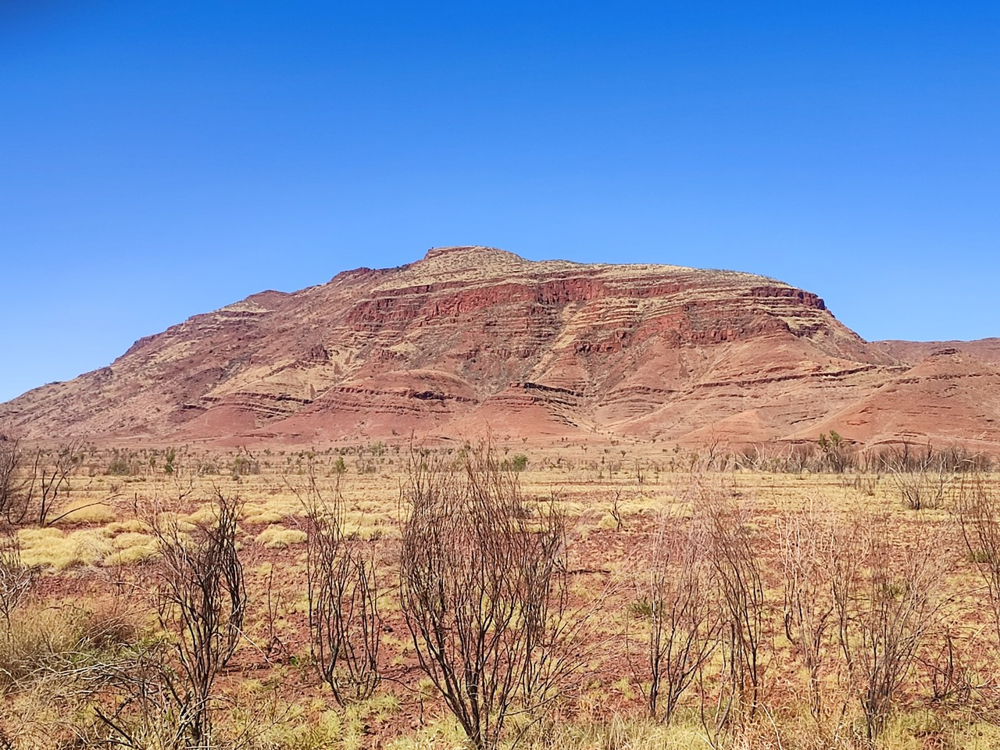
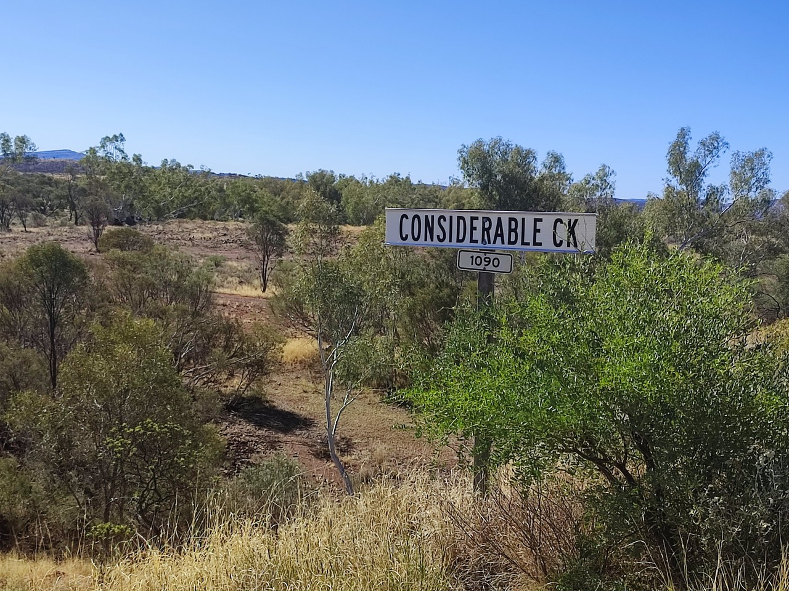

# 2023-Australie - part3

[2023/06/26]

On peut cliquer sur la route ou les étapes pour aller directement au jour mais
le dernier jour [c'est ici](#{LASTDATE}). Cliquez sur </img> pour passer la carte en plein écran (Esc pour sortir du plein écran).  Cliquez sur les images pour agrandir. Et pour tous les journaux de voyage, [c'est par ici](https://gilles-arcas.blogspot.com/2020/09/home_31.html).
______
[2023/06/26]

{MAPPOST map.html}
{MAPFULL maplocal.html}
______
[2023/06/27]

### J104 - 27 juin - Darwin - 0 km (4706 km)

Retour à Darwin et fin de la parenthèse. Arrivée chez Fleur à trois heures du matin. Elle reçoit un autre cycliste, français, François, parti depuis trois ans et demi. Il a travaillé presque un an en Australie et est sur le chemin du retour, en commençant par le Timor, l’Indonésie, etc. Objectif : ne pas prendre l’avion jusqu’en France. Il prévoit au moins un an et demi. Bonne route !

______
[2023/06/28]

### J105 - 28 juin - Tumbling Waters - 74 km (4780 km)

Sur les recommandations de Fleur et François, je passe d’abord au Northern General Store (un magasin de matériel de camping qui tient plus du hangar avec des étagères) pour acheter un meilleur duvet. Il paraît qu’il va faire beaucoup plus froid, surtout la nuit, sur la côte sud ouest. Ensuite, sur les conseils de Fleur, je prends le ferry pour traverser la baie de Darwin et prendre une petite route tranquille. Ça évite de sortir de Darwin en suivant la grosse route. C’est effectivement désert par ici, très peu de trafic (un peu plus après avoir dépassé une mine de lithium) et aucune localité traversée.

Pas sûr du tout pour le réseau les deux prochains jours.

______
[2023/06/29]

### J106 - 29 juin - Litchfield National Park - 84 km (4864 km)

Détour par le Litchfield National Park, réputé pour ses cascades et ses chutes d’eau. La principale est celle de Wingi Falls. Effectivement très jolie. Il y a un grand bassin au pied de la chute d’eau et les gens viennent faire trempette (en plus c’est les vacances scolaires). Baignade obligée. Il y a un sentier qui fait le tour de la chute d’eau, remonte sur le côté, traverse la rivière et redescend de l’autre côté. Décidément très joli. Un bout de rain forest, des arbres avec des chauves-souris qui font du boucan, et point de vue sur les forêts du parc national.

______
[2023/06/30]

### J107 - 30 juin - Zebra Stone - 63 km (4927 km)

Traversée du parc national en m’arrêtant plusieurs fois pour visiter. Montée aux Upper Cascades (les Lower Cascades sont fermées), trois quarts d’heure de sentier dans le bush pour y arriver. Ensuite, re-trempette dans les Wangi Falls, et visite aux Tolmer Falls. On y accède par le haut, et on voit tout le paysage autour. Arrivée au campground de nuit. Dix dollars avec douche et eau potable. Le gars me fait goûter de la confiture à la tomate et me donne le pot. Quand je le revois un peu plus tard, il me dit les push bikes ne payent pas et me redonne mes dix dollars.

Note : « push bikes », c’est comme ça que les australiens appellent les vélos de randonnée. La première fois qu’on m’a demandé « you are pushing the bike? », j’ai répondu ben non, je pousse pas, je pédale. Depuis, j’ai compris.

______
[2023/07/01]

### J108 - 1er juillet - Adelaide River - 48 km (4975 km)

Nuit dernière un peu difficile. Très chaud sous la tente en début de nuit, mais impossible d’ouvrir à cause des moustiques (dont une escadrille a quand même réussi à rentrer). Ensuite, le vent s’est levé mais la tente est mal fixée (le sol est presque aussi dur que du béton). Je finis la nuit avec un bout de la tente fixé au vélo et l’autre bout qui a abdiqué. La fonction première de Zebra Stones, où j’ai passé la nuit, est de présenter et de vendre des objets en zebra stone, une pierre très ancienne avec des inclusions qui forment des motifs très jolis. J’assiste à la présentation avant de reprendre la route.

______
[2023/07/02]

### J109 - 2 juillet - Entre Adelaide River et Pine Creek - 66 km (5041 km)

Temps couvert et beaucoup moins chaud que les jours précédents. Vent du sud (c’est à peu près par là que va ma route). Petite route très tranquille qui évite la highway dans un paysage de collines. Bivouac dans le bush. Et j’ai vu un cheval sauvage, j’avoue, il avait de l’allure.

______
[2023/07/03]

### J110 - 3 juillet - Pine Creek - 66 km (5107 km)

D’abord, réparer la crevaison d’hier (j’avais fini en regonflant plusieurs fois). Ensuite, retrouver la Stuart highway (la route qui relie Adelaide et Darwin). Pas trop sympa, mais ça passe. Quand même vingt kilomètres de route parallèle, une toute petite route « unmaintained » très jolie qui longe un terrain d’aviation de WWII. Il y a même un nid d’oiseau jardinier au bord de la route.

______
[2023/07/04]

### J111 - 4 juillet - Katherine - 102 km (5209 km)

Je voulais suivre une petite route parallèle à la highway en quittant Pine Creek (la suite de la petite route d’hier). Pas de chance, la route est barrée après cinq kilomètres. Donc retour en arrière et toute la journée sur la grosse route. Caravan Park blindé. Une personne est refusée avant moi, mais on m’accepte parce que je suis en push bike (d’ailleurs, on dit en push bike ou à push bike ?).

______
[2023/07/05]

### J112 - 5 juillet - Katherine - 0 km (5209 km)

Jour de repos. En fait, il y a un nid de bowerbird (thanks Brian) à trois mètres de la cuisine du caravan park. Il vient même faire un peu de déco, pas farouche. Au programme de la journée, préparation des prochaines étapes (deux escales sur les 500 prochains kilomètres), lessive, réparation des crevaisons (pneu à plat quand j’ai voulu prendre le vélo) et recherche d’une chambre à air (trouvée au magasin de matériel de camping qui vend aussi des vélos). Finalement, balade le long de la rivière et trempette aux sources chaudes.

______
[2023/07/06]

### J113 - 6 juillet - Mathison Rest Area - 101 km (5310 km)

Direction sud ouest maintenant et vent plus favorable. Ça tombe bien, je suis chargé en eau et en nourriture (mais j’ai oublié mes yaourts dans le frigo du caravan park :( ). Une dizaine de caravanes au campsite. Quelqu’un vient discuter et me dit que la route vers une des villes où je dois passer a été coupée à cause des pluies. Il faudra que je vérifie et si c’est toujours le cas, il n’y a pas d’autre solution que d’attendre.

______
[2023/07/07]

### J114 - 7 juillet - Victoria River - 93 km (5403 km)

Vent toujours sympa. Des petites collines tout du long mais jamais trop de dénivelé. Paysage plus escarpé sur la fin. En fait, je suis rentré dans un parc national (Judbarra/Gregory National Park). Troisième crevaison en quatre jours à trois kilomètres de l’arrivée. Causettes avec plusieurs personnes au caravan park, dont un couple suisse-hollandais qui se sont rencontrés en Inde en faisant chacun leur tour du monde à vélo il y a quarante ans.

______
[2023/07/08]

### J115 - 8 juillet - Timber Creek - 94 km (5497 km)

Deux balades dans le parc national. D’abord, la Escarpment Walk, qui monte au sommet des falaises, et la Nawilbinbin Walk, dix kilomètres plus loin mais sur ma route. Celle-là monte à mi-hauteur et longe le pied de la falaise. Supers paysages et quelques peintures rupestres. Après ça, encore 80 kilomètres pour finir l’étape. Le caravan park a un problème de chauve-souris. Il y en a des centaines dans les arbres autour.

______
[2023/07/09]

### J116 - 9 juillet - Bulla - 81 km (5578 km)

Pour me protéger des chauves-souris, le caravan park m’avait proposé de m’installer sous un endroit abrité. Je l’ai partagé avec Kim, une américaine très sympa (elle m’a donné une de ces barres énergétiques rapportées d’Amérique). Elle est entrain de se balader à moto autour de l’Australie. Petit déjeuner copieux (finalement, ça aide à tenir la journée). Premier détour pour monter à un point de vue et voir le paysage, et deuxième détour pour aller au bord de la rivière. Après ça, plus grand-chose de notable à part quelques gros boabs (les baobabs d’ici) et le motard qui s’est mis à ma hauteur pour me demander si j’avais besoin d’eau ou de nourriture. Bivouac dans le bush, pas de réseau et silence total après le passage des dernières voitures.

______
[2023/07/10]

### J117 - 10 juillet - Allan Kellet Rest Area - 95 km (5673 km)

Route tranquille qui traverse une région de petites falaises et de gros baobabs. A la pause dans un campground, causette avec un jeune couple qui m’ont dépassé deux fois. Faciles à reconnaître, ils voyagent dans un bus aménagé plus une remorque qui contient une voiture et un bateau.

______
[2023/07/11]

### J118 - 11 juillet - Kununurra - 63 km (5736 km)

Passage en Australie-Occidentale. Quatre fois la France, 2,5 millions d’habitants dont 2 millions à Perth, autrement dit, on ne se marche pas sur les pieds. Pour des raisons sanitaires, il y a un poste frontière pour vérifier qu’il n’y a pas de fruits et de légumes qui rentrent.

______
[2023/07/12]

### J119 - 12 juillet - Kununurra - 0 km (5736 km)

Journée de repos. Passage au Visitor Center qui me propose d’aller au Mirima National Park, petit parc à la sortie de la ville. Très belle balade dans des formations rocheuses en grès. Un mini Bungle Bungle me dit la dame. Quant au vrai Bungle Bungle (à 250 kilomètres d’ici), elle ne propose qu’une excursion en avion à à peu près 1000$ (600 euros). L’alternative, c’est d’avoir un 4x4 pour faire les 50 kilomètres de piste depuis la route. En fait, il y a bien une compagnie qui fait des tours à partir de la route mais elle est fermée cette année.

______
[2023/07/13]

### J120 - 13 juillet - Kununurra - 0 km (5736 km)

Excursion en bateau au lac Argyle, un lac de barrage immense (une fois et demi le lac Léman) à 70 kilomètres de la ville.

______
[2023/07/14]

### J121 - 14 juillet - Doon Doon Roadhouse - 109 km (5845 km)

Départ un peu tardif (10h passées) malgré la longueur de l’étape et la nuit qui tombe à 18h. Très joli tout du long avec un paysage de collines plus ou moins escarpées . Arrivée à la roadhouse avec la nuit et le coucher de soleil.

______
[2023/07/15]

### J122 - 15 juillet - Warmun - 92 km (5937 km)

Relief un peu plus marqué, les collines sont souvent plus proches de la route et plus escarpées. Un peu plus de dénivelé aussi. Paysages toujours aussi beaux. J’ai aussi vu une bande de chevaux sauvages et j’ai sauvé un crapaud qui était sur la route d’une mort certaine. Arrivé à la roadhouse, la dernière place vient d’être prise. Le gars me trouve quand même une petite place parce que je suis à vélo.

______
[2023/07/16]

### J123 - 16 juillet - A mi-chemin de Warmun et Halls Creek - 78 km (6015 km)

Paysage plus plat mais toujours un peu de dénivelé. Les collines se sont éloignées et ça ressemble plus à un plateau. Encore vu des chevaux (mais pas de crapaud). Bivouac dans le bush.

______
[2023/07/17]

### J124 - 17 juillet - Halls Creek - 86 km (6101 km)

Toile de tente bien mouillée au réveil mais ça sèche vite dès que le soleil donne dessus. Encore un peu moins de collines. Au caravan park, la dame me recommande de garder mon argent sur moi et de ranger le vélo dans un garage qu’elle tient fermé.

______
[2023/07/18]

### J125 - 18 juillet - Halls Creek - 0 km (6101 km)

Journée de repos. Balade pour aller voir le China Wall à 7 km de la ville, et le lookout à 5 km de l’autre côté. Le China Wall est une veine de quartz verticale qui apparaît de temps en temps jusqu’à Kununurra. Et le point de vue n’est pas très haut mais permet de voir la ville en entier (pas grand-chose) et le paysage sur 360°. Pas de réseau pendant les deux jours qui viennent, et sûrement pas les deux jours qui suivent.

______
[2023/07/19]

### J126 - 19 juillet - Mary Pool Campground - 111 km (6212 km)

Vent très favorable et un peu moins de dénivelé. En fait, le paysage est devenu plus plat et vide par endroits. Un peu de réseau au campground. Le monsieur d’une caravane à côté vient discuter et finalement il propose de m’apporter un café demain matin.

______
[2023/07/20]

### J127 - 20 juillet - Mimbi Campground - 95 km (6307 km)

Comme promis, le monsieur m’a apporté un café ce matin. Toujours du vent favorable. Route de plus en plus plate sans vraiment rien de notable, à part une petite chaîne d’escarpements, Ngumban Cliff, à quelques kilomètres de Mimbi. Arrivée au campground perdu dans la nature après six kilomètres de piste.

______
[2023/07/21]

### J128 - 21 juillet - Mimbi Campground - 0 km (6307 km)

Journée sur place. Le matin, je vais faire un tour en haut des falaises (pas très hautes) au-dessus du campground pour voir le paysage. Et l’après-midi, c’est visite guidée des Mimbi Caves. L’accès est impressionnant et se fait entre des falaises aux formes très découpées. Les Mimbi Caves forment un ensemble de cavernes et de porches sans aucun emménagement. Il y a plein de ramifications partout et on aimerait avoir la possibilité d’explorer plus loin.

______
[2023/07/21] [ignore]

This is rainman. He sings a song to make the rain come.

______
[2023/07/21]  [ignore]

Do you ride at night? Are you afraid of the ghosts?

______
[2023/07/22]

### J129 - 22 juillet - Fitzroy Crossing - 115 km (6422 km)

Route plate, végétation plus ou moins clairsemée, vent un peu moins favorable. Dans la matinée, un cycliste en vélo de route et sans bagage me dépasse, prend juste le temps de dire bonjour, file devant et disparaît. On est quand même au milieu de 300 kilomètres de rien. Il y a eu des inondations en janvier à Fitzroy et le pont a été détruit. Le temps de le reconstruire, un pont temporaire a été construit quatre kilomètres plus loin, et donc huit kilomètres de détour. Arrivé en ville, je fais des courses et je cherche un caravan park. Celui qui est le plus près de la ville est fermé depuis les inondations, le deuxième est bien ouvert mais de l’autre côté de la rivière, donc encore huit kilomètres de détour.

______
[2023/07/23]

### J130 - 23 juillet - Fitzroy Crossing - 0 km (6422 km)

Jour de repos. Il y a un parc national à vingt kilomètres avec des gorges qui ont l’air impressionnant. Je voulais y aller mais le parc est fermé à cause des inondations. En partant faire des courses à l’IGA de l’autre côté, je m’approche des travaux du pont (juste à la sortie du caravan park) pour faire une photo. Il y a un autre pont temporaire pour les travaux. Un gars me laisse passer à pied en poussant le vélo (c’est du gros caillou). C’est nettement plus court comme ça.

______
[2023/07/24]

### J131 - 24 juillet - Ellendale Lagoon - 97 km (6519 km)

Vent frisquet ce matin (9° d’après l’appli). Pour repartir, il faut retraverser la rivière. Comme hier, je m’approche des travaux et je demande à quelqu’un si je peux traverser par le pont de service. Cette fois, c’est non parce qu’il y a des travaux mais le gars me dit qu’il va appeler une voiture et qu’on mettra le vélo dedans. La voiture arrive, on charge le vélo et le gars m’emmène de l’autre côté en passant par le détour. Merci ! Après ça, vent hyper favorable, jamais roulé aussi vite. Campground très agréable autour d’un étang sur un terrain privé qui laisse l’accès.

______
[2023/07/25]

### J132 - 25 juillet - 170 km à l'ouest de Fitzroy - 73 km (6592 km)

Rien à signaler à part le retour des gros baobabs, dont un énorme sur une aire de repos. Bivouac dans le bush.

______
[2023/07/26]

### J133 - 26 juillet - Willare Bridge Roadhouse - 64 km (6656 km)

Rien à signaler à part la voiture qui s’est mis à ma hauteur pour me dire super et me tendre une mandarine.

______
[2023/07/27]

### J134 - 27 juillet - Three Water Holes - 90 km (6746 km)

Juste après la roadhouse, il y a le pont sur la Fitzroy River, et juste après le pont, la route est en travaux sur plusieurs kilomètres. Un gars m’arrête, me dit que c’est dangereux de passer («safety first») et appelle son boss. On finit par embarquer le vélo dans sa voiture et il m’emmène quatre kilomètres plus loin. Tout petit campground au bord d’un étang. Repas à la lueur de la lune qui est juste au-dessus et qui éclaire assez pour se passer de lampe.

______
[2023/07/28]

### J135 - 28 juillet - Broome - 72 km (6818 km)

À mi-chemin, pause à la roadhouse à l’embranchement entre la route de Broome et la route qui suit la côte vers le sud. Je repasserai par là. Arrivé à Broome, je trouve un caravan park avec de la place à Cable Beach après trois appels infructueux. Caravan park convivial de 500 places. Après installation, direction la plage pour me tremper les pieds, je n’avais pas vu la mer depuis 2000 kilomètres. Broome est la grande ville (14000 habitants) de la côte nord-ouest. Trois jours de repos.

______
[2023/07/29]

______
[2023/07/30]

______
[2023/07/31]

### J138 - 31 juillet - Broome - 0 km (6818 km)

Trois jours à Broome. Du repos, un peu d’intendance et un peu de balade. Pas trop de choses à voir à Broome même, à part la plage et la mer.

______
[2023/08/01]

### J139 - 1er août - Roebuck Roadhouse

Je voulais passer la nuit ici après une petite étape mais c'est blindé, même en disant que je suis en push bike. Alors, changement de programme. Je prends de l'eau pour plusieurs jours (j'ai déjà de quoi manger) et je continue la route. Prochaine roadhouse dans presque 300 km où j'arriverai vendredi. Finalement, c'est bien aussi comme ça, par contre, pour le réseau, faudra sûrement attendre jusque là.

______
[2023/08/01]

### J139 - 1er août - Bush camp - 79 km (6897 km)

Chargé comme une mule (treize litres d’eau, pommes, bananes, avocats, etc, pour quatre jours), je repars de Roebuck Road House pour finir la journée. La route part vers le sud ouest et bonne surprise, le vent n’est pas défavorable. Quand le soleil se couche, je prends le premier chemin qui se présente et je trouve un endroit pour passer la nuit.

______
[2023/08/02]

### J140 - 2 août - Goldwire Campground - 82 km (6979 km)

Paysage tout pareil toute la journée. À un moment, il y a des travaux de marquage. Arrivé à la hauteur d’une voiture de sécurité, une dame me demande si je veux de l’eau fraîche et me donne deux petites bouteilles d’eau. C’est pas de refus, il fait 32°. Et en passant un des camions de travaux, le conducteur me tend une autre bouteille. Causette au campground avec un gars à moto qui fait le tour de l’Australie et avec une dame, en caravane, qui me remplit deux bouteilles d’eau.

______
[2023/08/03]

### J141 - 3 août - Bush camp - 91 km (7070 km)

Ce matin, Mary, qui m’a donné de l’eau hier soir, me propose un café. En fait, elle me sert un breakfast avec café, toasts, miel, fraises et framboises. Y viva Australia! Comme avait dit Fleur à Darwin « they will take care of you ». Mary et son mari sont en train de faire le tour de l’Australie en caravane. Ils sont partis il y a un an et pensent être rentrés pour Noël.

______
[2023/08/04]

### J142 - 4 août - Sandfire Roadhouse - 76 km (7146 km)

34° aujourd’hui. Vent de côté un peu gênant en début de journée mais tail wind pour finir et ça roule bien. Sandfire est la seule roadhouse (et point de ravitaillement en eau) sur presque 600 kilomètres. Ils ont des cabines à 80 dollars (50 euros) petites et un peu vétustes, mais comme c’est abordable et que je n’ai pas dormi dans un lit depuis un mois, je prends !

______
[2023/08/05]

______
[2023/08/06]

### J144 - 6 août - Sandfire Roadhouse - 0 km (7146 km)

Finalement, deux jours à Sandfire. J’ai bien profité du lit et ça m’a donné l’occasion d’avoir quelques interactions avec la faune locale.

______
[2023/08/07]

### J145 - 7 août - Warree Hill - 82 km (7228 km)

C’est reparti pour 280 kilomètres sans ravitaillement. Cette fois, je pars avec 17 litres d’eau (onze dans un jerrycan, quatre dans deux poches à eau et deux dans les bidons). Heureusement, le vent est très favorable et ça roule bien malgré le poids. Par contre, pneu arrière à plat après 25 kilomètres. Je finis la journée en regonflant deux fois et ça tient. On verra demain matin si il faut réparer. Depuis Broome, la route suit la mer à 10 ou 20 kilomètres. Il y a très peu d’accès et toujours en piste, alors pas question d’y aller avec tout le poids. Bivouac au pied d’une antenne 3G.

______
[2023/08/08]

### J146 - 8 août - Cape Keraudren - 68 km (7296 km)

Ce matin, juste en arrivant sur la highway après mon bivouac, je vois un cycliste arrivé. C’est un cycliste qui m’avait dépassé il y a trois semaines. Cette fois, on prend le temps de discuter. En fait, il a passé trois ans et demi à faire le tour de l’Australie avec deux chevaux et là, il est entrain de terminer son périple à vélo. Sa femme le suit dans le camion des chevaux mais les chevaux sont rentrés à Perth. Après ça, paysage toujours aussi vide et vent toujours aussi favorable. Petit arrêt à la roadhouse de Pardoo, fermée, dévastée par un cyclone en avril. Peu après la roadhouse, je vois une indication pour aller à Cape Keraudren à 12 kilomètres et la route est goudronnée. Après cinq secondes d’hésitation, je me dis que je peux faire le détour et c’est parti. Après 7 kilomètres, la route devient de la piste mais ça passe. Finalement, installation au campground à 50 mètres de la mer. C’est pas fini. Une fois la tente plantée ,j’entends « Gilles ». C’est Kim, l’américaine à moto, que j’avais rencontrée il y a un mois.Toujours aussi sympa. Elle a fait des courses à Port Hedland (140 km) et me donne de quoi faire un repas. C’est pas encore fini pour aujourd’hui. Dans les vans et caravanes, je vois un camion de chevaux avec un vélo à côté. C’est bien eux, Erwin et Monique, le cycliste de ce matin  et sa femme. Ils m’invitent à manger et je passe un moment avec eux.
`

______
[2023/08/09]

### J147 - 9 août - Cape Keraudren - 0 km (7296 km)

Je n’avais pas prévu de passer la journée ici, entre autres à cause du ravitaillement. Mais l’endroit est super et complètement isolé, même si les campgrounds sont bien occupés. Erwin et Monique m’ont expliqué que pour l’eau et la nourriture, ils pouvaient m’aider, d’autant plus qu’ils m’ont invité au barbecue ce soir. Merci ! J’ai pu profiter de la journée avec des balades sur la plage et à l’extrémité du cap. J‘ai discuté aussi avec Kim qui m’a dit qu’elle a été guide en kayak dans le Grand Canyon. Respect !

______
[2023/08/10]

### J148 - 10 août - De Grey River Rest Area - 82 km (7378 km)

On se dit au revoir avec Kim en échangeant nos Facebook. Même si on ne se recroise pas, on aura au moins des nouvelles. Par contre, avec Erwin et Monique, on se dit à ce soir puisque on se retrouve au même campement. Monique en profite pour me proposer de prendre une partie de mes affaires dans le camion et je fais le trajet avec plus de dix kilos en moins. Très appréciable. Quatre vingt kilomètres de paysage vide, de végétation basse, sans ombre, et à peine un peu de relief à un moment. Tellement isolé que deux road trains me font un coucou. Beaucoup de voitures me font un signe en me croisant (ça va de l’index levé à des appels de phare, des coups de klaxon, ou des grands gestes de la main par la fenêtre) mais je crois que pour les road trains, c’est la première fois.

______
[2023/08/11]

### J149 - 11 août - South Hedland - 78 km (7456 km)

Ambiance moins isolée. La route suit une voie de chemin de fer et une ligne à haute tension, ça change un peu l’ambiance. Aussi, c’est une région de mines et de carrières et il y a beaucoup de road trains (mais tout le monde fait attention). Rencontre avec Martin, un cycliste de Berlin, plein d’enthousiasme, qui va de Perth à Darwin. Je suis le premier cycliste qu’il croise depuis son départ. Je retrouve Erwin et Monique au campground du golf où ils ont réussi à trouver un emplacement. Douche (après quatre jours sans) et soirée fish&ships.

______
[2023/08/12]

### J150 - 12 août - South Hedland - 46 km (7502 km)

Journée off. Erwin et Monique ont pris la route mais je devrais les retrouver dans trois jours. Le campground est près des grands axes et on entend les road trains toute la nuit alors je commence la journée par déménager au caravan park à côté. Ensuite, routine des jours off (courses, lessive) et balade pour voir la mer à une quinzaine de kilomètres.

______
[2023/08/13]

### J151 - 13 août - Bush camp - 85 km (7587 km)

Départ pour trois jours sans rien. Direction au sud. D’abord un peu vers l’ouest et le vent n’est pas sympa puis plutôt vers l’est et le vent devient plus amical. Paysage spartiate, route plus importante, beaucoup de road trains, surtout ceux à quatre remorques qui transportent du minerai.

______
[2023/08/14]

### J152 - 14 août - Two Camel Creek Rest Area - 84 km (7671 km)

Route comme hier. Un peu plus de dénivelé, quelques collines avec des amoncellements de rochers, un peu moins de road trains. Je retrouve Erwin et Monique au campement et on passe la soirée ensemble.

______
[2023/08/15]

### J153 - 15 août - Auski Roadhouse - 85 km (7756 km)

Toujours sur la même route, la Great Northern Highway, avec peut-être un peu moins de camions et un peu plus de dénivelé (400 mètres, ça n’était pas arrivé depuis un mois). La route traverse des beaux paysages de collines ocres et desséchées, puis arrive sur un plateau. Cette fois, il y a plus d’arbres mais moins de végétation autour. À la roadhouse, je retrouve Erwin et Monique qui m’ont réservé une place sur leur emplacement.

______
[2023/08/16]

### J154 - 16 août - Bush camp - 78 km (7834 km)

Beaucoup de vent ce matin. Les premiers 35 kilomètres se font face au vent, avec un peu de dénivelé (à peu près 300 mètres, 500 mètres dans la journée) et chargé avec deux jours d’eau. Il me faut trois heures pour arriver à la jonction avec la route vers Tom Price, mais la route remonte dans une gorge avec des supers paysages et des supers couleurs. Après ça, ça monte et ça descend plus doucement, et le vent est moins défavorable. Moins spectaculaire, mais beau quand même, la route longe le  parc national de Karijini. Une heure avant de m’arrêter pour la nuit, une moto me double et s’arrête. C’est Kim qui revient de visiter le parc national.

______
[2023/08/17]

### J155 - 17 août - Tom Price - 81 km (7915 km)

Journée plus facile qu’hier. Toujours des beaux paysages, entre autres parce que la route longe le Mount Bruce, deuxième sommet de l’Australie de l’Ouest avec 1234 mètres. C’est possible d’y monter, c’est six heures aller-retour depuis un parking à trois kilomètres de piste de la route. Ça sera pour une autre fois. La grosse montée de la journée fait du 8% sur deux kilomètres. Juste avant, un road train me dépasse et commence la montée. Il monte à peine plus vite que moi. Je monte à 7km/h, il doit aller à 8 km/h.

______
[2023/08/18]

______
[2023/08/19]

### J157 - 19 août - Tom Price - 0 km (7915 km)

Deuxième jour à Tom Price. Excursion d’une journée au parc national de Karijini. 300 kilomètres, dont 100 kilomètres de piste, en bus 4x4. Plusieurs gorges visitées, depuis le haut ou depuis le bas, tout très beau.

______
[2023/08/20]

### J158 - 20 août - Tom Price - 0 km (7915 km)

Toujours à Tom Price. Montée sur le Mount Nameless qui surplombe la ville et le caravan park. 1128 mètres de haut, 400 mètres de dénivelé à partir de la route. C’est aussi le plus haut sommet d’Australie Occidentale accessible en 4x4. Ça casse un peu le charme mais le point de vue sur les environs vaut la balade. Reste de la journée pour préparer la suite et faire les courses. Prochaine ville pour faire des courses : demain et après, c’est dans 550 kilomètres.

______
[2023/08/21]

### J159 - 21 août - Paraburdoo - 89 km (8004 km)

Toujours des beaux paysages, beaucoup moins de camions et vent pas défavorable. En première impression, Paraburdoo est une ville dortoir pour les gens qui travaillent à la mine. Le check-in pour le caravan park se fait dans un immense motel, complet parce que the mine is very busy for the moment.

______
[2023/08/22]

### J160 - 22 août - Cheela Plains Station - 96 km (8100 km)

Pas dérangé sur la route. Beaucoup de vent, souvent gênant mais rarement franchement hostile. Plus d’arbres et ça devient plus facile de trouver de l’ombre. Caravan park dans une station, une exploitation agricole, à l’écart de la route.

______
[2023/08/23]

### J161 - 23 août - Nanutarra Road Rest Area - 89 km (8189 km)

Cette fois, le vent est devenu franchement antipathique. Vent de nord-ouest, c’est par là que je vais. Parti tard (crevaison à réparer), et roulant lentement, j’arrive juste après le coucher du soleil à mi-chemin entre Cheela Plains et la prochaine roadhouse. Et là, sur une aire de repos, je retrouve Monique et Erwin. On devait se retrouver à Cheela Plains mais ils avaient préféré s’installer sur une aire de repos juste après. Ils m’accueillent avec un grand verre d’eau fraîche, un fauteuil, un repas et une bière. En fait, je ne compte plus ce qu’ils mont offert entre les repas, la cartouche de gaz, le bœuf bourguignon lyophilisé (excellent), les boissons, et plein d’attentions.

______
[2023/08/24]

### J162 - 24 août - Nanutarra - 93 km (8282 km)

Petit-déj bien installé avec le fauteuil et la table d’Erwin et Monique. Après ça, bien plus facile qu’hier. Monique a pris les deux sacs et une sacoche dans le camion, et le vent est devenu favorable. Pas d’eau potable à la roadhouse, il faut l’acheter en bouteille, 7 dollars, 1,5 litre, il me faut au moins 10 litres demain.

______
