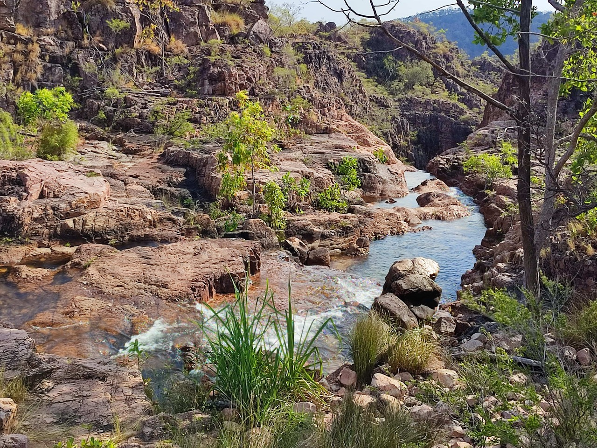

# 2023-Australie - part3

[2023/06/26]

On peut cliquer sur la route ou les étapes pour aller directement au jour mais
le dernier jour [c'est ici](#{LASTDATE}). Cliquez sur </img> pour passer la carte en plein écran (Esc pour sortir du plein écran).  Cliquez sur les images pour agrandir. Et pour tous les journaux de voyage, [c'est par ici](https://gilles-arcas.blogspot.com/2020/09/home_31.html).
______
[2023/06/26]

{MAPPOST map.html}
{MAPFULL maplocal.html}
______
[2023/06/27]

### J104 - 27 juin - Darwin - 0 km (4706 km)

Retour à Darwin et fin de la parenthèse. Arrivée chez Fleur à trois heures du matin. Elle reçoit un autre cycliste, français, François, parti depuis trois ans et demi. Il a travaillé presque un an en Australie et est sur le chemin du retour, en commençant par le Timor, l’Indonésie, etc. Objectif : ne pas prendre l’avion jusqu’en France. Il prévoit au moins un an et demi. Bonne route !

______
[2023/06/28]

### J105 - 28 juin - Tumbling Waters - 74 km (4780 km)

Sur les recommandations de Fleur et François, je passe d’abord au Northern General Store (un magasin de matériel de camping qui tient plus du hangar avec des étagères) pour acheter un meilleur duvet. Il paraît qu’il va faire beaucoup plus froid, surtout la nuit, sur la côte sud ouest. Ensuite, sur les conseils de Fleur, je prends le ferry pour traverser la baie de Darwin et prendre une petite route tranquille. Ça évite de sortir de Darwin en suivant la grosse route. C’est effectivement désert par ici, très peu de trafic (un peu plus après avoir dépassé une mine de lithium) et aucune localité traversée.

Pas sûr du tout pour le réseau les deux prochains jours.

______
[2023/06/29]

### J106 - 29 juin - Litchfield National Park - 84 km (4864 km)

Détour par le Litchfield National Park, réputé pour ses cascades et ses chutes d’eau. La principale est celle de Wingi Falls. Effectivement très jolie. Il y a un grand bassin au pied de la chute d’eau et les gens viennent faire trempette (en plus c’est les vacances scolaires). Baignade obligée. Il y a un sentier qui fait le tour de la chute d’eau, remonte sur le côté, traverse la rivière et redescend de l’autre côté. Décidément très joli. Un bout de rain forest, des arbres avec des chauves-souris qui font du boucan, et point de vue sur les forêts du parc national.

______
[2023/06/30]

### J107 - 30 juin - Zebra Stone - 63 km (4927 km)

Traversée du parc national en m’arrêtant plusieurs fois pour visiter. Montée aux Upper Cascades (les Lower Cascades sont fermées), trois quarts d’heure de sentier dans le bush pour y arriver. Ensuite, re-trempette dans les Wangi Falls, et visite aux Tolmer Falls. On y accède par le haut, et on voit tout le paysage autour. Arrivée au campground de nuit. Dix dollars avec douche et eau potable. Le gars me fait goûter de la confiture à la tomate et me donne le pot. Quand je le revois un peu plus tard, il me dit les push bikes ne payent pas et me redonne mes dix dollars.

Note : « push bikes », c’est comme ça que les australiens appellent les vélos de randonnée. La première fois qu’on m’a demandé « you are pushing the bike? », j’ai répondu ben non, je pousse pas, je pédale. Depuis, j’ai compris.

______
[2023/07/01]

### J108 - 1er juillet - Adelaide River - 48 km (4975 km)

Nuit dernière un peu difficile. Très chaud sous la tente en début de nuit, mais impossible d’ouvrir à cause des moustiques (dont une escadrille a quand même réussi à rentrer). Ensuite, le vent s’est levé mais la tente est mal fixée (le sol est presque aussi dur que du béton). Je finis la nuit avec un bout de la tente fixé au vélo et l’autre bout qui a abdiqué. La fonction première de Zebra Stones, où j’ai passé la nuit, est de présenter et de vendre des objets en zebra stone, une pierre très ancienne avec des inclusions qui forment des motifs très jolis. J’assiste à la présentation avant de reprendre la route. 

______
[2023/07/02]

### J109 - 2 juillet - Entre Adelaide River et Pine Creek - 66 km (5041 km)

Temps couvert et beaucoup moins chaud que les jours précédents. Vent du sud (c’est à peu près par là que va ma route). Petite route très tranquille qui évite la highway dans un paysage de collines. Bivouac dans le bush. Et j’ai vu un cheval sauvage, j’avoue, il avait de l’allure.

______
[2023/07/03]

### J110 - 3 juillet - Pine Creek - 66 km (5107 km)

D’abord, réparer la crevaison d’hier (j’avais fini en regonflant plusieurs fois). Ensuite, retrouver la Stuart highway (la route qui relie Adelaide et Darwin). Pas trop sympa, mais ça passe. Quand même vingt kilomètres de route parallèle, une toute petite route « unmaintained » très jolie qui longe un terrain d’aviation de WWII. Il y a même un nid d’oiseau jardinier au bord de la route.

______
[2023/07/04]

### J111 - 4 juillet - Katherine - 102 km (5209 km)

Je voulais suivre une petite route parallèle à la highway en quittant Pine Creek (la suite de la petite route d’hier). Pas de chance, la route est barrée après cinq kilomètres. Donc retour en arrière et toute la journée sur la grosse route. Caravan Park blindé. Une personne est refusée avant moi, mais on m’accepte parce que je suis en push bike (d’ailleurs, on dit en push bike ou à push bike ?).

______
[2023/07/05]

### J112 - 5 juillet - Katherine - 0 km (5209 km)

Jour de repos. En fait, il y a un nid de bowerbird (thanks Brian) à trois mètres de la cuisine du caravan park. Il vient même faire un peu de déco, pas farouche. Au programme, préparation des prochaines étapes (deux escales sur les 500 prochains kilomètres), lessive, réparation des crevaisons (pneu à plat quand j’ai voulu prendre le vélo) et recherche d’une chambre à air (trouvée au magasin de matériel de camping qui vend aussi des vélos). Finalement, balade le long de la rivière et trempette aux sources chaudes.

______
